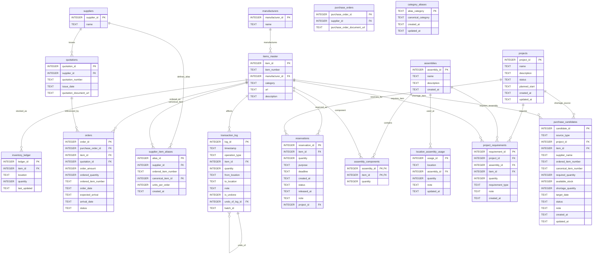

# **Optical Component Inventory Management System**
---

## **1. System Overview**

### **1.1 Purpose**

The Optical Component Inventory Management System provides comprehensive lifecycle management for optical laboratory components, from purchasing through usage tracking, with support for advanced planning features.

### **1.2 Core Capabilities**

| Capability | Description |
|------------|-------------|
| **Purchasing** | Order registration, quotation tracking, unregistered batch import+move procedure, alias-based SKU normalization, arrival processing |
| **Stock Tracking** | Real-time inventory by location |
| **Movement** | Transfer, consume, adjust inventory |
| **Reservation** | Soft-reserve with purpose/deadline tracking |
| **BOM Analysis** | Gap analysis, batch reservation, shortage handoff to procurement |
| **Procurement** | Cross-project procurement batches and CSV export for supplier communication |
| **Project Planning** | Future demand registration, sequential project netting, procurement-linked shortage workflow |
| **Undo Operations** | Safe reversal with compensating transactions |

### **1.3 Non-Functional Requirements**

| Requirement | Specification |
|-------------|---------------|
| Target OS | Windows |
| Database | PostgreSQL 16+ (primary deployment target via Docker Compose) |
| Language (Backend) | Python 3.10+ |
| Backend API | FastAPI |
| Backend DB Access | SQLAlchemy Core / Raw SQL |
| Language (Frontend) | TypeScript |
| UI Framework | React (+React Router for SPA routing) |
| UI Styling | Tailwind CSS (+shadcn/ui or Radix primitives) |
| Data Fetching | SWR |
| Package Manager (Python) | uv |
| Package Manager (Frontend) | npm |
| Frontend Builder | Vite |
| User Model | Shared-server operation on trusted internal network, with forward compatibility for fuller RBAC deployment |
| Authentication/Authorization | Browser/API auth uses `Authorization: Bearer <JWT>`. The browser-facing cloud target uses Identity Platform email/password sign-in to obtain the Bearer token, while manual token entry remains a local/test fallback. When `OIDC_REQUIRE_EMAIL_VERIFIED=1`, users must complete email verification before the backend will accept their token. The frontend must therefore support account creation, verification-email send/resend, and an unverified-account holding page. Verified OIDC claims (`email`, `sub`, optional `hd`) then resolve either to an active app user or to a self-registration flow (`username`, required `display_name`, requested role, optional memo`). If no active app user exists for a verified identity, the browser must route the user into registration and block normal app access until an admin approves the request. Admins review and approve/reject requests from the Users page; rejected requests must keep history and expose the rejection reason to the applicant. `AUTH_MODE` controls bearer-token enforcement (`none`, `oidc_dry_run`, `oidc_enforced`) and `RBAC_MODE` controls role enforcement (`none`, `rbac_dry_run`, `rbac_enforced`). Bootstrap exception: `POST /api/users` may omit Bearer auth only when zero active users exist. |
| Timezone | Fixed JST for all date/time fields |
| CSV Encoding | UTF-8 (no BOM) |
| Expected Scale | Items: 10,000 / Orders: 5,000 / Transactions: ~100,000 |
| Response Time | List views < 500ms, Single item operations < 200ms |

### **1.4 Requirement Precedence**

When statements conflict, interpret in this order:

1. `documents/specification.md`
2. `documents/technical_documentation.md`
3. current code behavior

---

## **2. Database Schema**

### **2.1 Design Principles**

- `items_master.item_id` is the canonical identifier for all components
- All references use foreign keys to enforce referential integrity
- Prices and costs are explicitly out of scope
- Zero-quantity inventory records are deleted (not retained)
- Transaction log is append-only for full audit trail
- Should satisfy Third Normal Form (3NF) at least to minimize redundancy and update anomalies

### **2.2 Table Summary (Current Implementation)**

| Domain | Table | Purpose | Key Fields |
|-------|-------|---------|------------|
| Auth | `users` | Application user master | user_id, username, role, is_active |
| Auth | `registration_requests` | Self-registration review queue and history | request_id, email, username, status |
| Master | `manufacturers` | Manufacturer registry | manufacturer_id, name |
| Master | `suppliers` | Supplier registry (vendors) | supplier_id, name |
| Master | `items_master` | Component definitions + ownership boundary | item_id, item_number, source_system |
| Master | `supplier_item_aliases` | Supplier SKU alias mappings | alias_id, supplier_id, ordered_item_number |
| Master | `category_aliases` | Category soft-merge aliases | alias_category, canonical_category |
| Inventory | `inventory_ledger` | Current inventory by location | ledger_id, item_id, location, quantity |
| Inventory | `transaction_log` | Inventory operation audit log + undo chain | log_id, operation_type, item_id |
| Inventory | `reservations` | Reservation header/lifecycle | reservation_id, item_id, status |
| Inventory | `reservation_allocations` | Per-location reservation allocations | allocation_id, reservation_id, item_id, location |
| Purchasing | `quotations` | Quotation headers | quotation_id, supplier_id, quotation_number |
| Purchasing | `purchase_orders` | Purchase-order headers | purchase_order_id, supplier_id, purchase_order_number |
| Purchasing | `orders` | Purchase-order lines | order_id, purchase_order_id, item_id |
| Purchasing | `order_lineage_events` | ETA/split lineage events | event_id, event_type, source_purchase_order_line_id |
| Planning | `projects` | Project definitions | project_id, name, status |
| Planning | `project_requirements` | Project requirement rows | requirement_id, project_id, item_id / assembly_id |
| Planning | `assemblies` | Assembly templates | assembly_id, name |
| Planning | `assembly_components` | Assembly BOM rows | assembly_id, item_id |
| Planning | `location_assembly_usage` | Assembly deployment state by location | usage_id, location, assembly_id |
| Procurement | `procurement_batches` | Cross-project procurement batches | batch_id, title, status |
| Procurement | `procurement_lines` | Procurement batch line items | line_id, batch_id, item_id |
| Procurement (compat) | `rfq_batches` | Legacy RFQ batch compatibility | rfq_id, project_id |
| Procurement (compat) | `rfq_lines` | Legacy RFQ line compatibility | line_id, rfq_id, item_id |
| Procurement (compat) | `purchase_candidates` | Legacy shortage candidate compatibility | candidate_id, source_type, item_id |
| Import/Audit | `import_jobs` | Import job headers (items/orders) | import_job_id, import_type, status |
| Import/Audit | `import_job_effects` | Row-level import effects for undo/redo safety | effect_id, import_job_id, effect_type |
| Artifacts | `generated_artifacts` | Managed downloadable generated files | artifact_id, artifact_type, filename |
| External Sync Foundation | `external_item_mirrors` | Future external item mirror cache | mirror_id, source_system, external_item_id |
| External Sync Foundation | `external_order_mirrors` | Future external order mirror cache | mirror_id, source_system, external_order_id |
| External Sync Foundation | `local_order_splits` | Local split overlay metadata | split_id, root_order_id, child_order_id |

### **2.3 ER Diagram (Core Domain, Mermaid)**

The ER diagram below focuses on core purchasing/inventory/planning entities.
Authentication (`users`, `registration_requests`), import/artifact operational tables (`import_jobs`, `import_job_effects`, `generated_artifacts`), and external-sync foundation tables are documented in Section 3.



---

## **3. Table Definitions**

### **3.1 manufacturers**

Centralizes manufacturer names. An item's SKU belongs to a manufacturer.

| Column | Type | Constraints | Description |
|--------|------|-------------|-------------|
| manufacturer_id | INTEGER | PK, AUTOINCREMENT | Internal manufacturer ID |
| name | TEXT | UNIQUE, NOT NULL | Canonical manufacturer name |

### **3.2 suppliers**

Centralizes supplier (vendor) names from whom items are purchased.

| Column | Type | Constraints | Description |
|--------|------|-------------|-------------|
| supplier_id | INTEGER | PK, AUTOINCREMENT | Internal supplier ID |
| name | TEXT | UNIQUE, NOT NULL | Canonical supplier name |

### **3.3 items_master**

Stores constant, non-quantity attributes of components.

| Column | Type | Constraints | Description |
|--------|------|-------------|-------------|
| item_id | INTEGER | PK, AUTOINCREMENT | Canonical item ID |
| item_number | TEXT | NOT NULL | Manufacturer part number |
| manufacturer_id | INTEGER | FK ↁEmanufacturers | Manufacturer reference |
| category | TEXT | | Component category (Lens, Mirror, etc.) |
| url | TEXT | | Product URL |
| description | TEXT | | Human-readable description |
| source_system | TEXT | NOT NULL, default `local` | Ownership boundary for future external item master migration |
| external_item_id | TEXT | Nullable, unique when present | External source identifier for mirrored item ownership |

**Unique Constraint:** `(manufacturer_id, item_number)`

### **3.4 inventory_ledger**

Stores current quantity snapshots per location.

| Column | Type | Constraints | Description |
|--------|------|-------------|-------------|
| ledger_id | INTEGER | PK, AUTOINCREMENT | Internal ID |
| item_id | INTEGER | FK ↁEitems_master | Item reference |
| location | TEXT | NOT NULL | Logical location |
| quantity | INTEGER | NOT NULL | Current quantity |
| last_updated | TEXT | | Last modification timestamp |

**Unique Constraint:** `(item_id, location)`

**Location Semantics:**
- `STOCK` ↁEAvailable inventory
- `RESERVED` ↁELegacy compatibility location only (new reservations should not move physical stock here)
- Any other string ↁEUser-defined locations

**Rules:**
- Empty string locations are forbidden
- If quantity becomes 0, the row is deleted

### **3.5 quotations**

Stores quotation metadata.

| Column | Type | Constraints | Description |
|--------|------|-------------|-------------|
| quotation_id | INTEGER | PK, AUTOINCREMENT | Internal ID |
| supplier_id | INTEGER | FK ↁEsuppliers | Supplier reference |
| quotation_number | TEXT | NOT NULL | Supplier quotation number |
| issue_date | TEXT | | YYYY-MM-DD |
| quotation_document_url | TEXT | | External quotation document URL (for example SharePoint) |

**Unique Constraint:** `(supplier_id, quotation_number)`

### **3.6 purchase_orders**

Stores purchase-order header metadata.

| Column | Type | Constraints | Description |
|--------|------|-------------|-------------|
| purchase_order_id | INTEGER | PK, AUTOINCREMENT | Internal header ID |
| supplier_id | INTEGER | FK -> suppliers | Supplier reference |
| purchase_order_number | TEXT | Nullable, nonblank when present | Supplier purchase-order number used as the import/header identity |
| purchase_order_document_url | TEXT | | External purchase order document URL (for example SharePoint) |
| import_locked | BOOLEAN | NOT NULL, default TRUE | Prevents duplicate re-import for the same supplier + purchase order number until manually released |

**Unique Constraint:** `(supplier_id, purchase_order_number)` when `purchase_order_number` is not null

### **3.7 orders**

Tracks purchase-order lines and delivery status.

| Column | Type | Constraints | Description |
|--------|------|-------------|-------------|
| order_id | INTEGER | PK, AUTOINCREMENT | Internal ID |
| purchase_order_id | INTEGER | FK -> purchase_orders, NOT NULL | Purchase-order header reference |
| project_id | INTEGER | FK -> projects, Nullable | Dedicated project assignment for planning |
| item_id | INTEGER | FK ↁEitems_master | Item reference |
| quotation_id | INTEGER | FK ↁEquotations, Nullable | Quotation reference |
| order_amount | INTEGER | NOT NULL | Canonical-item quantity used for inventory math |
| ordered_quantity | INTEGER | Legacy nullable; auto-filled and validated | Original quantity from supplier order line |
| ordered_item_number | TEXT | Legacy nullable; auto-filled and validated | Original supplier order SKU |
| order_date | TEXT | NOT NULL | Order date (YYYY-MM-DD) |
| expected_arrival | TEXT | | Scheduled arrival date |
| arrival_date | TEXT | | Actual arrival date |
| status | TEXT | Normalized to `Ordered`/`Arrived` | `Ordered`, `Arrived` |
| source_system | TEXT | NOT NULL, default `local` | Ownership boundary for future external order migration |
| external_order_id | TEXT | Nullable, unique when present | External source identifier for mirrored order ownership |

**Split Delivery Policy:**
When an order is partially delivered:
1. Update original row: `order_amount = arrived_quantity`, `status = 'Arrived'`
2. Create a new row: `order_amount = remaining_quantity`, `status = 'Ordered'`
3. Reject the operation if split traceability would become fractional

**Migration-Ready Split Tracking:**
- Current runtime still materializes split siblings as `orders` rows.
- `local_order_splits` records the root/child relationship and reconciliation mode so future external-order mirroring can treat split behavior as a local overlay instead of inferring everything from mutable order rows.

**Traceability Rule:**
- `ordered_item_number` and `ordered_quantity` preserve the source order representation.
- If an order line was resolved via alias (pack SKU), `order_amount` can differ from `ordered_quantity`.

**Runtime Guards:**
- Trigger validation enforces date fields in `YYYY-MM-DD` when present.
- Trigger validation enforces `status` in `Ordered` / `Arrived`.
- Trigger autofill ensures missing legacy `ordered_item_number` / `ordered_quantity` / `status` are repaired.
- When `project_id` is set, the order is excluded from the generic future-arrival pool and treated as dedicated supply for that project in planning.
- If an `ORDERED` RFQ line owns an order, manual `project_id` updates may only preserve that RFQ-owned project assignment; reassignment or clearing must happen from the RFQ line workflow.
- Splitting an RFQ-owned open order must keep the existing `project_id` only on the original RFQ-linked row; the new sibling row starts with `project_id = NULL` until an RFQ line explicitly links to it.

### **3.7 transaction_log**

Records all inventory-affecting operations (append-only).

| Column | Type | Constraints | Description |
|--------|------|-------------|-------------|
| log_id | INTEGER | PK, AUTOINCREMENT | Internal ID |
| timestamp | TEXT | DEFAULT NOW | Event time |
| operation_type | TEXT | | ARRIVAL, MOVE, RESERVE, CONSUME, ADJUST |
| item_id | INTEGER | FK ↁEitems_master | Item reference |
| quantity | INTEGER | | Absolute value |
| from_location | TEXT | Nullable | Source location |
| to_location | TEXT | Nullable | Destination location |
| note | TEXT | | Optional comment |
| is_undone | INTEGER | DEFAULT 0 | 1 if operation was undone |
| undo_of_log_id | INTEGER | FK ↁEtransaction_log | Reference to original if this is an undo |
| batch_id | TEXT | | Group related operations |

### **3.8 reservations**

Stores structured reservation records with lifecycle tracking.

| Column | Type | Constraints | Description |
|--------|------|-------------|-------------|
| reservation_id | INTEGER | PK, AUTOINCREMENT | Internal ID |
| item_id | INTEGER | FK ↁEitems_master, NOT NULL | Reserved item |
| quantity | INTEGER | NOT NULL, CHECK > 0 | Reserved quantity |
| purpose | TEXT | | Reservation purpose |
| deadline | TEXT | | Optional deadline (YYYY-MM-DD) |
| created_at | TEXT | DEFAULT NOW | Creation timestamp |
| status | TEXT | DEFAULT 'ACTIVE' | ACTIVE, RELEASED, CONSUMED |
| released_at | TEXT | | Timestamp when released/consumed |
| note | TEXT | | Optional notes |
| project_id | INTEGER | FK ↁEprojects, Nullable | Associated project |

**Status Transitions:**
- ACTIVE ↁERELEASED (cancelled, items returned to STOCK)
- ACTIVE ↁECONSUMED (items used/removed from inventory)

### **3.9 assemblies**

Stores assembly definitions as reusable templates.

| Column | Type | Constraints | Description |
|--------|------|-------------|-------------|
| assembly_id | INTEGER | PK, AUTOINCREMENT | Internal ID |
| name | TEXT | NOT NULL, UNIQUE | Assembly name |
| description | TEXT | | Detailed description |
| created_at | TEXT | DEFAULT NOW | Creation timestamp |

### **3.10 assembly_components**

Defines component composition per assembly.

| Column | Type | Constraints | Description |
|--------|------|-------------|-------------|
| assembly_id | INTEGER | FK ↁEassemblies, PK | Parent assembly |
| item_id | INTEGER | FK ↁEitems_master, PK | Component reference |
| quantity | INTEGER | NOT NULL, CHECK > 0 | Quantity per assembly |

### **3.11 location_assembly_usage**

Tracks assembly deployment per location.

| Column | Type | Constraints | Description |
|--------|------|-------------|-------------|
| usage_id | INTEGER | PK, AUTOINCREMENT | Internal ID |
| location | TEXT | NOT NULL | Location name |
| assembly_id | INTEGER | FK ↁEassemblies, NOT NULL | Assembly reference |
| quantity | INTEGER | NOT NULL, CHECK > 0 | Number of assemblies |
| note | TEXT | | Optional note |
| updated_at | TEXT | DEFAULT NOW | Last modification |

**Unique Constraint:** `(location, assembly_id)`

### **3.12 projects**

Stores project definitions with lifecycle status.

| Column | Type | Constraints | Description |
|--------|------|-------------|-------------|
| project_id | INTEGER | PK, AUTOINCREMENT | Internal ID |
| name | TEXT | NOT NULL, UNIQUE | Project name |
| description | TEXT | | Detailed description |
| status | TEXT | DEFAULT 'PLANNING' | Lifecycle status |
| planned_start | TEXT | | Target start date (YYYY-MM-DD) |
| created_at | TEXT | DEFAULT NOW | Creation timestamp |
| updated_at | TEXT | | Last modification |

**Valid Statuses:** PLANNING, CONFIRMED, ACTIVE, COMPLETED, CANCELLED

**Planning Semantics:**
- `PLANNING`: draft only; does not consume capacity of later projects
- `CONFIRMED`: committed demand; does consume capacity of later projects
- `ACTIVE`: committed/executing demand; still consumes planning capacity
- `COMPLETED`, `CANCELLED`: excluded from future planning

### **3.13 project_requirements**

Defines component requirements per project.

| Column | Type | Constraints | Description |
|--------|------|-------------|-------------|
| requirement_id | INTEGER | PK, AUTOINCREMENT | Internal ID |
| project_id | INTEGER | FK ↁEprojects, NOT NULL | Parent project |
| assembly_id | INTEGER | FK ↁEassemblies, Nullable | Assembly (if assembly-based) |
| item_id | INTEGER | FK ↁEitems_master, Nullable | Item (if item-based) |
| quantity | INTEGER | NOT NULL, CHECK > 0 | Required quantity |
| requirement_type | TEXT | DEFAULT 'INITIAL' | INITIAL, SPARE, REPLACEMENT |
| note | TEXT | | Optional note |
| created_at | TEXT | DEFAULT NOW | Creation timestamp |

**Check Constraint:** Either assembly_id OR item_id must be set (not both, not neither).

### **3.14 rfq_batches**

Stores project-specific RFQ batches created from planning shortages.

| Column | Type | Constraints | Description |
|--------|------|-------------|-------------|
| rfq_id | INTEGER | PK, AUTOINCREMENT | Internal RFQ batch ID |
| project_id | INTEGER | FK -> projects, NOT NULL | Owning project |
| title | TEXT | NOT NULL | Operator-facing batch title |
| target_date | TEXT | Nullable | Planning date used when the batch was created |
| status | TEXT | NOT NULL, DEFAULT `OPEN` | `OPEN`, `CLOSED`, `CANCELLED` |
| note | TEXT | Nullable | Batch note |
| created_at | TEXT | NOT NULL | Creation timestamp |
| updated_at | TEXT | NOT NULL | Last update timestamp |

### **3.15 rfq_lines**

Stores project-dedicated quote / order-planning line items.

| Column | Type | Constraints | Description |
|--------|------|-------------|-------------|
| line_id | INTEGER | PK, AUTOINCREMENT | Internal line ID |
| rfq_id | INTEGER | FK -> rfq_batches, NOT NULL | Parent RFQ batch |
| item_id | INTEGER | FK -> items_master, NOT NULL | Canonical item |
| requested_quantity | INTEGER | NOT NULL, CHECK > 0 | Initial shortage quantity copied from planning |
| finalized_quantity | INTEGER | NOT NULL, CHECK > 0 | Quantity after RFQ refinement |
| supplier_name | TEXT | Nullable | Supplier label selected during RFQ |
| lead_time_days | INTEGER | Nullable, CHECK >= 0 | Lead time captured during RFQ |
| expected_arrival | TEXT | Nullable | Planned arrival date used by planning |
| linked_purchase_order_line_id | INTEGER | FK -> purchase order line, Nullable | Real purchase-order line linked after purchasing |
| status | TEXT | NOT NULL, DEFAULT `DRAFT` | `DRAFT`, `SENT`, `QUOTED`, `ORDERED`, `CANCELLED` |
| note | TEXT | Nullable | Operator note |
| created_at | TEXT | NOT NULL | Creation timestamp |
| updated_at | TEXT | NOT NULL | Last update timestamp |

**Planning Rule:**
- `QUOTED` lines with `expected_arrival` count as project-dedicated planned supply and must not retain a `linked_purchase_order_line_id`.
- `ORDERED` lines must link to an actual order row; only the ordered link drives `orders.project_id`, and any reassignment or clearing of that dedicated ownership must happen by changing the RFQ line link/status.

### **3.16 purchase_candidates**

Stores persistent shortage candidates before purchase order creation.

| Column | Type | Constraints | Description |
|--------|------|-------------|-------------|
| candidate_id | INTEGER | PK, AUTOINCREMENT | Internal candidate ID |
| source_type | TEXT | NOT NULL | `BOM` or `PROJECT` |
| project_id | INTEGER | FK -> projects, Nullable | Linked project (if source is project gap) |
| item_id | INTEGER | FK -> items_master, Nullable | Canonical item (nullable for unresolved/missing item rows) |
| supplier_name | TEXT | Nullable | Supplier label for BOM-driven rows |
| ordered_item_number | TEXT | Nullable | Supplier-facing ordered item number |
| canonical_item_number | TEXT | Nullable | Canonical item number at analysis time |
| required_quantity | INTEGER | NOT NULL, CHECK >= 0 | Required quantity at analysis time |
| available_stock | INTEGER | NOT NULL, CHECK >= 0 | Available quantity at analysis time |
| shortage_quantity | INTEGER | NOT NULL, CHECK >= 0 | Gap quantity to purchase |
| target_date | TEXT | Nullable | Analysis target date (`YYYY-MM-DD`) |
| status | TEXT | NOT NULL, DEFAULT `OPEN` | `OPEN`, `ORDERING`, `ORDERED`, `CANCELLED` |
| note | TEXT | Nullable | Operator note |
| created_at | TEXT | NOT NULL | Creation timestamp |
| updated_at | TEXT | NOT NULL | Last update timestamp |

### **3.17 supplier_item_aliases**

Maps supplier-facing order SKUs (for example pack SKUs) to canonical items in `items_master`.

| Column | Type | Constraints | Description |
|--------|------|-------------|-------------|
| alias_id | INTEGER | PK, AUTOINCREMENT | Internal alias ID |
| supplier_id | INTEGER | FK -> suppliers, NOT NULL | Supplier owning this alias |
| ordered_item_number | TEXT | NOT NULL | Item number as it appears in supplier order CSV |
| canonical_item_id | INTEGER | FK -> items_master, NOT NULL | Canonical item for inventory/order records |
| units_per_order | INTEGER | NOT NULL, CHECK > 0 | Multiplier to convert ordered quantity |
| created_at | TEXT | DEFAULT NOW | Creation timestamp |

**Unique Constraint:** `(supplier_id, ordered_item_number)`

### **3.18 category_aliases**

Maps raw category names to canonical category names for soft-merge behavior.

| Column | Type | Constraints | Description |
|--------|------|-------------|-------------|
| alias_category | TEXT | PK, NOT NULL, CHECK TRIM != '' | Raw category value to treat as alias |
| canonical_category | TEXT | NOT NULL, CHECK TRIM != '' | Canonical category shown in UI/search |
| created_at | TEXT | DEFAULT NOW | Alias creation timestamp |
| updated_at | TEXT | DEFAULT NOW | Last alias update timestamp |

**Rules:**
- `alias_category` and `canonical_category` cannot be identical.
- Soft-merge does not rewrite `items_master.category`; resolution is applied at read time.
- Removing an alias restores original category behavior immediately.

### **3.19 users**

Stores active application users resolved from verified bearer-token identity.

| Column | Type | Constraints | Description |
|--------|------|-------------|-------------|
| user_id | INTEGER | PK, AUTOINCREMENT | Internal user ID |
| username | TEXT | UNIQUE, NOT NULL | Login/display handle used in operations |
| display_name | TEXT | NOT NULL | UI-facing user display name |
| role | TEXT | NOT NULL | `admin`, `operator`, `viewer` |
| is_active | BOOLEAN | NOT NULL, default TRUE | Soft activation flag |
| email | TEXT | Nullable, unique when present (case-insensitive) | Verified identity email mapping |
| identity_provider | TEXT | Nullable | OIDC provider label |
| external_subject | TEXT | Nullable | OIDC `sub` mapping |
| hosted_domain | TEXT | Nullable | Optional domain mapping boundary |
| created_at | TIMESTAMP | NOT NULL | Creation timestamp |
| updated_at | TIMESTAMP | Nullable | Last update timestamp |

### **3.20 registration_requests**

Stores pending/approved/rejected self-service registration requests separately from `users`.

| Column | Type | Constraints | Description |
|--------|------|-------------|-------------|
| request_id | INTEGER | PK, AUTOINCREMENT | Internal request ID |
| email | TEXT | NOT NULL | Verified token email |
| username | TEXT | NOT NULL | Requested username |
| display_name | TEXT | NOT NULL | Requested display name |
| memo | TEXT | Nullable | Applicant memo |
| requested_role | TEXT | NOT NULL, default `viewer` | Requested role |
| identity_provider | TEXT | Nullable | OIDC provider label |
| external_subject | TEXT | Nullable | OIDC `sub` mapping |
| status | TEXT | NOT NULL, default `pending` | `pending`, `approved`, `rejected` |
| rejection_reason | TEXT | Nullable | Required when rejected |
| reviewed_by_user_id | INTEGER | FK -> users, Nullable | Reviewer |
| approved_user_id | INTEGER | FK -> users, Nullable | Created/linked user |
| reviewed_at | TIMESTAMP | Nullable | Review timestamp |
| created_at | TIMESTAMP | NOT NULL | Creation timestamp |
| updated_at | TIMESTAMP | NOT NULL | Last update timestamp |

### **3.21 reservation_allocations**

Tracks per-location reservation allocations without moving stock into a synthetic `RESERVED` bucket.

| Column | Type | Constraints | Description |
|--------|------|-------------|-------------|
| allocation_id | INTEGER | PK, AUTOINCREMENT | Internal allocation ID |
| reservation_id | INTEGER | FK -> reservations, NOT NULL | Parent reservation |
| item_id | INTEGER | FK -> items_master, NOT NULL | Allocated item |
| location | TEXT | NOT NULL | Physical inventory location |
| quantity | INTEGER | NOT NULL, CHECK > 0 | Allocated quantity |
| status | TEXT | NOT NULL, default `ACTIVE` | `ACTIVE`, `RELEASED`, `CONSUMED` |
| created_at | TIMESTAMP | NOT NULL | Allocation creation timestamp |
| released_at | TIMESTAMP | Nullable | Release/consume timestamp |
| note | TEXT | Nullable | Optional note |

### **3.22 order_lineage_events**

Stores traceability events for order ETA update/split/merge transitions.

| Column | Type | Constraints | Description |
|--------|------|-------------|-------------|
| event_id | INTEGER | PK, AUTOINCREMENT | Internal lineage event ID |
| event_type | TEXT | NOT NULL | `ETA_UPDATE`, `ETA_SPLIT`, `ETA_MERGE`, `ARRIVAL_SPLIT` |
| source_purchase_order_line_id | INTEGER | NOT NULL | Source order-line ID |
| target_purchase_order_line_id | INTEGER | Nullable | Target order-line ID for split/merge |
| quantity | INTEGER | Nullable | Quantity affected by the event |
| previous_expected_arrival | DATE | Nullable | Previous ETA |
| new_expected_arrival | DATE | Nullable | Updated ETA |
| note | TEXT | Nullable | Event note |
| created_at | TIMESTAMP | NOT NULL | Event timestamp |

### **3.23 import_jobs**

Tracks import executions and metadata required for safe undo/redo.

| Column | Type | Constraints | Description |
|--------|------|-------------|-------------|
| import_job_id | INTEGER | PK, AUTOINCREMENT | Internal import job ID |
| import_type | TEXT | NOT NULL | `items`, `orders` |
| source_name | TEXT | Nullable | Operator-provided import source label |
| source_hash | TEXT | Nullable | Input content hash |
| request_metadata | TEXT | Nullable | Persisted import request metadata |
| status | TEXT | NOT NULL | `ok`, `partial`, `error` |
| executed_at | TIMESTAMP | NOT NULL | Execution timestamp |
| executed_by | INTEGER | FK -> users, Nullable | Executor user |
| undoable | BOOLEAN | NOT NULL | Undo availability flag |
| undone_at | TIMESTAMP | Nullable | Undo timestamp |
| undone_by | INTEGER | FK -> users, Nullable | Undo actor |

### **3.24 import_job_effects**

Stores row-level import side effects for operator inspection and guarded undo/redo.

| Column | Type | Constraints | Description |
|--------|------|-------------|-------------|
| effect_id | INTEGER | PK, AUTOINCREMENT | Internal effect ID |
| import_job_id | INTEGER | FK -> import_jobs, NOT NULL | Parent import job |
| row_number | INTEGER | Nullable | Source row number |
| effect_type | TEXT | NOT NULL | `item_created`, `order_created`, `order_missing_item`, etc. |
| before_snapshot | TEXT | Nullable | Serialized pre-state |
| after_snapshot | TEXT | Nullable | Serialized post-state |
| created_at | TIMESTAMP | NOT NULL | Effect timestamp |

### **3.25 generated_artifacts**

Registry for browser-downloadable generated files (for example missing-item CSV artifacts).

| Column | Type | Constraints | Description |
|--------|------|-------------|-------------|
| artifact_id | TEXT | PK | Opaque artifact identifier |
| artifact_type | TEXT | NOT NULL | Artifact category |
| filename | TEXT | NOT NULL | Download filename |
| storage_path | TEXT | NOT NULL | Storage-layer reference (`local://...` or `gcs://...`) |
| size_bytes | INTEGER | NOT NULL, CHECK >= 0 | File size |
| created_at | TIMESTAMP | NOT NULL | Creation timestamp |
| source_job_type | TEXT | Nullable | Related job category |
| source_job_id | TEXT | Nullable | Related job identifier |

### **3.26 external_item_mirrors**

Future-facing mirror table for externally managed item master synchronization.

| Column | Type | Constraints | Description |
|--------|------|-------------|-------------|
| mirror_id | INTEGER | PK, AUTOINCREMENT | Internal mirror row ID |
| source_system | TEXT | NOT NULL | External source label |
| external_item_id | TEXT | NOT NULL | External item identifier |
| local_item_id | INTEGER | FK -> items_master, Nullable | Linked local item |
| mirror_payload | JSONB | Nullable | Raw mirror payload |
| sync_state | TEXT | NOT NULL, default `pending` | Synchronization state |
| last_webhook_at | TEXT | Nullable | Last webhook timestamp |
| last_synced_at | TEXT | Nullable | Last sync timestamp |
| created_at | TEXT | NOT NULL | Creation timestamp |

### **3.27 external_order_mirrors**

Future-facing mirror table for externally managed order synchronization.

| Column | Type | Constraints | Description |
|--------|------|-------------|-------------|
| mirror_id | INTEGER | PK, AUTOINCREMENT | Internal mirror row ID |
| source_system | TEXT | NOT NULL | External source label |
| external_order_id | TEXT | NOT NULL | External order identifier |
| local_order_id | INTEGER | FK -> orders, Nullable | Linked local order |
| mirror_payload | JSONB | Nullable | Raw mirror payload |
| sync_state | TEXT | NOT NULL, default `pending` | Synchronization state |
| last_webhook_at | TEXT | Nullable | Last webhook timestamp |
| last_synced_at | TEXT | Nullable | Last sync timestamp |
| created_at | TEXT | NOT NULL | Creation timestamp |

### **3.28 local_order_splits**

Stores local split metadata so split behavior is explicit and externally reconcilable.

| Column | Type | Constraints | Description |
|--------|------|-------------|-------------|
| split_id | INTEGER | PK, AUTOINCREMENT | Internal split ID |
| split_type | TEXT | NOT NULL | Local split mode label |
| root_order_id | INTEGER | FK -> orders, NOT NULL | Root order line |
| child_order_id | INTEGER | FK -> orders, NOT NULL, UNIQUE | Child split order line |
| split_quantity | INTEGER | NOT NULL, CHECK > 0 | Split quantity |
| root_expected_arrival | TEXT | Nullable | Root ETA snapshot |
| child_expected_arrival | TEXT | Nullable | Child ETA snapshot |
| reconciliation_mode | TEXT | NOT NULL | External reconciliation behavior |
| created_at | TEXT | NOT NULL | Creation timestamp |

---

## **4. Core Business Logic**

### **4.1 Order Processing**

**Order Import:**
1. User uploads one or more order CSV files; each CSV row must include `supplier`
2. Manual Purchase Order Lines UI first calls `POST /purchase-order-lines/import-preview`
   - classify each row as `exact`, `high_confidence`, `needs_review`, or `unresolved`
   - prefer direct item-number and supplier-alias matches before fuzzy ranking
   - surface locked purchase-order conflicts before commit without creating a supplier during preview
3. Manual order-import CSVs should include `purchase_order_number`; legacy rows that omit it fall back to `quotation_number` as the effective purchase-order number during import
4. Preview confirmation may send optional per-row `row_overrides` (`item_id`, `units_per_order`)
   plus optional `alias_saves` for reusable supplier-scoped ordered names and optional `unlock_purchase_orders` selections for operator-approved re-import
   - preview-confirmation JSON fields are strict: malformed JSON, wrong top-level types, missing required keys, unsupported fields, and row numbers not present in the uploaded CSV must return `422`, never `5xx`
5. System resolves each CSV `item_number`:
   - direct match in `items_master`, or
   - alias match in `supplier_item_aliases` (`ordered_item_number -> canonical_item_id`)
   - or preview-provided override item when confirmation selected a canonical target manually
6. Quantity conversion:
   - direct match: `order_amount = quantity`
   - alias match: `order_amount = quantity * units_per_order`
   - preview override uses the selected `units_per_order` (default `1` when not specified)
7. If unresolved items remain: generate `missing_items_registration.csv` into `imports/items/unregistered/` and return `status="missing_items"` (no orders inserted yet)
8. User completes missing item resolution in the generated CSV (new item or alias).
9. User processes the unregistered item CSV via the Items page, creating master data records.
10. User re-runs order import with the same order CSV (the missing item is now resolvable).
11. If all rows resolve, insert/reuse quotation headers and purchase-order headers, then insert orders into `orders` and keep traceability fields
    (`ordered_item_number`, `ordered_quantity`)
    - rows that share the same `(supplier, purchase_order_number)` within one import reuse the same purchase-order header rather than blocking the second line
    - reject import when an existing locked purchase order with the same `(supplier, purchase_order_number)` already exists, unless the operator explicitly selected that header in `unlock_purchase_orders`
    - apply requested alias saves only after lock checks pass
12. Normalize date fields to `YYYY-MM-DD`; reject invalid date strings
13. For manual CSV import, `quotation_document_url` is required and must be a normalized non-empty document reference string
14. `purchase_order_document_url` is optional and, when provided, must be a normalized non-empty document reference string; it is descriptive metadata and does not determine purchase-order identity
15. Manual `POST /purchase-order-lines/import` creates an `import_jobs` row with `import_type='orders'` and records row-level `import_job_effects`
    - created rows use `effect_type='order_created'`
    - locked purchase-order rejection uses `effect_type='order_purchase_order_locked'`
    - unresolved item output uses `effect_type='order_missing_item'`
    - job status uses the shared import-job vocabulary (`ok`, `partial`, `error`), while the immediate import response may still return `status="missing_items"`
16. Import-capable CSV workflows expose companion downloads:
    - template CSV: header-only exact import columns, UTF-8 with BOM
    - reference CSV: live canonical DB values relevant to that flow, generated on demand from current state

**Historical Unregistered Item Batch Procedure (removed from active API/UI path):**
1. Process all `*.csv` accumulated in `imports/items/unregistered/` (`register_unregistered_item_csvs`)
2. Register missing items/aliases. Supports mixed batches (alias rows may reference canonical rows created as `new_item` in the same file).
3. Move successfully processed CSV files to `imports/items/registered/<YYYY-MM>/`
4. After a fully successful batch run, automatically consolidate small CSV files in each `imports/items/registered/<YYYY-MM>/` subfolder into larger consolidated files (`consolidate_registered_item_csvs`)
   - Consolidated file naming: `items_YYYY-MM_001.csv`, `items_YYYY-MM_002.csv`, etc.
   - Maximum 5,000 rows per consolidated file (configurable via `ITEMS_IMPORT_MAX_CONSOLIDATED_ROWS`)
   - Files matching the `items_YYYY-MM_NNN.csv` pattern are recognized as already-consolidated and merged into the next consolidation pass
   - Consolidation stages replacement files and only swaps them into place after all chunk writes succeed; original non-consolidated source CSVs are deleted only after that successful swap
   - Header-only registered CSV inputs are removed without generating an empty consolidated archive
   - Consolidated CSVs are **read-only import-history archives** — they preserve original import data; UI edits to item attributes only affect the database, not the CSV archives
5. If one file errors, continue or stop based on `continue_on_error`

**Arrival Processing:**
1. Update order status to 'Arrived'
2. Increment inventory at STOCK location
3. Log ARRIVAL operation
4. For partial arrivals, require integer-safe split of ordered traceability quantities

### **4.2 Inventory Operations**

**Movement Types:**

| Type | From | To | Effect |
|------|------|-----|--------|
| MOVE | Location A | Location B | Transfer items |
| CONSUME | Location | NULL | Remove items from inventory |
| RESERVE | NULL | NULL | Create/release allocation records without moving physical inventory |
| ADJUST | NULL or Location | Location or NULL | Correction (add/remove) |
| ARRIVAL | NULL | STOCK | Add from order |

**Shortage Handling:**
- Validate sufficient quantity before applying
- If insufficient: return shortage status, no changes made

### **4.3 Reservation System**

**Creating Reservations:**
1. Validate item exists and quantity > 0
2. Calculate available quantity across physical locations (`inventory_ledger.quantity - active allocations`)
3. Allocate reservation quantity from physical locations without moving inventory rows
4. Create reservation record with purpose/deadline

**Releasing Reservations:**
1. Support full or partial release quantity
2. Mark corresponding active allocations as RELEASED (no inventory movement)
3. If released quantity equals remaining reservation quantity: set status to RELEASED
4. If released quantity is partial: keep status ACTIVE and decrement remaining reservation quantity

**Consuming Reservations:**
1. Support full or partial consume quantity
2. Consume from allocated physical locations and mark those allocations CONSUMED
3. If consumed quantity equals remaining reservation quantity: set status to CONSUMED
4. If consumed quantity is partial: keep status ACTIVE and decrement remaining reservation quantity

### **4.4 Assembly System**

**Assembly Formula:**
```
Total Component @ Location = 
    Σ(assembly_qty ÁEcomponent_qty_per_assembly)
```

**Example:**
- Assembly "Laser Module" contains: 2ÁELens, 1ÁEMirror
- Location "SetupA" uses 3ÁE"Laser Module"
- Total @ SetupA: Lens = 6, Mirror = 3

**Key Principle (Current + Target):**
- **Current implementation:** Assembly data is advisory/organizational.
- **Target evolution:** Keep advisory behavior in planning, then allow enforceable checks in active operation mode.

Current advisory behavior does NOT:
- Automatically move components
- Block movements that violate requirements
- Modify inventory_ledger directly

Target enforceable mode (future) should:
- Validate required components for active locations/projects before critical operations
- Provide override/audit workflows instead of silent failure

### **4.5 Project Demand Planning**

**Project Lifecycle:**
```
PLANNING ↁECONFIRMED ↁEACTIVE ↁECOMPLETED
     ↁE
  CANCELLED
```

**Status Behaviors:**

| Status | Inventory Impact | Editability |
|--------|------------------|-------------|
| PLANNING | None | Free add/edit/delete requirements |
| CONFIRMED | RESERVED via reservations | Release required before changes |
| ACTIVE | Components at project locations | Movement operations only |
| COMPLETED | Archived | Read-only |

**Inventory Projection Formula:**
```
Projected Available = 
    Current STOCK
  + Pending Orders (expected_arrival ≤ date)
  - Active Reservations
  - Planned Demand (PLANNING status projects)
```

### **4.6 Undo Operations**

**Design Principles:**
- Append-only log (original entries never deleted)
- Creates compensating transactions
- Supports partial undo when full reversal isn't possible
- Partial undo is acceptable when required quantity is not currently available
- Undo actor policy (PoC): any local operator; RBAC control planned for multi-user phase
- Undo note policy: note is strongly recommended and should become mandatory in controlled deployments

**Undo Feasibility:**
| Original | Undo Requirement | Feasibility Check |
|----------|------------------|-------------------|
| MOVE | Reverse direction | Check quantity at to_location |
| ARRIVAL | Remove from STOCK | Check quantity at STOCK |
| CONSUME | Restore to original | Always possible |
| ADJUST | Reverse the delta | Check if removal is possible |

### **4.7 Category Soft Merge (Alias)**

**Behavior:**
- Category merge uses alias mapping (`category_aliases`) instead of rewriting `items_master.category`.
- Category resolution is applied in read paths (search, item list, location inspect, snapshots, item details).
- Alias removal provides a direct rollback path for category taxonomy changes.

**Service Functions:**

| Function | Purpose | Parameters |
|----------|---------|------------|
| `list_raw_categories()` | List raw category values from item rows | conn |
| `list_categories()` | List effective (canonical) category values | conn |
| `list_category_aliases()` | List active alias mappings | conn |
| `get_category_usage()` | Show direct/effective usage for one category | conn, category |
| `merge_category_alias()` | Soft-merge source into target canonical category | conn, source_category, target_category |
| `remove_category_alias()` | Remove one alias mapping (undo soft merge) | conn, source_category |
| `rename_category()` | Backward-compatible wrapper to soft merge | conn, source_category, target_category |

### **4.8 Orders and Quotations Management**

**Service Functions:**

| Function | Purpose | Parameters |
|----------|---------|------------|
| `list_orders()` | Query orders with filters | status, supplier, include_arrived |
| `update_order()` | Edit open purchase-order line or split partial ETA | order_id, expected_arrival, status, split_quantity |
| `merge_open_orders()` | Merge two open split-compatible purchase-order lines | source_purchase_order_line_id, target_purchase_order_line_id, expected_arrival |
| `list_order_lineage_events()` | Retrieve split/merge lineage events for one purchase-order line | order_id |
| `list_quotations()` | Query quotations with filters | supplier |
| `update_quotation()` | Edit quotation | quotation_id, issue_date, quotation_document_url |
| `list_purchase_orders()` | Query purchase-order headers with filters | supplier |
| `update_purchase_order()` | Edit purchase-order header | purchase_order_id, purchase_order_document_url |
| `list_supplier_item_aliases()` | Query alias mappings | supplier |
| `upsert_supplier_item_alias()` | Create/update one alias | supplier, ordered_item_number, canonical_item_number, units_per_order |
| `register_supplier_item_aliases_df()` | Bulk import aliases | supplier, dataframe |
| `register_supplier_item_aliases()` | Bulk import aliases | supplier, csv_path |
| `delete_supplier_item_alias()` | Delete one alias | alias_id |
| `register_unregistered_item_csvs()` | Batch register unregistered item CSV files, move successful files to registered, restore the source file if a post-move per-file failure occurs before the savepoint is released, and consolidate registered CSVs only when the batch completes without file errors | items_unregistered_root, items_registered_root, continue_on_error |
| `consolidate_registered_item_csvs()` | Consolidate small CSVs in each `imports/items/registered/<YYYY-MM>/` subfolder into `items_YYYY-MM_NNN.csv` files (max 5,000 rows each); deletes originals after merge and removes header-only inputs without writing an empty archive | items_registered_root |
| `rename_category()` | Backward-compatible soft merge wrapper | source_category, target_category |

**Constraints:**
- Only non-Arrived orders can be updated
- Open-order status remains `Ordered` (do not set `Arrived` via `update_order`)
- `update_order` can split one open order into two open rows when `split_quantity` is provided together with a new `expected_arrival`
- Split must be integer-safe for traceability quantities (`ordered_quantity`)
- Merge is allowed only when open orders share `item_id`, `quotation_id`, and `ordered_item_number`
- Split/merge updates must append lineage events for auditability
- All quotations can be edited
- All purchase-order headers can be edited independently from line rows
- Date fields must be YYYY-MM-DD format

**Frontend workflow requirement:**
- The Orders screen should be browseable at three domain levels without forcing one long vertical row form:
  - `Purchase Order Lines` for operational line edits and arrivals
  - `Quotations` for quotation-header review/edit
  - `Purchase Orders` for purchase-order-header review/edit
- The line-management area should prefer dense cards plus a side detail pane over a long single-column field stack so operators do not need excessive vertical scrolling to reach lower fields.


### **4.8.1 CSV Import Preview/Reconciliation**

- Manual CSV imports are preview-first before commit for items, inventory, orders, and reservations.
- Projects quick requirement parsing is also preview-first before rows are applied into project requirements.
  - `POST /projects/requirements/preview` parses `item_number,quantity` text lines, classifies item matches as `exact`, `high_confidence`, `needs_review`, or `unresolved`, and returns ranked item candidates for correction
  - `POST /projects/requirements/preview/unresolved-items.csv` exports unresolved preview rows plus `needs_review` rows that only have fuzzy/non-exact suggestions as an Items import-compatible CSV using default registration metadata (`row_type=item`, `manufacturer_name=UNKNOWN`, `units_per_order=1`), de-duplicates repeated item numbers, and still excludes review rows backed by exact registered matches
  - preview-confirmed project rows are applied client-side into the editable requirements grid; project create/update contracts remain unchanged
- BOM spreadsheet entry is also preview-first before analysis, reservation, or shortage persistence.
  - `POST /bom/preview` classifies supplier and item matches as `exact`, `high_confidence`, `needs_review`, or `unresolved`
  - preview rows return ranked supplier/item candidates plus projected canonical quantity, available stock, and shortage for the suggested item match
  - preview-confirmed BOM rows are then sent through the existing `POST /bom/analyze`, `POST /bom/reserve`, or `POST /purchase-candidates/from-bom` contracts; no separate BOM commit payload is required
- Items preview:
  - `POST /items/import-preview` classifies item rows as create-vs-duplicate and alias rows as create/update/review/unresolved
  - the Items page may batch one or more selected CSV files through the same preview/confirm workflow
  - order-generated missing-item CSVs are edited and re-imported through this same Items preview/import path; there is no separate browser-only missing-item resolver flow
  - preview confirmation may send optional per-row `row_overrides` (`canonical_item_number`, `units_per_order`) to `POST /items/import`
- Inventory preview:
  - `POST /inventory/import-preview` validates operation/location requirements, simulates stock effects in CSV order, and flags unresolved `item_id` values or stock shortages before commit
  - preview confirmation may send optional per-row `row_overrides` (`item_id`) to `POST /inventory/import-csv`
- Inventory movement CSV import supports `MOVE`, `CONSUME`, `ADJUST`, `ARRIVAL`, `RESERVE` operation rows and executes them via the existing batch transaction service.
- Reservation preview:
  - `POST /reservations/import-preview` validates direct item or assembly targets, previews assembly expansion, and flags inventory shortages before commit
  - preview confirmation may send optional per-row `row_overrides` (`item_id` or `assembly_id`) to `POST /reservations/import-csv`; the override target is authoritative during commit, even if the raw CSV row still contains a stale item or assembly field
- All preview-confirmation multipart JSON fields (`row_overrides`, `alias_saves`) are strict contracts:
  - malformed JSON returns `422 INVALID_REQUEST`
  - wrong top-level JSON shape, missing required keys, unsupported fields, and row numbers not present in the uploaded CSV return flow-specific `422` errors
  - these validation failures must not bubble as `5xx`
- Reservation CSV import supports either direct `item_id` reservations or assembly-driven rows (`assembly` + optional `assembly_quantity`) that expand to component reservations using assembly definitions.
- Assembly expansion is intentionally advisory/planning-oriented (no automatic inventory movement beyond reservation allocation), which aligns with current assembly policy and avoids unnecessary complexity.
- Items, inventory, orders, and reservations CSV workflows each expose:
  - `GET .../import-template` for header-only UTF-8-with-BOM templates
  - `GET .../import-reference` for live reference CSV generated from current canonical data

### **4.9 Inventory Snapshots**

**Purpose:** View inventory state at any point in time (past or future).

**Boundary:** Inventory snapshot is a physical-stock projection tool. It does not apply project planning commitments or RFQ-dedicated backlog netting; those belong to the Planning pipeline.

**Service Functions:**

| Function | Purpose |
|----------|---------|
| `get_inventory_snapshot_past()` | Reconstruct past state by reversing transactions |
| `get_inventory_snapshot_future()` | Project future state based on expected arrivals/reservations |
| `get_inventory_snapshot()` | Unified API with auto mode detection |

**Past Snapshot Algorithm:**
1. Start with current `inventory_ledger`
2. Query all transactions after the specified date
3. Reverse each transaction:
   - MOVE: Reverse from/to locations
   - CONSUME: Add back to from_location
   - RESERVE: Move from RESERVED to STOCK
   - ARRIVAL: Remove from STOCK
   - ADJUST: Reverse the delta

**Future Snapshot Algorithm:**
1. Start with current `inventory_ledger`
2. Add pending orders where `date(expected_arrival) <= date(target_date)` and `status != 'Arrived'`
3. Subtract active reservations where `deadline <= date` (assumed consumed)

**Availability Basis:**
- `basis=raw` (default): return physical snapshot rows from the location-state projection described above
- `basis=net_available`: future/current-only view that returns residual free quantity by location after subtracting current active reservation allocations from on-hand stock, then adding open orders due by the selected date
- `basis=net_available` with `mode=past` is rejected because the current model does not provide authoritative historical allocation-state reconstruction

When `basis=net_available`, snapshot rows may also include compact occupation context for the same `(item, location)`:
- `allocated_quantity`
- `active_reservation_count`
- `allocated_project_names`

These are summary-only fields for quick scanning, not a full allocation-explainer replacement for Workspace.

---

## **5. Interface Specifications**

### **5.1 User Interface Tabs**

**General UI Requirement (Multi-row Data Entry):** 
All management pages handling CRUD operations (Items, Orders, Reservations, etc.) MUST provide **Bulk/Multi-row Data Entry** interfaces. To prevent tedious data entry, the system should avoid forcing users to submit forms one-by-one. Instead, it should offer spreadsheet-like grids where users can paste or type multiple rows of data at once and submit them as a single batch, in addition to CSV import/export functions.

| Tab | Functions |
|-----|-----------|
| **Dashboard** | **Overview: overdue arrivals, expiring reservations, low stock alerts, recent activity** |
| **Workspace** | **Summary-first future-demand route: project dashboard, committed pipeline view, planning board, and contextual drawers for Project/Item/RFQ follow-up** |
| Search | Keyword search (multi-word support), filtering/sorting, inventory snapshot export |
| Location | Location inspection, assembly view, disassemble |
| Projects | CRUD project definitions, requirements, lifecycle status |
| Planning | Sequential project netting, start-date shortage analysis, convert uncovered rows into RFQ batches |
| RFQ | Project-dedicated RFQ batches, quote refinement, order linking |
| Purchase Candidates | Secondary persistent shortage list for BOM / ad-hoc pre-PO tracking |
| Orders | Bulk import orders, download generated missing-item CSV outputs, alias CSV import, **purchase-order-line / quotation / PO-header management** |
| Arrival | **Open-arrival monitoring by ETA, overdue / no-ETA follow-up, and full or partial arrival processing** |
| Movements | Single/batch movements, all operation types, CSV import (`operation_type,item_id,quantity,from_location,to_location,location,note`) |
| Reserve | Reservation management, BOM batch reservation, CSV import (`item_id` or `assembly`, `quantity`, optional `assembly_quantity/purpose/deadline/note/project_id`) |
| BOM | Preview-first reconciliation, gap analysis, reserve available, optional date-aware projection |
| Assemblies | Define assemblies, location usage, requirements |
| Items | Bulk edit item attributes; soft-merge categories via alias mapping; preview/import regular item CSVs and order-generated missing-item CSVs through one shared UI |
| History | Transaction log, undo operations |
| **Snapshot** | **Past/future inventory state reconstruction, searchable residual-stock review via `net_available`, CSV export** |

### **5.2 CLI Commands (Deprecated / Removed For PostgreSQL Deployment)**

| Command | Purpose |
|---------|---------|
| `init-db` | Initialize database |
| `import-orders` | Import order CSV |
| `arrival` | Process order arrival |
| `move` | Move inventory |
| `consume` | Consume inventory |
| `reserve` | Reserve inventory |
| `list-reservations` | List reservations |
| `release-reservation` | Release reservation (full or partial with `--quantity`) |
| `consume-reservation` | Consume reservation (full or partial with `--quantity`) |
| `bom-analyze` | BOM gap analysis (supports optional `--target-date`) |
| `bom-reserve` | Reserve BOM items |
| `list-purchase-candidates` | List persistent pre-PO shortage candidates |
| `purchase-candidates-from-bom` | Create shortage candidates from BOM rows |
| `purchase-candidates-from-project` | Create shortage candidates from project gap |
| `update-purchase-candidate` | Update candidate status/note |
| `search` | Search items |
| `location-inspect` | Inspect location |
| `location-disassemble` | Return location items to STOCK |
| `assembly-create` | Create assembly |
| `assembly-list` | List assemblies |
| `assembly-show` | Show assembly details |
| `assembly-delete` | Delete assembly |
| `location-set-assembly` | Set assembly usage |

### **5.3 API Endpoints**

Base URL: `http://localhost:8000/api`

#### **Dashboard**

| Method | Endpoint | Description |
|--------|----------|-------------|
| GET | `/dashboard/summary` | Get dashboard overview (overdue orders, expiring reservations, low stock) |

#### **Auth / Capability Metadata**

| Method | Endpoint | Description |
|--------|----------|-------------|
| GET | `/auth/capabilities` | Return runtime auth mode and planned RBAC roles metadata |

#### **Users**

| Method | Endpoint | Description |
|--------|----------|-------------|
| GET | `/users` | Admin-only user directory; `include_inactive=true` includes inactive rows |
| GET | `/users/me` | Resolve the current user from Bearer JWT identity |
| GET | `/users/{user_id}` | Get one user |
| POST | `/users` | Create a user and its OIDC mapping; anonymous only for first-user bootstrap |
| PUT | `/users/{user_id}` | Update display name, role, username, OIDC mapping, and active state |
| DELETE | `/users/{user_id}` | Deactivate a user |

#### **Artifacts**

| Method | Endpoint | Description |
|--------|----------|-------------|
| GET | `/artifacts` | List managed generated-file artifacts from the DB-backed artifact registry; supports optional `?artifact_type=` filtering |
| GET | `/artifacts/{artifact_id}` | Get generated artifact metadata |
| GET | `/artifacts/{artifact_id}/download` | Download one generated artifact through the browser |
| GET | `/health` | Health check plus runtime posture summary (`runtime_target`, `cloud_run_mode`, `app_data_root`, `app_port`) |

#### **Workspace**

| Method | Endpoint | Description |
|--------|----------|-------------|
| GET | `/workspace/summary` | Return aggregate project dashboard data for `/workspace`, including committed-vs-draft semantics, RFQ summary counts, and committed pipeline rows without per-project planning-analysis fan-out |
| GET | `/workspace/planning-export` | Download CSV export for the selected project planning view (`project_id`, optional `target_date`) including pipeline summary, selected-project totals, item rows, and RFQ counts |
| GET | `/workspace/planning-export-multi` | Download CSV export for the full planning pipeline, optionally including a selected preview project (`project_id`, optional `target_date`) with per-project summaries and item rows |

#### **Catalog Search**

| Method | Endpoint | Description |
|--------|----------|-------------|
| GET | `/catalog/search` | Search typed catalog entities for write-flow selectors (`?q=...&types=item,assembly,supplier,project&limit_per_type=8`); matching is case-insensitive, ignores whitespace differences, and treats space-delimited terms as AND conditions |

#### **Items**

| Method | Endpoint | Description |
|--------|----------|-------------|
| GET | `/items` | List items (supports `?q=`, `?category=`, `?manufacturer=`, pagination); `q` matching is case-insensitive, ignores whitespace differences, and treats space-delimited terms as AND conditions |
| GET | `/items/import-template` | Download header-only item import template CSV (UTF-8 with BOM) |
| GET | `/items/import-reference` | Download live item/alias reference CSV |
| POST | `/items/import-preview` | Preview item/alias CSV reconciliation before commit |
| POST | `/items/import` | Import items and supplier-scoped aliases from CSV; accepts optional preview-confirmation `row_overrides` (`canonical_item_number`, `units_per_order`) with strict `422` validation for malformed or invalid override payloads, and archives successful manual-import CSV content into `imports/items/registered/<YYYY-MM>/` for consolidation |
| GET | `/items/{item_id}` | Get item details |
| POST | `/items` | Create item |
| PUT | `/items/{item_id}` | Update item |
| DELETE | `/items/{item_id}` | Delete item (blocked if referenced) |
| GET | `/items/{item_id}/history` | Get item transaction history |
| GET | `/items/{item_id}/flow` | Get item-centric increase/decrease timeline (transactions + expected arrivals + reservation demand) |
| GET | `/items/{item_id}/planning-context` | Return cross-project planning demand/allocation context for the item, optionally including a preview project/date |

#### **Inventory**

| Method | Endpoint | Description |
|--------|----------|-------------|
| GET | `/inventory` | List inventory by location |
| GET | `/inventory/import-template` | Download header-only movement import template CSV (UTF-8 with BOM) |
| GET | `/inventory/import-reference` | Download live movement reference CSV (item ids and current locations/quantities) |
| POST | `/inventory/import-preview` | Preview movement CSV validation and simulated stock effects before commit |
| GET | `/inventory/snapshot` | Get inventory snapshot (supports `?date=`, `?mode=past|future`, `?basis=raw|net_available`) |
| POST | `/inventory/move` | Move items between locations |
| POST | `/inventory/consume` | Consume items from location |
| POST | `/inventory/adjust` | Adjust inventory quantity |
| POST | `/inventory/batch` | Batch movement operations |
| POST | `/inventory/import-csv` | Import movement operations from CSV; accepts optional preview-confirmation `row_overrides` (`item_id`) with strict `422` validation for malformed or invalid override payloads |

#### **Orders & Quotations**

| Method | Endpoint | Description |
|--------|----------|-------------|
| GET | `/purchase-order-lines` | List purchase-order lines (supports `?status=`, `?supplier=`, `?item_id=`, `?project_id=`) |
| GET | `/arrival-schedule` | List open purchase-order lines for arrival operations with `arrival_bucket`, overdue-day metadata, and the same `supplier` / `item_id` / `project_id` filter shape used by arrival monitoring UI. Supports optional `?bucket=overdue|scheduled|no_eta`. |
| GET | `/purchase-order-lines/import-template` | Download header-only purchase-order-line import template CSV (UTF-8 with BOM) |
| GET | `/purchase-order-lines/import-reference` | Download live purchase-order-line reference CSV; optional `?supplier_name=` remains available for alias lookup narrowing |
| POST | `/purchase-order-lines/import-preview` | Preview purchase-order-line CSV reconciliation from uploaded CSV content; each row must carry `supplier` |
| GET | `/purchase-order-lines/import-jobs` | List manual purchase-order-line import jobs recorded in `import_jobs` (`import_type='orders'`) |
| GET | `/purchase-order-lines/import-jobs/{import_job_id}` | Get one manual purchase-order-line import job with row-level `import_job_effects` |
| GET | `/purchase-order-lines/{order_id}` | Get purchase-order-line details |
| PUT | `/purchase-order-lines/{order_id}` | Update purchase-order-line ETA, project assignment for non-RFQ-managed lines, or split partial ETA via `split_quantity` |
| POST | `/purchase-order-lines/merge` | Merge two open compatible purchase-order lines |
| GET | `/purchase-order-lines/{order_id}/lineage` | List split/merge lineage events for the purchase-order line |
| POST | `/purchase-order-lines/import` | Import purchase-order lines from CSV; accepts optional preview-confirmation `row_overrides` and `alias_saves` form fields with strict `422` validation for malformed or invalid payloads. Each row must include `supplier`. `quotation_document_url` updates/creates quotation headers; optional `purchase_order_document_url` updates/creates purchase-order headers. Successful and missing-item responses include `import_job_id` |
| POST | `/purchase-order-lines/{order_id}/arrival` | Process purchase-order-line arrival |
| POST | `/purchase-order-lines/{order_id}/partial-arrival` | Process partial purchase-order-line arrival |
| GET | `/quotations` | List quotations |
| PUT | `/quotations/{quotation_id}` | Update quotation |

#### **Reservations**

| Method | Endpoint | Description |
|--------|----------|-------------|
| GET | `/reservations` | List reservations (supports `?status=`, `?item_id=`) |
| GET | `/reservations/import-template` | Download header-only reservation import template CSV (UTF-8 with BOM) |
| GET | `/reservations/import-reference` | Download live reservation reference CSV (items, assemblies, projects) |
| POST | `/reservations/import-preview` | Preview reservation CSV target resolution and stock availability before commit |
| POST | `/reservations` | Create reservation |
| PUT | `/reservations/{reservation_id}` | Update reservation |
| POST | `/reservations/{reservation_id}/release` | Release reservation (full or partial using optional `quantity`) |
| POST | `/reservations/{reservation_id}/consume` | Consume reservation (full or partial using optional `quantity`) |
| POST | `/reservations/batch` | Batch create reservations |
| POST | `/reservations/import-csv` | Import reservation rows from CSV; accepts optional preview-confirmation `row_overrides` (`item_id` or `assembly_id`) with strict `422` validation for malformed or invalid override payloads |

#### **Assemblies**

| Method | Endpoint | Description |
|--------|----------|-------------|
| GET | `/assemblies` | List assemblies |
| GET | `/assemblies/{assembly_id}` | Get assembly with components |
| POST | `/assemblies` | Create assembly |
| PUT | `/assemblies/{assembly_id}` | Update assembly |
| DELETE | `/assemblies/{assembly_id}` | Delete assembly (cascades) |
| GET | `/assemblies/{assembly_id}/locations` | Get assembly usage by location |
| PUT | `/locations/{location}/assemblies` | Set assembly usage at location |

#### **Projects**

| Method | Endpoint | Description |
|--------|----------|-------------|
| GET | `/projects` | List projects |
| GET | `/projects/{project_id}` | Get project with requirements |
| POST | `/projects/requirements/preview` | Preview `item_number,quantity` quick-entry lines before applying them to project requirements |
| POST | `/projects` | Create project |
| PUT | `/projects/{project_id}` | Update project |
| DELETE | `/projects/{project_id}` | Delete project |
| GET | `/projects/{project_id}/gap-analysis` | Compatibility start-date gap view (optional `target_date`) |
| GET | `/projects/{project_id}/planning-analysis` | Sequential planning analysis with earlier-project netting |
| POST | `/projects/{project_id}/confirm-allocation` | Persist on-time generic allocations for the selected planning date (`dry_run` preview or execute) by dedicating generic orders and creating project reservations from stock |
| POST | `/projects/{project_id}/reserve` | Reserve project requirements |
| POST | `/projects/{project_id}/rfq-batches` | Create an RFQ batch from uncovered planning rows |

#### **Planning & RFQ**

| Method | Endpoint | Description |
|--------|----------|-------------|
| GET | `/planning/pipeline` | List committed projects in sequential planning order; rows include `generic_committed_total` and `cumulative_generic_consumed_before_total` |
| GET | `/rfq-batches` | List RFQ batches |
| GET | `/rfq-batches/{rfq_id}` | Get RFQ batch with line items |
| PUT | `/rfq-batches/{rfq_id}` | Update RFQ batch metadata/status |
| PUT | `/rfq-lines/{line_id}` | Update RFQ line quantities, dates, status, or linked purchase-order line (`linked_purchase_order_line_id` is cleared automatically unless the final status is `ORDERED`) |

#### **BOM Analysis**

| Method | Endpoint | Description |
|--------|----------|-------------|
| POST | `/bom/preview` | Preview BOM supplier/item reconciliation and projected shortage before execution |
| POST | `/bom/analyze` | Analyze BOM gaps (accepts CSV or JSON; optional `target_date`) |
| POST | `/bom/reserve` | Reserve BOM items |

`POST /bom/analyze` request body supports optional `target_date` (`YYYY-MM-DD`):
- If omitted: compare BOM required quantity against current net available stock.
- If provided (today or future): compare against projected available stock where
  `projected_available = current_net_available + open_orders(expected_arrival <= target_date)`.
- `target_date` earlier than today returns `422` (`INVALID_TARGET_DATE`).

`GET /projects/{project_id}/planning-analysis` is the canonical future-planning view:
- committed projects (`CONFIRMED`, `ACTIVE`) are processed in planned-start order
- committed projects stay in the planning pipeline even after their stored `planned_start` passes; if a committed project has no persisted `planned_start`, planning treats it as `today_jst()` for sequencing
- the Planning Board UI preserves the stored `planned_start`, but when that stored date is earlier than today it analyzes the project from `today_jst()` unless the operator explicitly chooses a later override date
- earlier shortages become backlog demand that consumes later generic arrivals before newer projects can use them
- dedicated project supply comes from:
  - `QUOTED` RFQ lines with `expected_arrival`
  - orders whose `project_id` is set
- generic supply comes from current net available stock plus open orders with `project_id IS NULL`
- planning rows include:
  - `supply_sources_by_start`: explicit source objects (`stock`, `generic_order`, `dedicated_order`, `quoted_rfq`) used to cover the row by the selected start date
  - `recovery_sources_after_start`: explicit source objects that only recover backlog after the start date

`GET /api/workspace/summary` is the summary-first workspace contract:
- committed project rows expose authoritative planning totals from the canonical pipeline snapshot
- `PLANNING` project rows expose `summary_mode = preview_required` unless the backend later adds a separate draft-preview metric
- each project row also includes procurement batch/line counts so the default workspace dashboard stays aggregate and avoids N+1 planning-analysis requests

`POST /api/projects/{project_id}/confirm-allocation` turns the current planning board's on-time generic coverage into persisted project-specific state:
- request accepts `target_date`, `dry_run`, and optional `expected_snapshot_signature`
- `dry_run = true` returns a preview of:
  - stock-backed reservations that would be created
  - generic orders that would be assigned directly
  - generic orders that would be split so only the consumed child becomes project-dedicated
  - skipped sources that cannot be safely reassigned
- execution re-runs the planning snapshot and rejects stale confirmations with `409` / `PLANNING_SNAPSHOT_CHANGED` when `expected_snapshot_signature` no longer matches
- generic stock coverage is persisted as project reservations
- generic order coverage is persisted by setting `orders.project_id`; partial coverage splits the order first, then assigns only the consumed child row
- already-dedicated sources remain unchanged; ORDERED RFQ/procurement-managed orders are skipped instead of being force-reassigned

`GET /api/items/{item_id}/planning-context` returns the item-side planning drill-in used by the workspace drawer:
- current item identity plus the effective preview context (`preview_project_id`, `target_date`)
- one row per committed project, plus the selected preview project when applicable
- row metrics reuse canonical planning semantics (`required_quantity`, `covered_on_time_quantity`, `shortage_at_start`, `recovered_after_start_quantity`, `remaining_shortage_quantity`)
- each row also exposes `supply_sources_by_start` and `recovery_sources_after_start` so the item drawer can explain allocation without browser-side reconstruction

`GET /api/workspace/planning-export` returns a CSV attachment for the currently selected planning view:
- includes pipeline rows for committed-project sequencing
- includes selected-project summary totals and RFQ counts
- includes selected-project item rows with coverage/recovery source labels

`GET /api/workspace/planning-export-multi` returns a CSV attachment for the sequential planning pipeline:
- committed-project exports include every pipeline project summary plus each project's item rows
- optional `project_id` + `target_date` include the selected project as a preview row set using the same netting engine as the planning board
- rows include `project_rank` so downstream CSV consumers can preserve the planning sequence

`GET /planning/pipeline` rows also expose:
- `generic_committed_total`: generic supply consumed by that project (on-time allocation plus later generic recovery)
- `cumulative_generic_consumed_before_total`: generic supply already absorbed by earlier committed projects before the current row

`POST /projects/{project_id}/rfq-batches` accepts optional `target_date` (`YYYY-MM-DD`) so RFQ creation can reuse the planning date currently being reviewed. When this flow auto-promotes a `PLANNING` project, it persists that analysis date as `projects.planned_start`.

`GET /projects/{project_id}/gap-analysis` remains as a compatibility endpoint and reports:
- `available_stock`
- `shortage`
- `target_date`

Compatibility rule:
- no `target_date`: use current net available stock only and do not project open-order arrivals
- with `target_date`: use the planning/projection engine and include eligible arrivals up to that date

#### **Purchase Candidates**

| Method | Endpoint | Description |
|--------|----------|-------------|
| GET | `/purchase-candidates` | List candidates (supports `?status=`, `?source_type=`, `?target_date=`) |
| GET | `/purchase-candidates/{candidate_id}` | Get one candidate |
| POST | `/purchase-candidates/from-bom` | Analyze BOM rows and persist shortage/missing candidates |
| POST | `/purchase-candidates/from-project/{project_id}` | Analyze project gap and persist shortage candidates |
| PUT | `/purchase-candidates/{candidate_id}` | Update candidate status/note |

#### **Locations**

| Method | Endpoint | Description |
|--------|----------|-------------|
| GET | `/locations` | List all locations with item counts |
| GET | `/locations/{location}` | Inspect location (items + assemblies) |
| POST | `/locations/{location}/disassemble` | Return all items to STOCK |

#### **Transaction History**

| Method | Endpoint | Description |
|--------|----------|-------------|
| GET | `/transactions` | List transactions (supports `?item_id=`, `?batch_id=`) |
| POST | `/transactions/{log_id}/undo` | Undo a transaction |

#### **Master Data**

| Method | Endpoint | Description |
|--------|----------|-------------|
| GET | `/manufacturers` | List manufacturers |
| POST | `/manufacturers` | Create manufacturer |
| GET | `/suppliers` | List suppliers |
| POST | `/suppliers` | Create supplier |
| GET | `/suppliers/{supplier_id}/aliases` | List supplier item aliases |
| POST | `/suppliers/{supplier_id}/aliases` | Create/update alias |
| POST | `/aliases/upsert` | Create/update alias by `supplier_name`, creating the supplier row when needed |
| DELETE | `/aliases/{alias_id}` | Delete alias |
| GET | `/categories` | List categories (canonical) |
| GET | `/categories/raw` | List raw categories |
| POST | `/categories/merge` | Soft-merge categories |
| DELETE | `/categories/aliases/{alias_category}` | Remove category alias |

#### **API Response Format**

**Success Response:**
```json
{
  "status": "ok",
  "data": { ... }
}
```

**Error Response:**
```json
{
  "status": "error",
  "error": {
    "code": "ITEM_NOT_FOUND",
    "message": "Item with id 123 not found"
  }
}
```

**Pagination Response:**
```json
{
  "status": "ok",
  "data": [...],
  "pagination": {
    "page": 1,
    "per_page": 50,
    "total": 234,
    "total_pages": 5
  }
}
```

---

## **6. CSV File Formats**

### **6.1 order_import.csv**

| Column | Required | Type |
|--------|----------|------|
| supplier | Yes | String |
| item_number | Yes | String |
| quantity | Yes | Integer > 0 |
| quotation_number | Yes | String |
| issue_date | Yes | YYYY-MM-DD |
| order_date | No | YYYY-MM-DD |
| expected_arrival | No | YYYY-MM-DD |
| quotation_document_url | Yes | Normalized non-empty document reference string |
| purchase_order_document_url | No | Normalized non-empty document reference string |

If `order_date` is blank, the backend falls back to the import-day JST date.

Browser/shared-server contract:
- `supplier` is required on every order-import CSV row; browser flows should not rely on supplier folder names or a top-level supplier form field
- `quotation_document_url` is required for manual CSV import and should identify the external quotation document
- `purchase_order_document_url` is optional and updates or creates the referenced purchase-order header when available
- legacy ZIP/PDF batch flows remain compatibility-only for deployments that still manage PDFs inside this application, and are out of scope for the GCP-target browser workflow

### **6.2 missing_items_registration.csv**

| Column | Required | Type |
|--------|----------|------|
| item_number | Yes | String |
| supplier | Yes | String |
| manufacturer_name | No | String (used for `new_item`; defaults to `UNKNOWN` when blank; accepts alias header `manufacturer`) |
| resolution_type | No | `new_item` (default) or `alias` (alias header: `row_type`; value `item` is treated as `new_item`) |
| category | No | String (used for `new_item`; optional in current app) |
| url | No | URL |
| description | No | String |
| canonical_item_number | Conditional | String (required for `alias`; must exist for supplier as existing item or `new_item` in same registration batch) |
| units_per_order | No | Integer > 0 (defaults to 1 for alias when blank) |

Notes:
- `supplier` here is the supplier namespace used for order-SKU resolution/alias mapping. It is not the same concept as item `manufacturer`.
- `new_item` rows can optionally set `manufacturer_name` (or `manufacturer` alias header). When blank, manufacturer defaults to `UNKNOWN`.
- Registrations still fail on unresolved `new_item` rows by default. Batch retry/file-upload flows may opt into skipping unresolved `new_item` rows instead, in which case those rows are counted as skipped and no placeholder item is created.

For batch-generated consolidated register CSV, additional provenance columns may be prepended:

| Column | Required | Type |
|--------|----------|------|
| source_csv | Yes (batch-generated only) | String path |
| source_supplier | Yes (batch-generated only) | String |

### **6.3 bom_input.csv**

| Column | Required | Type |
|--------|----------|------|
| supplier | Yes | String |
| item_number | Yes | String |
| required_quantity | Yes | Integer ≥ 0 |

### **6.4 movement_import.csv**

| Column | Required | Type |
|--------|----------|------|
| supplier | Yes | String |
| item_number | Yes | String |
| quantity | Yes | Integer > 0 |
| from_location | Yes | String |
| to_location | Yes | String |
| operation_type | Yes | MOVE, CONSUME, RESERVE |
| note | No | String |

### **6.5 supplier_item_aliases.csv**

| Column | Required | Type |
|--------|----------|------|
| ordered_item_number | Yes | String |
| canonical_item_number | Yes | String (must exist for selected supplier) |
| units_per_order | Yes | Integer > 0 |
| supplier | No* | String |

*Optional in UI alias import flow (supplier is selected in UI). If present, it must match the selected supplier.

### **6.6 File Encoding and Format Rules**

| Rule | Value |
|------|-------|
| Character Encoding | UTF-8 (no BOM) |
| Line Endings | CRLF (Windows) or LF |
| Header Row | Required for all CSV files |
| Empty Values | Empty string (not NULL literal) |

---

## **7. File Management**

### **7.1 Directory Structure**
`
<workspace_root>/
  imports/
    staging/
      items/
        <job-id>/
          unregistered/
            <missing_items_registration.csv>
      orders/
        <job-id>/
          orders_batch.zip
          unregistered/
            csv_files/
              <supplier_name>/
                <order>.csv
            pdf_files/
              <supplier_name>/
                <quotation>.pdf
    orders/
      unregistered/
        csv_files/
          <supplier_name>/
            <order>.csv
        pdf_files/
          <supplier_name>/
            <quotation>.pdf
        missing_item_registers/
          batch_missing_items_registration_<timestamp>.csv
      registered/
        csv_files/
          <supplier_name>/
            <order>.csv
        pdf_files/
          <supplier_name>/
            <quotation>.pdf
  exports/
    <export_YYYYMMDD_HHMMSS>.csv
  backend/database/
    inventory.db
`

Managed generated-file delivery:
- direct-download endpoints remain the primary delivery mode for templates, references, planning exports, and procurement exports
- generated missing-item register CSVs are also exposed through `/api/artifacts/...` so the browser no longer depends on raw server file paths
### **7.2 File Naming Conventions**

| File Type | Pattern | Example |
|-----------|---------|---------|
| Quotation PDF | `<quotation_number>.pdf` | `Q2026-0001.pdf` |
| Order CSV | `<quotation_number>.csv` or free | `Q2026-0001.csv` |
| Missing Items CSV (single file import) | `<original>_missing_items_registration.csv` | `Q2026-0001_missing_items_registration.csv` |
| Missing Item Register CSV (batch import) | `batch_missing_items_registration_<timestamp>.csv` | `batch_missing_items_registration_20260302_120000.csv` |
| Consolidated Registered Items CSV | `items_<YYYY-MM>_<NNN>.csv` | `items_2026-03_001.csv` |
| Export CSV | `<type>_<timestamp>.csv` | `inventory_20260223_143052.csv` |

### **7.3 PDF Storage Rules**

- All quotation PDFs are stored under `imports/orders/registered/pdf_files/<supplier>/`
- `pdf_link` is no longer a database field on `quotations`
- PDF files are moved (not copied) during batch import processing
- Upload-first Orders batch imports first extract browser-uploaded ZIP contents into `imports/staging/orders/<job-id>/...`, then move accepted PDFs into canonical registered storage during the existing import flow
- Upload and manual import CSV contracts use `quotation_document_url`; staged PDF filename/path hints are not accepted
- Filename collisions are handled by deterministic suffixing (`_1`, `_2`, ...)
- Future hardening target: hash-based duplicate detection and original-filename retention

---

## **8. Data Integrity Rules**

### **7.1 Referential Integrity**

- All foreign keys are enforced
- Deleting an assembly cascades to assembly_components and location_assembly_usage
- Deleting an item is blocked if referenced in assembly_components

### **7.2 Business Rules**

| Rule | Enforcement |
|------|-------------|
| Zero-quantity deletion | Automatic on inventory update |
| Empty location prohibition | Validation on all operations |
| Unique (manufacturer_id, item_number) | Database constraint |
| Unique (supplier, ordered_item_number) alias | Database constraint |
| Unique category alias key (`alias_category`) | Database constraint |
| Unique (location, assembly) usage | Database constraint |
| Requirement: exactly one of assembly_id/item_id | Check constraint |
| Positive quantities | Check constraints |
| Positive alias units_per_order | Check constraint |
| Category alias cannot map blank/self | Check constraints + migration cleanup |

### **7.3 Transaction Logging**

- All inventory changes are logged
- Logs include operation type, item, quantity, locations, timestamp
- Undo operations create new log entries (never modify originals)
- Category alias changes are managed separately in `category_aliases` (not `transaction_log`)

---

## **9. Explicit Non-Goals**

The following are intentionally out of scope:

- **Cost/price tracking**: No financial data
- **Production-grade multi-user control (current release)**: Local-first PoC only, while keeping future compatibility
- **Authentication enforcement (current release)**: No login/session enforcement yet (RBAC planned)
- **Hard locking**: Soft reservation only
- **Nested assemblies**: Assemblies cannot contain other assemblies
- **Automatic ordering**: No integration with purchasing systems
- **Email notifications**: No alerting system
- **Assembly versioning**: No history of assembly changes
- **Automatic deployment**: Assemblies don't auto-move components

---

## **10. Database Indexes**

| Table | Column(s) | Purpose |
|-------|-----------|---------|
| transaction_log | batch_id | Batch operation lookup |
| transaction_log | undo_of_log_id | Undo chain lookup |
| reservations | item_id | Item reservation lookup |
| reservations | status | Status filtering |
| reservations | deadline | Deadline queries |
| reservations | project_id | Project reservation lookup |
| assembly_components | item_id | Component usage lookup |
| location_assembly_usage | location | Location assembly lookup |
| location_assembly_usage | assembly_id | Assembly location lookup |
| projects | status | Status filtering |
| projects | planned_start | Timeline queries |
| project_requirements | project_id | Project requirement lookup |
| project_requirements | assembly_id | Assembly requirement lookup |
| project_requirements | item_id | Item requirement lookup |
| orders | ordered_item_number | Ordered-SKU traceability queries |
| orders | status, expected_arrival | Pending-order date filtering |
| orders | item_id, status, expected_arrival | Item-level future projection |
| supplier_item_aliases | canonical_item_id | Canonical item alias lookup |
| category_aliases | canonical_category | Canonical category lookup |
| category_aliases | updated_at | Alias recency listing |

---

## **11. Migration Support**

The system supports migration from older database versions:

- `init_db()` creates tables if they don't exist
- `migrate_db()` adds missing columns to existing tables
- `migrate_db()` creates and normalizes category alias storage (`category_aliases`)
- `migrate_db()` backfills and normalizes legacy order traceability fields
- `migrate_db()` normalizes order/quotation date fields to `YYYY-MM-DD`
- `migrate_db()` installs order integrity validation/fill triggers
- Safe to run on every application startup (idempotent)
- Includes data normalization for forward compatibility

---

## **12. Change Management and QA Gate**

Minimum gate for non-trivial changes:

1. Update domain behavior first (`backend/app/service.py`), then adapters (`api.py`), then UI.
2. Run backend full tests: `uv run python -m pytest`.
3. If frontend changed, run build check: `npm run build`.
4. Execute a manual smoke check for touched flows (API/UI).
5. Update documents in the same change:
   - `documents/specification.md` for requirement/contract changes
   - `documents/technical_documentation.md` for architecture/maintenance impact
   - relevant README files for usage/setup impact

---

## **13. Release and Compliance Posture**

- **Versioning/Release Notes:** GitHub repository is expected, with `CHANGELOG.md` and migration notes recommended for each release.
- **Current compliance scope:** formal backup/retention/deletion policies are not enforced yet.
- **Forward-compatibility requirement:** design decisions should preserve room for:
  - backup/restore automation
  - retention controls for logs and quotation files
  - role-based audit controls in multi-user deployments

---

*End of Specification Sheet*

### 11.4 Order/Quotation maintenance from UI

- Users may correct imported purchase data from frontend by:
  - editing quotation metadata (`issue_date`, `quotation_document_url`)
  - editing open-order `expected_arrival`, optional split quantity, and manual `project_id`
  - deleting non-arrived orders
  - deleting quotations only when all linked orders are non-arrived (then cascade delete linked orders)
- Consistency requirement: these operations must keep persisted quotation/order CSV files and database records synchronized.
