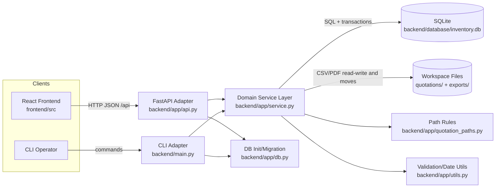
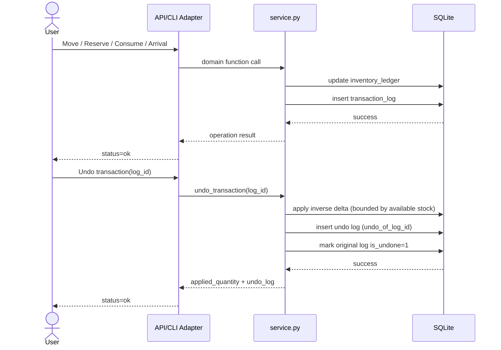
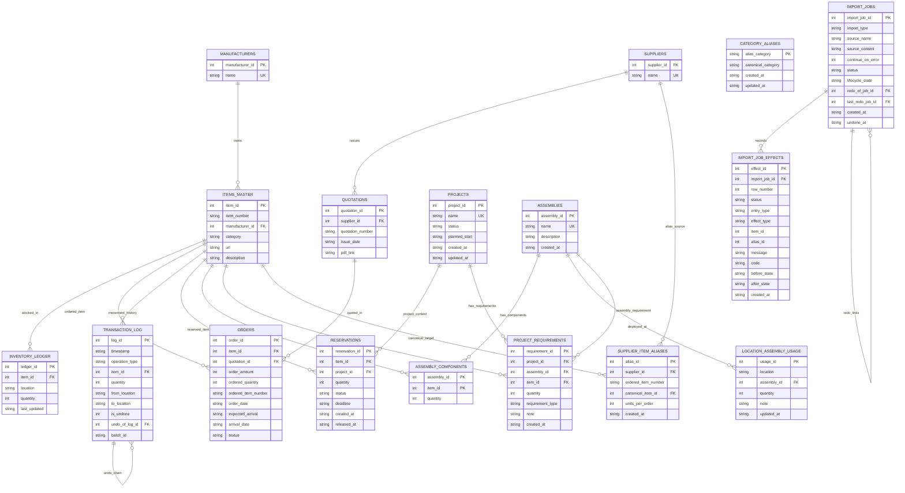

# Technical Documentation

## Purpose and Scope

This document explains the implemented architecture of the Materials Management application, its database design, and the key maintenance rules that keep behavior consistent across API, CLI, and file-based workflows.

## Operating Profile (Confirmed)

- Deployment posture: local-first personal usage today, with future migration path to shared multi-user operation.
- Auth posture: PoC runs without enforced authentication, but API/architecture should remain RBAC-ready (`admin`, `operator`, `viewer` planned).
- Timezone: fixed JST across backend date/time handling.
- Scale target: ~10,000 items, ~5,000 orders, ~100,000 transactions.
- Requirement precedence: `specification.md` > `documents/technical_documentation.md` > current code behavior.

## Software Architecture

### Projects planning UX notes (frontend)

- Added `/workspace` as the primary future-demand route.
  - default view: project summary dashboard with committed-vs-draft semantics
  - secondary view: committed pipeline table with cumulative generic-consumption metrics
  - deep-dive view: planning board with server-driven shortage rows and supply-source breakdowns
  - right-side drawer infrastructure provides local breadcrumb navigation for project, item, and RFQ context without leaving the board
  - project drawer now mounts the shared project editor, including preview-first bulk requirement entry
  - item drawer now combines inventory, incoming orders, item flow, and cross-project planning allocation context
  - RFQ drawer now mounts the shared RFQ batch/line editor instead of a read-only summary
  - board date state re-syncs to the effective planning `target_date` when the same project refreshes and no local preview edit is pending
  - drawer close, breadcrumb back, route leave, and drawer-stack truncation flows now guard unsaved project/RFQ drafts
  - item-scoped RFQ drawers keep the full batch visible while surfacing the focused item rows first
  - RFQ save flows selectively rehydrate the saved rows from refreshed server detail so backend-normalized values replace stale local drafts without discarding other unsaved rows
  - nested `CatalogPicker` Escape handling is scoped locally so dismissing picker results does not also trigger drawer close/discard flows
  - when `/workspace/summary` refresh removes the selected project, the page reselects the next valid project before issuing planning-analysis requests
  - hidden breadcrumb panels stay mounted for navigation continuity, but inactive project/item/RFQ panels suspend their SWR fetches and preload queries
  - project drawer RFQ metrics come from `workspace/summary` aggregate `rfq_summary` data rather than a paginated RFQ list slice
  - shared project/RFQ drawer editors backfill current selections when ids fall outside initial preload pages so existing links still render correctly
  - legacy `/projects`, `/planning`, and `/rfq` routes remain available for heavy edits and operational fallback
- The Projects page supports requirement target lookup via searchable item input (`datalist`) so users can select from large item registries faster than scrolling long select lists.
- Requirement entry includes a preview-first bulk text parser (`item_number,quantity` per line).
  - `POST /api/projects/requirements/preview` classifies each line as `exact`, `high_confidence`, `needs_review`, or `unresolved`
  - preview rows return ranked item candidates and allow manual correction through `CatalogPicker` before the frontend applies them into editable requirement rows
  - unresolved lines can still be applied as unregistered placeholder rows so operators can finish correction in the main requirement table
- Free-text target parsing accepts `#<id>` suffixes only when the parsed id exists in the currently loaded item/assembly options, preventing invalid IDs from being treated as matched entries.
- Existing projects can be loaded into the same form for edit/save flows (`GET /api/projects/{id}` then `PUT /api/projects/{id}`), including requirement composition updates.

### High-level Architecture (Mermaid)

### Why it is implemented this way

1. Single business-logic layer (`service.py`) is shared by API and CLI.
   This avoids duplicated logic and keeps behavior consistent for web and batch operations.
2. Current-state table + event log model.
   `inventory_ledger` gives fast current stock lookup, while `transaction_log` enables traceability and undo.
3. Filesystem-aware quotation ingestion.
   Orders are imported from CSV/PDF folders, then moved to canonical registered paths to preserve auditability.
4. Reversible bulk imports.
   Item imports store job and row-level effects (`import_jobs`, `import_job_effects`) so undo/redo can be state-checked and safe.
5. Migration-safe manual project assignment retention.
   DB migration backfills `orders.project_id_manual` for legacy rows that have `project_id` but no ORDERED RFQ ownership, preventing RFQ unlink synchronization from clearing historical manual assignments.
6. Alias-based normalization strategy.
   `supplier_item_aliases` maps supplier-specific ordered numbers to canonical items; `category_aliases` merges categories without destructive rewrites.
7. Local PoC with growth path.
   The current stack is intentionally simple (SQLite + single service layer) while preserving extension points for future RBAC and multi-user deployment.

### Inventory and Undo Flow (Mermaid)

## Database Structure (E-R Diagram)

Note: `CATEGORY_ALIASES` is intentionally not a strict foreign-key relation to `items_master.category`; it is a soft-merge mapping used during reads and filters.

## Maintenance Guidance

### 1) Business-rule centralization

- Add or change domain behavior in `backend/app/service.py`, then expose it through API/CLI adapters.
- Avoid adding business logic directly in `api.py` route handlers or CLI parser branches.

### 2) Inventory correctness invariants

- Every inventory-changing operation must update both:
  - `inventory_ledger` (current state)
  - `transaction_log` (audit trail and undo source)
- If you introduce a new `operation_type`, update:
  - `undo_transaction`
  - `get_inventory_snapshot` (past/future logic)
  - any dashboard/reporting code that depends on operation semantics

### 3) Item identity immutability

- Item identity (`item_number`, `manufacturer`) cannot be changed once referenced by orders/inventory/reservations/assemblies/projects/aliases.
- Metadata (`category`, `url`, `description`) remains editable.

### 4) Order and quotation file workflow

- Manual order import accepts only canonical registered PDF links or filename-only values.
- Unregistered batch import resolves/moves CSV and PDF files and rewrites links to canonical workspace-relative paths.
- Missing items discovered during unregistered batch import are aggregated into a single register CSV per batch run under `quotations/unregistered/missing_item_registers/` (instead of per-quotation output beside source CSVs).
- Consolidated missing-item rows are de-duplicated by `(supplier, manufacturer_name, item_number)` so repeated unresolved rows across quotations are emitted once per batch register CSV.
- Batch consolidation uses collision-safe temporary per-file register naming (supplier-prefixed) and deletes temporary files only after consolidated-register write succeeds.
- Consolidated register files may include rows from multiple suppliers; archive move in missing-item registration uses `registered/csv_files/UNKNOWN/` while preserving row-level supplier columns.
- In `missing_items_registration.csv`, `supplier` means the supplier alias namespace for ordered SKU resolution. `new_item` rows may optionally provide `manufacturer_name` (or `manufacturer`); blank values default to `UNKNOWN`.
- Registration inputs accept both `resolution_type` (`new_item`/`alias`) and legacy `row_type` (`item`/`alias`) to avoid mixed-template confusion; `row_type=item` is normalized to `resolution_type=new_item`.
- Manual and batch order imports reject quotations already imported for the same supplier (same `quotation_number` with existing orders), returning a conflict to avoid duplicate order ingestion.
- Per-file unregistered import must keep filesystem moves atomic: if any move fails, rollback already moved files for that CSV and return file-level error.
- File collisions are handled by non-destructive renaming (`_1`, `_2`, ...).
- Missing/unresolved PDF links are surfaced as warnings, not silent failures.
- Keep canonical layout:
  - `quotations/unregistered/csv_files/<supplier>/`
  - `quotations/unregistered/pdf_files/<supplier>/`
  - `quotations/registered/csv_files/<supplier>/`
  - `quotations/registered/pdf_files/<supplier>/`
  - `quotations/unregistered/missing_item_registers/`

### 5) Reservation partial-actions policy

- Reservation release/consume should support full and partial quantities.
- Full action transitions reservation status (`RELEASED` / `CONSUMED`).
- Partial action keeps status `ACTIVE` and decrements remaining reservation quantity.

### 5.1) Reservation allocation architecture (current)

- Reservation no longer physically moves inventory to `RESERVED`.
- Active reservation quantity is tracked in `reservation_allocations` by `(reservation_id, item_id, location)` rows.
- Availability for reservation and planning uses:
  - `available = inventory_ledger.on_hand - active_allocations`
- Consume acts on physical inventory locations referenced by active allocations, preserving location traceability.
- Release changes allocation status only (no inventory delta).

### 6) Import job undo/redo safety

- Undo is guarded by before/after state snapshots from `import_job_effects`.
- Undo should fail with conflict if rows were modified after import; do not bypass this check.
- Redo is only valid after the source job lifecycle is `undone`.
- Partial undo is acceptable when current stock/locations cannot satisfy full reversal.

### 7) Assembly policy boundary

- Current mode is advisory for planning and visibility.
- Target evolution is enforceable checks during active/operational phases, with explicit override+audit design.

### 8) Schema and migration discipline

- Keep migrations idempotent (`migrate_db` runs at startup).
- New columns/tables must be backward-safe for existing DB files.
- Preserve date normalization (`YYYY-MM-DD`) and trigger constraints around orders.

### 9) API contract consistency

- Response envelope is standardized:
  - success: `{ "status": "ok", "data": ... }`
  - error: `{ "status": "error", "error": { "code", "message", "details" } }`
- Keep frontend in sync when adding/changing payload shapes.

### 10) QA gate and release hygiene

- Minimum gate:
  - run backend full tests (`uv run python -m pytest`)
  - run frontend build check when frontend changed (`npm run build`)
  - run manual smoke checks for touched flows
- Keep docs in the same change set as behavior updates.
- For release history, maintain changelog/migration notes once GitHub repository workflow is established.

## Recommended update workflow

1. Change schema/migration in `app/db.py` if needed.
2. Update domain logic in `app/service.py`.
3. Expose endpoints/CLI routes in `app/api.py` and `main.py`.
4. Update frontend API usage/types in `frontend/src/lib`.
5. Add or update tests in `backend/tests`.

### Item flow traceability (item-first workflow)

- Added `GET /api/items/{item_id}/flow` for item-centric stock-change planning/traceability.
- Response merges three sources into a single timeline sorted by event time:
  - transaction-driven stock deltas (`transaction_log`)
  - planned stock increases from open orders with `expected_arrival`
  - planned stock decreases from active reservations with `deadline`
- UI integration: Item List row action opens a dedicated timeline panel showing **when**, **how many (+/-)**, and **why** (demand source reference/reason).

### BOM date-aware gap analysis

- Preview-first reconciliation endpoint:
  - `POST /api/bom/preview`
  - classifies supplier and item resolution per row as `exact`, `high_confidence`, `needs_review`, or `unresolved`
  - returns ranked supplier and item candidates plus projected canonical quantity / available stock / shortage for the suggested item match
  - preview does not create missing suppliers; it reuses the same non-destructive matching stack as the import-preview flows
- `POST /api/bom/analyze` now accepts optional `target_date` (`YYYY-MM-DD`).
- Domain rule (`service.analyze_bom_rows`):
  - no `target_date`: use current net available (`inventory_ledger.on_hand - active_allocations`)
  - with `target_date` (today/future): use
    `current_net_available + sum(open order_amount where expected_arrival <= target_date)`
- Supplier lookup during analyze is now non-creating:
  - unknown supplier labels no longer insert supplier master rows as a side effect of BOM analysis
  - direct canonical item numbers can still be analyzed without a registered supplier alias scope
- Validation:
  - `target_date` earlier than today is rejected with `422` / `INVALID_TARGET_DATE`.
- `POST /api/bom/reserve` remains current-stock reservation behavior (execution-time allocation); it does not reserve future arrivals.

### Sequential project planning pipeline

- Planning is no longer modeled as an isolated per-project gap check.
- Canonical planning endpoint: `GET /api/projects/{project_id}/planning-analysis`
- Supporting summary endpoint: `GET /api/planning/pipeline`
- Workspace summary endpoint: `GET /api/workspace/summary`
- Workspace planning export endpoint: `GET /api/workspace/planning-export`
- Item-side planning context endpoint: `GET /api/items/{item_id}/planning-context`
- Core domain rule (`service.project_planning_analysis` / `_build_project_planning_snapshot`):
  - committed projects are those with status `CONFIRMED` or `ACTIVE`
  - committed projects are processed in `planned_start` order
  - committed projects remain in the pipeline after their `planned_start` passes; missing committed start dates are treated as `today_jst()` for sequencing until a date is persisted
  - current stock starts from `inventory_ledger.on_hand - active_allocations`
  - generic future supply comes only from open orders with `project_id IS NULL`
  - project-dedicated supply comes from:
    - `QUOTED` RFQ lines with `expected_arrival`
    - open orders with `project_id = <project>`
  - dedicated supply is consumed before generic supply at the project start date
  - if a project is still short at its start date, that shortage becomes backlog demand
  - later generic arrivals satisfy older backlog before they become available to later projects
- Planning rows now include explicit `supply_sources_by_start` and `recovery_sources_after_start` arrays so the frontend can explain why one row is covered or short without reconstructing source usage in the browser.
- Pipeline summary rows now include:
  - `generic_committed_total`: generic supply consumed by that project across on-time allocation plus later generic recovery
  - `cumulative_generic_consumed_before_total`: generic supply already absorbed by earlier committed projects before the current project row
- Compatibility endpoint: `GET /api/projects/{project_id}/gap-analysis`
  - still returns `available_stock` / `shortage`
  - internally reads from the sequential planning engine instead of the old isolated projection rule
  - returns the effective `target_date` that the shared planning engine actually used
- `GET /api/workspace/summary` is intentionally aggregate-only:
  - committed rows include authoritative planning totals reused from the canonical pipeline snapshot
  - `PLANNING` rows return explicit `preview_required` semantics instead of unreliable inferred shortage numbers
  - project rows also include RFQ batch/line counts so the default workspace view does not issue per-project fan-out requests
- `GET /api/items/{item_id}/planning-context` is the drawer-side item drill-in contract:
  - returns one row per committed project, plus the selected preview project when applicable
  - reuses canonical planning metrics and source arrays so the frontend does not recalculate allocation behavior
  - supports workspace what-if review by accepting optional `preview_project_id` and `target_date`
  - narrows snapshot expansion to the requested item while still using the canonical sequential-planning rules
- `_build_project_planning_snapshot(...)` now batches the hot-path lookup work:
  - committed projects and requirements are loaded in one pass instead of repeated `get_project(...)` calls
  - assembly component rows are preloaded once per snapshot and reused across project requirement expansion
  - available inventory totals are precomputed per relevant item instead of re-queried inside the item loop
- `GET /api/workspace/planning-export` serializes the selected planning view into CSV:
  - includes committed pipeline rows, selected-project totals, selected-project item rows, and RFQ summary counts
  - reuses canonical planning analysis output instead of duplicating export-only planning logic

### Project RFQ workflow

- Added persistent RFQ tables:
  - `rfq_batches`
  - `rfq_lines`
- RFQ creation flow:
  - `POST /api/projects/{project_id}/rfq-batches`
  - creates line items from current on-time shortage rows only
  - accepts optional `target_date` so RFQ creation can reuse the planning date currently under review
  - auto-promotes a `PLANNING` project to `CONFIRMED` so later projects will net against it
  - when auto-promoted, the project persists the analysis `target_date` as `projects.planned_start`
- RFQ maintenance endpoints:
  - `GET /api/rfq-batches`
  - `GET /api/rfq-batches/{rfq_id}`
  - `PUT /api/rfq-batches/{rfq_id}`
  - `PUT /api/rfq-lines/{line_id}`
- RFQ line semantics:
  - `QUOTED` + `expected_arrival` => dedicated planned supply
  - `ORDERED` requires `linked_order_id`
  - non-`ORDERED` RFQ states clear `linked_order_id`, so quoted supply stays in the planning-only path
  - only `ORDERED` links set `orders.project_id`; removing or replacing the link clears/reassigns the dedicated order ownership to match the RFQ line state, and manual `/api/orders/{id}` project edits must not override that RFQ-owned assignment
  - splitting an RFQ-owned order must not clone that dedicated `project_id` onto the new sibling order, because RFQ ownership remains attached only to the original linked row

### Purchase candidate persistence (pre-PO planning)

- Added persistent shortage table `purchase_candidates` for planning between gap analysis and PO creation.
- New endpoints:
  - `GET /api/purchase-candidates`
  - `GET /api/purchase-candidates/{candidate_id}`
  - `POST /api/purchase-candidates/from-bom`
  - `POST /api/purchase-candidates/from-project/{project_id}`
  - `PUT /api/purchase-candidates/{candidate_id}`
- Status lifecycle for planning execution:
  - `OPEN` -> `ORDERING` -> `ORDERED`
  - `CANCELLED` for abandoned candidates
- Item mutation/deletion safeguards treat `purchase_candidates` as item references, so item delete conflicts surface as controlled `ITEM_REFERENCED` errors instead of raw FK exceptions.
- UI flow:
  - BOM page can persist shortages directly via `Save Shortages`.
  - Purchase Candidates page remains available for BOM / ad-hoc pre-PO tracking, but the main multi-project workflow now runs through Planning + RFQ.

### Order/quotation correction operations (UI + consistency)

- Correction endpoints:
  - `PUT /api/orders/{order_id}` updates open-order expected arrival metadata (`expected_arrival`) and supports partial ETA postponement via `split_quantity` (integer-safe split creates a second open order row).
  - `POST /api/orders/merge` merges two open split-compatible rows and appends lineage metadata.
  - `GET /api/orders/{order_id}/lineage` returns split/merge/arrival lineage events for traceability views and audits.
  - `PUT /api/quotations/{quotation_id}` updates quotation metadata.
  - `DELETE /api/orders/{order_id}` deletes open (non-arrived) orders.
  - `DELETE /api/quotations/{quotation_id}` deletes quotation and linked orders only when no linked order is already arrived.
- Consistency rule: when these operations mutate DB rows, matching order CSV records are rewritten/inserted/removed so CSV source files and database state do not diverge.
- Reliability/scalability posture: order split/merge transitions are persisted in `order_lineage_events` so future analytics/audit screens can read durable lineage without inferring history from mutable order rows.
- CSV row identity rule for order-level maintenance: `update_order`/`delete_order` must target exactly one CSV row by order identity (including duplicate `(supplier, quotation_number, item_number)` occurrences) to prevent fan-out edits/deletes when a quotation contains repeated item rows.

## CSV import extensions (movements/reservations)

- Added API endpoints:
  - `POST /api/inventory/import-csv` (multipart CSV, optional `batch_id`)
  - `POST /api/reservations/import-csv` (multipart CSV)
  - `GET /api/items/import-template`, `GET /api/items/import-reference`
  - `GET /api/inventory/import-template`, `GET /api/inventory/import-reference`
  - `GET /api/orders/import-template`, `GET /api/orders/import-reference`
  - `GET /api/reservations/import-template`, `GET /api/reservations/import-reference`
- Movement CSV rows are normalized into existing `batch_inventory_operations`, preserving transaction log semantics and undo behavior consistency.
- Reservation CSV supports assembly references by assembly name/id and expands to component-level reservations; this reuses assembly data efficiently for planning input while keeping assembly behavior advisory.
- Template CSV endpoints return header-only files encoded as UTF-8 with BOM for Excel compatibility; reference endpoints render live canonical DB values on demand so the frontend does not maintain duplicated template/reference logic.
- Orders import reference supports optional `supplier_name` scoping so alias rows match the supplier currently selected in the write flow while canonical item rows remain available for direct item-number imports.
- Manual CSV imports now support preview-first reconciliation:
  - `POST /api/items/import-preview` classifies item rows as new-vs-duplicate and alias rows as create/update/review/unresolved before commit
  - `POST /api/items/import` accepts optional multipart JSON `row_overrides` so preview confirmation can pin `canonical_item_number` and `units_per_order` for alias rows
  - `POST /api/inventory/import-preview` validates movement rows against operation/location rules, simulates stock deltas in CSV order, and flags item resolution or stock-shortage problems before commit
  - `POST /api/inventory/import-csv` accepts optional multipart JSON `row_overrides` so preview confirmation can substitute canonical `item_id` values
  - `POST /api/orders/import-preview` parses the upload, classifies rows (`exact`, `high_confidence`, `needs_review`, `unresolved`), ranks candidate matches, and reports duplicate quotation conflicts before commit
  - preview uses direct canonical item numbers, supplier-scoped aliases, normalized equality, and fuzzy ranking, but does not create a missing supplier during preview
  - `POST /api/orders/import` now accepts optional multipart JSON fields `row_overrides` and `alias_saves` so preview-confirmation can pin canonical items/units and persist supplier aliases after duplicate checks pass
  - `POST /api/reservations/import-preview` validates item/assembly target resolution, previews assembly expansion into generated component reservations, and flags inventory shortages before commit
  - `POST /api/reservations/import-csv` accepts optional multipart JSON `row_overrides` so preview confirmation can choose `item_id` or `assembly_id` targets explicitly; that explicit override wins over stale raw CSV target text during commit
  - preview-confirmation JSON is strict across these flows: malformed JSON, wrong top-level shapes, missing required keys, unsupported fields, and row numbers not present in the uploaded CSV all return controlled `422` responses instead of uncaught server errors

## Catalog search / picker foundation

- Added `GET /api/catalog/search?q=...&types=item,assembly,supplier,project&limit_per_type=8`.
- Current search coverage:
  - `item`: canonical item number, manufacturer, category, description, supplier alias text, and alias supplier name
  - `assembly`: assembly name and description
  - `supplier`: supplier name
  - `project`: project name and description
- Search returns typed rows with `entity_type`, `entity_id`, `value_text`, `display_label`, `summary`, and `match_source`; the frontend groups them by entity type.
- Frontend now has a reusable `CatalogPicker` component with:
  - keyboard navigation (`ArrowUp`, `ArrowDown`, `Enter`, `Escape`)
  - `localStorage` recent selections
  - single-select and multi-select support
  - inline or popover result presentation
  - single-select query text resync when the parent value changes while the picker is open, so preview correction panels stay aligned after external edits/reset
- Current rollout:
  - Projects page requirement selector now uses `CatalogPicker` for item and assembly targets
  - Projects quick bulk-parser preview also uses `CatalogPicker` for manual item correction before rows are applied
  - Assemblies page component selector now uses `CatalogPicker` for item lookup
  - BOM spreadsheet entry now uses `CatalogPicker` in type-or-search mode for supplier and item cells
  - BOM preview reconciliation also uses `CatalogPicker` for supplier and item overrides before analyze/reserve/save
  - Movements entry now uses `CatalogPicker` for item selection in the unified single/batch movement table
  - Adding a new movement row inherits the latest completed `from/to` locations to speed repeated transfer entry
  - Reservations entry now uses `CatalogPicker` for item selection
  - Items, Orders, Movements, and Reservations import preview rows now use the same catalog-search payload for reconciliation corrections
  - Orders import supplier selection also uses the same picker/search contract
  - preview-first flows now preserve an explicit cleared selection instead of silently falling back to a stale suggested match
