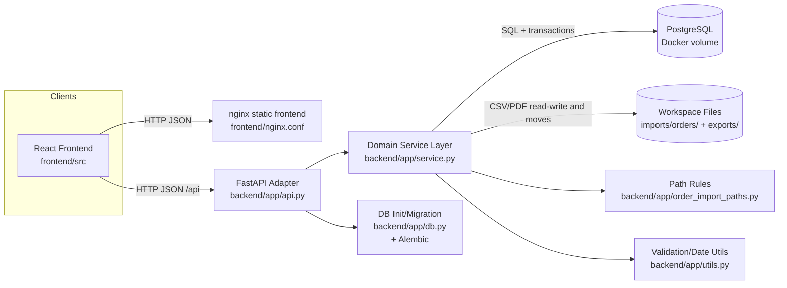
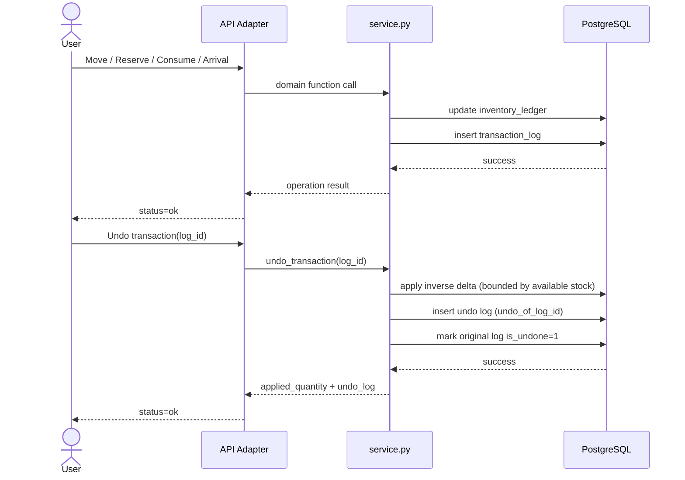

# Technical Documentation

## Purpose and Scope

This document explains the implemented architecture of the Materials Management application, its database design, and the key maintenance rules that keep behavior consistent across API and file-based workflows.

## Deployment Architecture

- Backend targets PostgreSQL through a SQLAlchemy-managed engine and Alembic baseline migration.
- The raw-SQL service layer is preserved behind a compatibility connection wrapper while the storage engine is PostgreSQL.
- `init_db(database_url=...)` is the authoritative migration target; startup/test helpers should not rely on ambient `DATABASE_URL` overriding an explicit connection string.
- Alembic CLI execution now also prefers `DATABASE_URL` over the fallback `backend/alembic.ini` localhost URL, so Cloud Run migration jobs use Secret Manager-provided Cloud SQL connection strings instead of accidentally targeting `127.0.0.1`.
- Runtime mode is now explicit.
  - local/shared-server Docker mode: `APP_RUNTIME_TARGET=local`
  - Cloud Run mode: `APP_RUNTIME_TARGET=cloud_run` or implicit Cloud Run `K_SERVICE`
  - Cloud Run mode defaults runtime file roots under the OS temp directory and no longer performs historical workspace folder migration
  - Cloud Run mode defaults `AUTO_MIGRATE_ON_STARTUP` to off, so Alembic can run as a deployment step instead of on autoscaled request-serving startup
  - DB engine tuning is environment-driven through `DB_POOL_SIZE`, `DB_MAX_OVERFLOW`, `DB_POOL_TIMEOUT`, and `DB_POOL_RECYCLE_SECONDS`
  - first-rollout request guardrails are environment-driven through `MAX_UPLOAD_BYTES` (default 32 MB), `HEAVY_REQUEST_TARGET_SECONDS` (default 60), and `CLOUD_RUN_CONCURRENCY_TARGET` (default 10)
  - deployment metadata is now explicit through `INSTANCE_CONNECTION_NAME`, `BACKEND_PUBLIC_BASE_URL`, and `FRONTEND_PUBLIC_BASE_URL`
- CORS posture is now explicit by runtime.
  - local defaults allow the common localhost frontend origins
  - Cloud Run defaults to no allowed browser origins until `CORS_ALLOWED_ORIGINS` is set explicitly
- Docker deployment stack:
  - `docker-compose.yml` (production), `docker-compose.override.yml` (local dev), `docker-compose.test.yml` (test DB)
  - `backend/Dockerfile`, `frontend/Dockerfile`, `frontend/nginx.conf`, `frontend/nginx.local-proxy.conf`
  - the built frontend image keeps a cloud-first nginx config that does not proxy `/api`; local Docker Compose mounts `frontend/nginx.local-proxy.conf` to preserve same-origin `/api` access
- Bearer-token identity and RBAC:
  - API/browser calls use `Authorization: Bearer <JWT>`
  - verified claims are normalized into `request.state.identity` (`subject`, `email`, `provider`, `claims`, optional `hosted_domain`)
  - app users are resolved into `request.state.user` through active `users` rows using `email` or `identity_provider` + `external_subject`, with optional hosted-domain matching
  - configured OIDC hosted-domain allow-lists only reject tokens that actually carry an `hd` claim; per-user hosted-domain mappings remain enforced when configured
  - browser login now supports Identity Platform email/password sign-in when `VITE_IDENTITY_PLATFORM_API_KEY` is configured, while manual token entry remains as a local/test fallback
  - database-side audit triggers continue to populate `created_by` / `updated_by` / `performed_by` where supported
  - application-level domain audit events are now emitted through structured logs for successful high-impact mutations and export/download flows
  - `AUTH_MODE` controls auth posture: `none`, `oidc_dry_run`, `oidc_enforced`
  - `RBAC_MODE` controls authorization posture: `none`, `rbac_dry_run`, `rbac_enforced`
  - `JWT_VERIFIER` supports `shared_secret` and `jwks`; deployed OIDC verification uses `OIDC_JWKS_URL`
  - Identity Platform / Google-signed ID tokens require `JWT_SIGNING_ALGORITHMS=RS256` instead of the local fixture default
  - `/api/users*` is admin-only, normal mutations/exports/imports are operator scope, and authenticated reads default to viewer scope
  - supported persisted user roles are constrained to `admin`, `operator`, and `viewer` on both create and update flows
  - duplicate username/email/OIDC identity collisions in admin user CRUD are normalized into domain `409` errors instead of raw database failures
  - bootstrap exception: `POST /api/users` is allowed without Bearer auth only while the system has zero active users
- Frontend user administration at `/users` page.
  - admins manage `username`, display name, role, active state, and OIDC mapping fields
  - the global shell now stores a Bearer token and resolves the current user through `/api/users/me`
  - signed-in identities that are not yet mapped to an active app user now go through a dedicated `/registration` route instead of seeing generic fetch failures
  - signed-in identities whose tokens are rejected because `email_verified=true` is required now go through a dedicated `/verify-email` route with verification-mail resend support
  - the verify-email route now also consumes Identity Platform email-action links (`mode=verifyEmail` + `oobCode`) and applies the verification code before refreshing the stored session, so the browser flow does not depend on the Google-hosted default handler alone
  - `/verify-email` now also offers an explicit "I have verified this email" action that refreshes the stored Identity Platform session immediately, so the UI does not stay stuck on an old unverified ID token after the user completes verification in another tab/window
  - the verify-email refresh path now also performs an Identity Toolkit account lookup and retries one token refresh when the backend account state is verified but the first refreshed ID token still carries a stale `email_verified=false` claim
  - the shared shell now supports both sign-in and sign-up against Identity Platform email/password, and newly created accounts immediately trigger verification-mail delivery through the Identity Toolkit REST API
  - login and verify-email success flows now land on `/registration` first; approved users are redirected onward to `/`, while unapproved users no longer briefly land on the mostly empty dashboard
  - the `/registration` holding flow now periodically re-checks approval state only for confirmed waiting states (`pending` and inactive previously `approved` identities), so admin approval/reactivation in another browser/session can promote the applicant without forcing a manual sign-out/sign-in cycle while anonymous, rejected, and generic error states stay quiet
  - hosted cloud UX now hides the manual bearer-token fallback entry by default; that token override remains visible only for local/test-style localhost operation
  - anonymous dashboard access now stops at explicit sign-in guidance instead of trying to load protected data and misreporting backend unavailability
  - self-registration requests are stored separately from active users so approval history can be retained without polluting the `users` table
  - applicants submit `username`, required `display_name`, requested role, and optional memo; email comes from the verified token identity
  - admins approve or reject requests inside `/users`; approval can override username/display name/role, rejection requires a reason, and both actions are recorded with reviewer metadata
  - the Users page now trims identity-mapping internals from the main operator UI: normal manual recovery creation is email-first, while raw `sub` mapping is tucked under an advanced section and provider/domain internals are no longer shown as first-class fields
  - pending users cannot access the rest of the application; they can only read registration status and wait/reapply after rejection
  - frontend request handling now classifies auth failures, backend-unavailable failures, and generic API failures so cloud login and dashboard errors no longer collapse into a generic "Failed to fetch" UX
  - the shell now shows a persistent sign-in guidance callout while anonymous, and workspace/dashboard views surface a dedicated "environment unavailable" message when Cloud SQL or the backend is down
  - the same auth/backend-unavailable messaging is now reused across the other major routed pages (Orders, Items, Projects, Inventory, Reservations, History) and supporting editors so protected-page failures no longer surface as raw exception text
  - create/update/deactivate flows emit a frontend refresh signal so the shared header picker stays aligned
- Frontend styling runtime now uses Tailwind CSS v4 in CSS-first mode.
  - `frontend/src/index.css` is the source of truth for theme tokens through `@theme inline`
  - `frontend/postcss.config.js` uses `@tailwindcss/postcss`
  - `frontend/tailwind.config.ts` remains as a minimal compatibility file and no longer carries the active theme contract
- The browser-facing item registration flow is now unified around the preview-first Items CSV import.
  - order-generated missing-item CSVs are downloaded to the browser, edited, and re-imported through `POST /api/items/import-preview` + `POST /api/items/import`
  - the Items page no longer exposes a dedicated missing-item resolver or batch-upload section
  - bulk alias entry now uses a dedicated alias upsert-by-supplier-name API instead of the older `register-missing` compatibility endpoints
  - Bulk Item Entry manufacturer and alias-supplier fields remain free-text, but now also expose a shared accessible combobox with filterable suggestions from the registered manufacturer and supplier masters
  - the Orders page no longer exposes or depends on ZIP/PDF batch upload behavior
  - item import jobs are finalized in the DB before the registered-history archive copy is written, so a failed request commit cannot leave a history archive behind without the matching DB mutation/import-job state
- Manual Orders CSV import now uses external document URLs as the primary contract.
  - `supplier` is required on every imported order CSV row
  - `quotation_document_url` is required and stored as a normalized non-empty document reference string
  - `purchase_order_document_url` is optional and stored as a normalized non-empty document reference string when present
  - `purchase_order_number` is the canonical purchase-order header identity; the import lock key is `(supplier_id, purchase_order_number)`
  - multiple rows for the same supplier + purchase-order number in a single import reuse one purchase-order header instead of blocking the second line
  - `purchase_order_document_url` is descriptive metadata only and no longer determines purchase-order header identity
  - migration backfill assigns stable `LEGACY-PO-<purchase_order_id>` numbers to legacy purchase-order headers and keeps those existing headers unlocked so earlier data stays uniquely addressable
  - line-level document-reference edits still flow through the header model: changing a line's purchase-order document reference updates the current header metadata when appropriate or reattaches the line to an existing same-supplier header already using that value
  - the Orders UI opens HTTPS references as document links and shows other references as plain text
  - `frontend/src/features/orders/OrdersPage.tsx` now acts as a thin orchestration shell: SWR data fetching and import-preview state stay in the parent, while line/quotation/purchase-order browsing and edit state live in dedicated section components
  - order import jobs now persist `request_metadata` so `supplier_id`, `supplier_name`, `row_overrides`, `alias_saves`, and `unlock_purchase_orders` remain available for inspection and redo
  - `POST /api/purchase-order-lines/import-jobs/{import_job_id}/undo` and `POST /api/purchase-order-lines/import-jobs/{import_job_id}/redo` now provide the same safety-first operator pattern already used by item imports
- Generated artifact delivery for batch-produced missing-item register CSVs:
- `GET /api/artifacts`, `GET /api/artifacts/{artifact_id}`, `GET /api/artifacts/{artifact_id}/download`
- storage-backed registry now goes through `backend/app/storage.py`
- current implementation persists generated artifacts under a local storage reference (`local://generated_artifacts/...`) so the API no longer depends on browser-visible workspace paths
- storage now supports both `local://...` and `gcs://...` refs; Cloud Run durable storage can use `STORAGE_BACKEND=gcs` with `GCS_BUCKET` and `GCS_OBJECT_PREFIX`
- the Orders UI now treats artifact entries as download-only records and no longer displays workspace-relative paths
- generated artifact lookups now require storage-backed refs; raw filesystem artifact paths are no longer part of the active runtime contract
- Stock Snapshot CSV export now uses a direct response download endpoint (`GET /api/inventory/snapshot/export.csv`) that reuses the same `date`, `mode`, and `basis` parameters as the JSON snapshot view
- the Snapshot page exposes that export as a browser download action beside `Generate Snapshot`; the exported rows stay aligned with the backend snapshot calculation, including `net_available` allocation summary columns
- Manual Items CSV import archives now use the same storage boundary for their archive reference metadata, and the registered-month folder is treated as read-only history instead of a consolidation work queue.
- Default durable move targets for registered item CSVs and registered order CSV/PDF files now also route through the storage layer, while request-scoped staging remains local-path based.
- Retired order-batch compatibility internals have been removed.
  - no `orders_legacy_batch` import-job mode remains in the schema
  - no `legacy_batch_staged_files` table remains in the runtime model
  - artifact metadata is now browser-facing (`filename`, timestamps, size, detail/download endpoints) rather than a UI contract around `relative_path`
- `backend/main.py` is a server entrypoint only (no CLI).
- `/api/health` now reports runtime posture fields useful for deployment validation:
  - `runtime_target`
  - `cloud_run_mode`
  - `app_data_root`
  - `app_port`
  - upload/concurrency guardrails
  - Cloud SQL strategy/configuration presence
  - storage backend summary and public-url metadata
  - repo-visible recovery policy metadata for Cloud SQL PITR, GCS retention/versioning, and post-restore validation expectations
  - temporary mutation-identity posture
  - diagnostics exposure posture through `diagnostics.auth_role`
- dedicated probe endpoints now separate lightweight liveness from dependency readiness:
  - `GET /healthz` for fast process liveness
  - `GET /readyz` for DB-backed readiness checks suitable for Cloud Run
  - `GET /api/health` and `GET /api/auth/capabilities` now default to `admin` exposure in Cloud Run unless `DIAGNOSTICS_AUTH_ROLE` explicitly relaxes that
- backend request/application logging now supports structured JSON output via `STRUCTURED_LOGGING`, including request IDs, latency, status, auth mode, and startup/shutdown events.

## Operating Profile (Confirmed)

- Deployment posture: shared-server Docker Compose deployment (PostgreSQL + backend + nginx/frontend).
- Auth posture: PoC runs without enforced authentication, but API/architecture should remain RBAC-ready (`admin`, `operator`, `viewer` planned).
- Timezone: fixed JST across backend date/time handling.
- Scale target: ~10,000 items, ~5,000 orders, ~100,000 transactions.
- Requirement precedence: `documents/specification.md` > `documents/technical_documentation.md` > current code behavior.

## Software Architecture

### Redesign status (2026-03-23)

- The active direction is procurement-first: legacy RFQ and purchase-candidate flows are being consolidated behind `procurement_batches` and `procurement_lines`.
- Project requirements are item-only in the primary UI path. Assembly-based planning is no longer part of the target design.
- The canonical navigation now favors `/workspace` for planning analysis and `/procurement` for shortage follow-up.
- Temporary backend/API compatibility shims remain for some legacy RFQ, assembly, and purchase-candidate routes while the redesign settles.
- Legacy assembly-backed project requirements are preserved on project update when the item-only editor does not send them back, and the editor warns that those preserved rows are not editable in the current item-only form.
- Workspace procurement creation can explicitly confirm a `PLANNING` project and persist the active planning date so the procurement-first path keeps the prior project-confirmation behavior.
- Workspace planning board now also supports `Confirm Allocation`, which persists current on-time generic coverage by:
  - converting stock-backed coverage into project reservations
  - assigning fully consumed generic orders to the project
  - splitting partially consumed generic orders, then assigning only the consumed child row
  - allowing dry-run preview for `PLANNING` projects but rejecting execute until the project is `CONFIRMED` or `ACTIVE`
  - rejecting stale confirmations when the planning snapshot no longer matches the preview signature

### Projects planning UX notes (frontend)

- Added `/workspace` as the primary future-demand route.
  - default view: project summary dashboard with committed-vs-draft semantics
  - secondary view: committed pipeline table with cumulative generic-consumption metrics
  - deep-dive view: planning board with server-driven shortage rows and supply-source breakdowns
  - planning board rows now summarize later recovery as compact outcome text (`Recovered by ...`, `Resolved on ...`, or `Still short ...`) instead of showing only aggregate recovered quantity
  - undated recovery sources are treated as unknown-date recovery in those summaries and burndown rows instead of rendering backend null placeholders
  - frontend routing now boots through a React Router data router (`createBrowserRouter` + `RouterProvider`)
- workspace route-leave protection now uses `useBlocker` plus an explicit confirmation effect instead of `unstable_usePrompt`, avoiding stale blocked-navigation state after leaving workspace/RFQ flows
  - right-side drawer infrastructure provides local breadcrumb navigation for project, item, and procurement context without leaving the board
  - project drawer now mounts the shared project editor, including preview-first bulk requirement entry
  - item drawer now combines inventory, incoming orders, item flow, and cross-project planning allocation context
  - item planning context cards now include a chronological recovery burndown table showing how the initial start-date gap burns down across dated recovery sources
  - legacy RFQ drawer paths are being reduced in favor of the dedicated `/procurement` page and procurement summary links
  - board date state re-syncs to the effective planning `target_date` when the same project refreshes and no local preview edit is pending
  - when a project's stored `planned_start` is already in the past, the Planning Board keeps that persisted value unchanged but initializes the board analysis date to `today_jst()` so future-only planning endpoints remain usable without erasing the delay history
  - drawer close, breadcrumb back, route leave, and drawer-stack truncation flows now guard unsaved project/RFQ drafts
  - item-scoped RFQ drawers keep the full batch visible while surfacing the focused item rows first
  - RFQ save flows selectively rehydrate the saved rows from refreshed server detail so backend-normalized values replace stale local drafts without discarding other unsaved rows
  - nested `CatalogPicker` Escape handling is scoped locally so dismissing picker results does not also trigger drawer close/discard flows
  - when `/workspace/summary` refresh removes the selected project, the page reselects the next valid project before issuing planning-analysis requests
  - hidden breadcrumb panels stay mounted for navigation continuity, but inactive project/item/RFQ panels suspend their SWR fetches and preload queries
  - project drawer RFQ metrics come from `workspace/summary` aggregate `rfq_summary` data rather than a paginated RFQ list slice
  - shared project/RFQ drawer editors backfill current selections when ids fall outside initial preload pages so existing links still render correctly
  - shared RFQ linked-order selectors now lazy-load per active row and keep the current selection visible from saved metadata, avoiding eager option rendering across the whole batch
  - shared RFQ editors now page the line table (25/50/100 rows) so large batches do not mount the entire editable grid at once during route changes
  - legacy `/planning` and `/rfq` routes have been **removed from the router**; `PlanningPage.tsx` and `RfqPage.tsx` remain as unused source files. Unsupported paths fall through to the `*` wildcard catch-all and redirect to `/`.
- The Projects page supports requirement target lookup via `CatalogPicker` so users can search and select from large item registries.
  - item candidate summaries include manufacturer, category, and description text to disambiguate similar part numbers during selection
- Requirement entry includes a preview-first bulk text parser (`item_number,quantity` per line).
  - `POST /api/projects/requirements/preview` classifies each line as `exact`, `high_confidence`, `needs_review`, or `unresolved`
  - preview rows return ranked item candidates and allow manual correction through `CatalogPicker` before the frontend applies them into editable requirement rows
- `POST /api/projects/requirements/preview/unresolved-items.csv` exports unresolved preview rows plus review rows that only have fuzzy/non-exact suggestions as an Items import-compatible CSV with default `row_type=item`, `manufacturer_name=UNKNOWN`, and `units_per_order=1`; exact/duplicate review rows stay excluded so already-registered item numbers are not re-exported, and the Projects UI sends the reviewed preview snapshot so export stays aligned with the visible preview even if the textarea changes later
  - unresolved lines can still be applied as unregistered placeholder rows so operators can finish correction in the main requirement table
- Free-text target parsing accepts `#<id>` suffixes only when the parsed id exists in the currently loaded item/assembly options, preventing invalid IDs from being treated as matched entries.
- Existing projects can be loaded into the same form for edit/save flows (`GET /api/projects/{id}` then `PUT /api/projects/{id}`), including requirement composition updates.

### High-level Architecture (Mermaid)



### Why it is implemented this way

1. Single business-logic layer (`service.py`) is shared by all API routes.
   This avoids duplicated logic and keeps behavior consistent across all operations.
2. Current-state table + event log model.
   `inventory_ledger` gives fast current stock lookup, while `transaction_log` enables traceability and undo.
3. Filesystem-aware order ingestion.
     Orders are imported from CSV/PDF folders, then moved to canonical registered paths to preserve auditability.
    Order import now requires canonical `quotation_document_url` values; legacy `pdf_link` compatibility has been removed.
    Imported order CSVs are historical artifacts only; order and quotation edits now use database state as the source of truth and do not rescan or rewrite archived CSV content.
    Shared-server upload adapters are now limited to request-scoped temporary files where needed; the Items missing-item batch path processes uploaded CSV bytes directly.
    Generated artifact retrieval is now routed through a storage boundary so the public API can use opaque artifact IDs instead of raw file locations.
    Cloud Run mode no longer trusts legacy raw-path artifact fallback.
4. Reversible and inspectable bulk imports.
   Item imports store job and row-level effects (`import_jobs`, `import_job_effects`) so undo/redo can be state-checked and safe.
   Manual order CSV imports now also write `import_jobs` / `import_job_effects` records (`import_type='orders'`) so missing-item outcomes and created-order rows are inspectable without relying on folder state.
   Duplicate supplier/manufacturer creation and delete-time FK races on core CRUD paths are normalized into domain `409` responses instead of bubbling raw database integrity errors.
   Order undo/redo now also snapshots quotation and supplier-alias side effects, and it refuses to undo when imported orders, quotations, or aliases no longer match the recorded post-import state.
   Backend pytest fixtures remap workspace import/export roots into per-test temporary directories so import-related tests cannot leak CSV artifacts into the real repository workspace.
5. Migration-safe manual project assignment retention.
   DB migration backfills `orders.project_id_manual` for legacy rows that have `project_id` but no ORDERED RFQ ownership, preventing RFQ unlink synchronization from clearing historical manual assignments.
6. Alias-based normalization strategy.
   `supplier_item_aliases` maps supplier-specific ordered numbers to canonical items; `category_aliases` merges categories without destructive rewrites.
7. Docker Compose deployment with growth path.
   The current stack uses PostgreSQL via Docker Compose with a single service layer, preserving extension points for future RBAC enforcement and horizontal scaling.

### Inventory and Undo Flow (Mermaid)



## Database Structure (E-R Diagram)

```mermaid
erDiagram
    MANUFACTURERS {
        int manufacturer_id PK
        string name UK
    }

    SUPPLIERS {
        int supplier_id PK
        string name UK
    }

    ITEMS_MASTER {
        int item_id PK
        string item_number
        int manufacturer_id FK
        string category
        string url
        string description
    }

    INVENTORY_LEDGER {
        int ledger_id PK
        int item_id FK
        string location
        int quantity
        string last_updated
    }

    QUOTATIONS {
        int quotation_id PK
        int supplier_id FK
        string quotation_number
        string issue_date
        string quotation_document_url
    }

    PURCHASE_ORDERS {
        int purchase_order_id PK
        int supplier_id FK
        string purchase_order_document_url
    }

    ORDERS {
        int order_id PK
        int purchase_order_id FK
        int item_id FK
        int quotation_id FK
        int order_amount
        int ordered_quantity
        string ordered_item_number
        string order_date
        string expected_arrival
        string arrival_date
        string status
    }

    TRANSACTION_LOG {
        int log_id PK
        string timestamp
        string operation_type
        int item_id FK
        int quantity
        string from_location
        string to_location
        int is_undone
        int undo_of_log_id FK
        string batch_id
    }

    PROJECTS {
        int project_id PK
        string name UK
        string status
        string planned_start
        string created_at
        string updated_at
    }

    RESERVATIONS {
        int reservation_id PK
        int item_id FK
        int project_id FK
        int quantity
        string status
        string deadline
        string created_at
        string released_at
    }

    ASSEMBLIES {
        int assembly_id PK
        string name UK
        string description
        string created_at
    }

    ASSEMBLY_COMPONENTS {
        int assembly_id PK
        int item_id PK
        int quantity
    }

    LOCATION_ASSEMBLY_USAGE {
        int usage_id PK
        string location
        int assembly_id FK
        int quantity
        string note
        string updated_at
    }

    PROJECT_REQUIREMENTS {
        int requirement_id PK
        int project_id FK
        int assembly_id FK
        int item_id FK
        int quantity
        string requirement_type
        string note
        string created_at
    }

    SUPPLIER_ITEM_ALIASES {
        int alias_id PK
        int supplier_id FK
        string ordered_item_number
        int canonical_item_id FK
        int units_per_order
        string created_at
    }

    CATEGORY_ALIASES {
        string alias_category PK
        string canonical_category
        string created_at
        string updated_at
    }

    IMPORT_JOBS {
        int import_job_id PK
        string import_type
        string source_name
        string source_content
        int continue_on_error
        string status
        string lifecycle_state
        int redo_of_job_id FK
        int last_redo_job_id FK
        string created_at
        string undone_at
    }

    IMPORT_JOB_EFFECTS {
        int effect_id PK
        int import_job_id FK
        int row_number
        string status
        string entry_type
        string effect_type
        int item_id
        int alias_id
        string message
        string code
        string before_state
        string after_state
        string created_at
    }

    USERS {
        int user_id PK
        string username UK
        string display_name
        string role
        bool is_active
        string created_at
        string updated_at
    }

    RESERVATION_ALLOCATIONS {
        int allocation_id PK
        int reservation_id FK
        int item_id FK
        string location
        int quantity
        string status
        string created_at
        string released_at
        string note
    }

    PROCUREMENT_BATCHES {
        int batch_id PK
        int project_id FK
        string status
        string target_date
        string note
        string created_at
        string updated_at
    }

    PROCUREMENT_LINES {
        int line_id PK
        int batch_id FK
        int item_id FK
        int required_quantity
        int finalized_quantity
        string supplier_name
        string status
        string expected_arrival
        int linked_purchase_order_line_id FK
        string note
    }

    ORDER_LINEAGE_EVENTS {
        int event_id PK
        string event_type
        int source_purchase_order_line_id FK
        int target_purchase_order_line_id FK
        string metadata
        string created_at
    }

    MANUFACTURERS ||--o{ ITEMS_MASTER : owns
    ITEMS_MASTER ||--o{ INVENTORY_LEDGER : stocked_in
    SUPPLIERS ||--o{ QUOTATIONS : issues
    QUOTATIONS ||--o{ ORDERS : quoted_in
    ITEMS_MASTER ||--o{ ORDERS : ordered_item
    ITEMS_MASTER ||--o{ TRANSACTION_LOG : movement_history
    TRANSACTION_LOG ||--o{ TRANSACTION_LOG : undo_chain
    ITEMS_MASTER ||--o{ RESERVATIONS : reserved_item
    PROJECTS ||--o{ RESERVATIONS : project_context
    ASSEMBLIES ||--o{ ASSEMBLY_COMPONENTS : has_components
    ITEMS_MASTER ||--o{ ASSEMBLY_COMPONENTS : component_item
    ASSEMBLIES ||--o{ LOCATION_ASSEMBLY_USAGE : deployed_at
    PROJECTS ||--o{ PROJECT_REQUIREMENTS : has_requirements
    ASSEMBLIES ||--o{ PROJECT_REQUIREMENTS : assembly_requirement
    ITEMS_MASTER ||--o{ PROJECT_REQUIREMENTS : item_requirement
    SUPPLIERS ||--o{ SUPPLIER_ITEM_ALIASES : alias_source
    ITEMS_MASTER ||--o{ SUPPLIER_ITEM_ALIASES : canonical_target
    IMPORT_JOBS ||--o{ IMPORT_JOB_EFFECTS : records
    IMPORT_JOBS ||--o{ IMPORT_JOBS : redo_links
    RESERVATIONS ||--o{ RESERVATION_ALLOCATIONS : allocates
    ITEMS_MASTER ||--o{ RESERVATION_ALLOCATIONS : allocated_item
    PROJECTS ||--o{ PROCUREMENT_BATCHES : procurement_context
    PROCUREMENT_BATCHES ||--o{ PROCUREMENT_LINES : has_lines
    ITEMS_MASTER ||--o{ PROCUREMENT_LINES : procured_item
    ORDERS ||--o{ ORDER_LINEAGE_EVENTS : lineage_source
    ORDERS ||--o{ ORDER_LINEAGE_EVENTS : lineage_target
```



Note: `CATEGORY_ALIASES` is intentionally not a strict foreign-key relation to `items_master.category`; it is a soft-merge mapping used during reads and filters.

## Maintenance Guidance

### 1) Business-rule centralization

- Add or change domain behavior in `backend/app/service.py`, then expose it through API adapters in `api.py`.
- Avoid adding business logic directly in `api.py` route handlers.

### 2) Inventory correctness invariants

- Every inventory-changing operation must update both:
  - `inventory_ledger` (current state)
  - `transaction_log` (audit trail and undo source)
- If you introduce a new `operation_type`, update:
  - `undo_transaction`
  - `get_inventory_snapshot` (past/future logic)
  - any dashboard/reporting code that depends on operation semantics
- Snapshot basis contract:
  - `basis=raw` preserves location-state reconstruction semantics
  - `basis=net_available` is a future/current residual-stock view built from `available = inventory_ledger.on_hand - active_allocations`, plus open orders due by the selected date
  - `basis=net_available` rows also expose a compact occupation summary (`allocated_quantity`, `active_reservation_count`, `allocated_project_names`) for the same `(item, location)` so Snapshot can answer "who is occupying this stock?" at a glance without duplicating Workspace-level allocation detail
  - do not claim historical `net_available` support unless allocation-history reconstruction is implemented; the current API rejects `mode=past&basis=net_available`

### 3) Item identity immutability

- Item identity (`item_number`, `manufacturer`) cannot be changed once referenced by orders/inventory/reservations/assemblies/projects/aliases.
- Metadata (`category`, `url`, `description`) remains editable.
- Migration-ready ownership metadata now exists on `items_master` and `orders`.
  - `source_system` defaults to `local`
  - nullable `external_item_id` / `external_order_id` fields reserve stable external identities for future mirror-based migration
  - local edit/delete paths should reject non-`local` rows instead of silently mutating externally managed records

### 4) Order and quotation file workflow

- Manual Orders CSV import now uses external document URLs as the primary contract.
  - `quotation_document_url` is required and must be a normalized non-empty document reference string
  - `purchase_order_document_url` is optional and, when present, must be a normalized non-empty document reference string
- Unregistered batch import resolves/moves CSV and PDF files, but no longer rewrites archived CSV content or quotation DB rows just to keep filesystem paths canonical.
- The GCP-target browser workflow does not depend on supplier folder names or uploaded PDF staging for order import.
- Orders ZIP staging accepts either canonical `csv_files/...` + `pdf_files/...` paths or simpler supplier-subfolder layouts, then normalizes them into the canonical unregistered structure before domain import starts.
- Upload-first Orders ZIP CSVs should use `quotation_document_url` values only; staged PDF filename/path compatibility is no longer supported.
- Manual Orders CSV import should use normalized external document references instead of filesystem-style PDF references.
- `quotations.pdf_link` is removed from the schema; `quotation_document_url` is the document-reference field.
- Manual order import now records DB-backed import jobs and row-level effects.
  - `POST /api/purchase-order-lines/import` creates `import_jobs(import_type='orders')`
  - `GET /api/purchase-order-lines/import-jobs` and `GET /api/purchase-order-lines/import-jobs/{import_job_id}` expose summary and row-level results
  - job rows keep shared import-job statuses (`ok`, `partial`, `error`) even when the immediate API response uses `status="missing_items"`
- The Orders page now supports selecting multiple CSV files in one browser action and processes them sequentially through the same preview/import contract.
- Missing items discovered during unregistered batch import are aggregated into a single register CSV per batch run under `imports/items/unregistered/` (instead of per-quotation output beside source CSVs).
- Generated missing-item register CSVs now return artifact metadata in API responses and are downloadable through `/api/artifacts/{artifact_id}/download`, so the frontend no longer has to display raw server file paths.
- Generated artifact lookup is now DB-backed (`generated_artifacts`) with opaque `artifact_id` values rather than filesystem-derived IDs or folder scans.
- Consolidated missing-item rows are de-duplicated by `(supplier, manufacturer_name, item_number)` so repeated unresolved rows across quotations are emitted once per batch register CSV.
- Batch consolidation uses collision-safe temporary per-file register naming (supplier-prefixed) and deletes temporary files only after consolidated-register write succeeds.
- Consolidated register files may include rows from multiple suppliers.
- Manual Items-page CSV imports store a registered copy under `imports/items/registered/<YYYY-MM>/` as import history, but the runtime no longer rescans that archive tree for follow-up consolidation work.
- Batch-uploaded missing-item registration CSVs are archived the same way after successful processing, but the primary browser path now expects users to download the generated CSV and feed it through the normal Items preview/import flow.
- Registered item CSV archives are historical evidence only — UI edits and order/quotation mutations do not rewrite those archived CSVs.
- In `missing_items_registration.csv`, `supplier` means the supplier alias namespace for ordered SKU resolution. `new_item` rows may optionally provide `manufacturer_name` (or `manufacturer`); blank values default to `UNKNOWN`. The Items-page missing-order resolver now surfaces both manufacturer and alias-supplier fields so its new-item editing surface matches Bulk Item Entry while still preserving alias registration context.
- Missing-item registration now reuses the same core item/alias write path as the preview-first Items CSV import after normalizing the batch-specific CSV contract. Batch-only rules still apply first: unresolved `new_item` rows can be skipped, existing new-item rows remain no-op, and file staging/archive behavior stays specific to the batch workflow.
- Registration inputs accept both `resolution_type` (`new_item`/`alias`) and legacy `row_type` (`item`/`alias`) to avoid mixed-template confusion; `row_type=item` is normalized to `resolution_type=new_item`.
- Content/file-based missing-item registration uses the same `skip_unresolved` behavior as the uploaded batch path; there is no longer a server-root batch rescanning endpoint in the public API.
- Manual and batch order imports now default to a durable purchase-order lock keyed by `(supplier_id, purchase_order_number)`.
  - purchase-order headers store `import_locked` and default newly imported headers to locked
  - preview returns locked purchase-order conflicts before commit
  - final import may explicitly clear selected locks through `unlock_purchase_orders`
  - legacy CSV rows that omit `purchase_order_number` fall back to `quotation_number` so older imports still resolve to a stable header key
- Per-file unregistered import must keep filesystem moves atomic: if any move fails, rollback already moved files for that CSV and return file-level error.
- File collisions are handled by non-destructive renaming (`_1`, `_2`, ...).
- Missing/unresolved PDF links are surfaced as warnings, not silent failures.
- Keep canonical layout:
  - `imports/staging/orders/<job-id>/...`
  - `imports/orders/unregistered/csv_files/<supplier>/`
  - `imports/orders/unregistered/pdf_files/<supplier>/`
  - `imports/orders/registered/csv_files/<supplier>/`
  - `imports/orders/registered/pdf_files/<supplier>/`
  - `imports/items/unregistered/`
  - `imports/items/registered/<YYYY-MM>/`

### 5) Reservation partial-actions policy

- Reservation release/consume should support full and partial quantities.
- Full action transitions reservation status (`RELEASED` / `CONSUMED`).
- Partial action keeps status `ACTIVE` and decrements remaining reservation quantity.

### 5.1) Reservation allocation architecture (current)

- Reservation no longer physically moves inventory to `RESERVED`.
- Active reservation quantity is tracked in `reservation_allocations` by `(reservation_id, item_id, location)` rows.
- Future-arrival reservation backing is tracked separately in `reservation_incoming_allocations`, each row linked to a specific open purchase-order line.
- Availability for reservation and planning uses:
  - `available = inventory_ledger.on_hand - active_allocations`
- Reservation headers may now mix stock-backed and incoming-backed quantity; the remaining reservation quantity must equal the sum of active rows across both backing tables.
- Consume acts on physical inventory locations referenced by active allocations, preserving location traceability.
- Incoming-backed quantity cannot be consumed until order arrival converts it into stock-backed location rows.
- Release changes allocation status only (no inventory delta).
- Inventory and reservation mutations now serialize on PostgreSQL advisory transaction locks keyed by item/reservation so concurrent requests cannot over-allocate the same inventory snapshot.
- Reservation release/consume transaction logs now include event-specific identifiers so undo can restore both reservation allocation state and the original consumed location.
- Order arrival now converts matching incoming-backed reservation rows into stock-backed location allocations automatically, defaulting to `STOCK` unless the arrival request names another location.

### 6) Import job undo/redo safety

- Undo is guarded by before/after state snapshots from `import_job_effects`.
- Undo should fail with conflict if rows were modified after import; do not bypass this check.
- Redo is only valid after the source job lifecycle is `undone`.
- Partial undo is acceptable when current stock/locations cannot satisfy full reversal.

### 7) Assembly policy boundary

- Current mode is advisory for planning and visibility.
- Target evolution is enforceable checks during active/operational phases, with explicit override+audit design.

### 7.1) Planning allocation confirmation

- `POST /api/projects/{project_id}/confirm-allocation` is the persistence bridge between planning-time virtual generic consumption and durable project-specific data.
- The endpoint always reuses `_build_project_planning_snapshot(...)` so preview/execute semantics stay identical to the Workspace board.
- `dry_run` returns a preview payload plus `snapshot_signature`; execute may send that signature back as `expected_snapshot_signature` to fail fast on stale planning state.
- Stock sources are persisted through `create_reservation(...)` with `project_id` set.
- Generic orders are persisted through `update_order(...)`.
  - full consumption: assign `project_id` directly
  - partial consumption: split first with the current ETA preserved, then assign only the created child row
- Orders already controlled by ORDERED RFQ/procurement links are skipped rather than forcibly reassigned.
- Split persistence now has two layers by design.
  - the current operational behavior still creates split child rows in `orders`
  - `local_order_splits` records root/child split metadata plus reconciliation mode so future external mirrors can reuse the same API/read model with shallow frontend changes
  - user-created split ETA/quantity adjustments are marked as manual override state on the split metadata so later external ETA propagation can skip locally curated children

### 8) Schema and migration discipline

- Keep migrations idempotent.
- Local/test bootstrap may still run migrations through `init_db(...)`, but Cloud Run request-serving startup should not be the production migration path.
- New columns/tables must be backward-safe for existing DB files.
- Preserve date normalization (`YYYY-MM-DD`) and trigger constraints around orders.

### 9) API contract consistency

- Response envelope is standardized:
  - success: `{ "status": "ok", "data": ... }`
  - error: `{ "status": "error", "error": { "code", "message", "details" } }`
- Keep frontend in sync when adding/changing payload shapes.

- Minimum gate:
  - run backend full tests (`uv run python -m pytest`)
  - run frontend build check when frontend changed (`npm run build`)
  - run frontend E2E tests via the isolated Docker wrapper (`.\run-e2e.ps1`)
  - run manual smoke checks for touched flows
- Keep docs in the same change set as behavior updates.
- For release history, maintain changelog/migration notes once GitHub repository workflow is established.

### 11) E2E Testing with Playwright

End-to-End tests are implemented using Playwright to verify the full-stack behavior of the application.

- **Storage**: `frontend/e2e/`
- **Configuration**: `frontend/playwright.config.ts` and `frontend/tsconfig.e2e.json`
- **Execution**:
  ```powershell
  .\run-e2e.ps1
  ```
- **Runtime Isolation**: `run-e2e.ps1` starts a dedicated Docker Compose project using the normal compose file with `NGINX_HOST_PORT=8088`, bootstraps an `e2e.admin` user in Playwright global setup, then always tears the project down with `down -v` so PostgreSQL and appdata artifacts do not leak into the normal local stack.
- **Authenticated E2E posture**: `run-e2e.ps1` now also supports auth-sensitive flows without relying on the shared local stack defaults.
  - the wrapper temporarily sets `AUTH_MODE=oidc_enforced`, `RBAC_MODE=rbac_enforced`, local OIDC/shared-secret fixture env vars, and a frontend API key placeholder for the isolated Compose project
  - it generates a valid HS256 bearer token, exports `PLAYWRIGHT_E2E_BEARER_TOKEN`, and creates the initial `e2e.admin` row through the first-user bootstrap path before the spec runs
  - this keeps `/users`, `/reserve`, and `/history` E2E coverage close to production auth semantics while staying self-contained for local CI/manual runs
- **Stateful Tests**: Tests in `05-users-crud.spec.ts`, `06-projects-crud.spec.ts`, and `07-items-orders-csv-crud.spec.ts` still perform real mutations, but they now target the isolated E2E runtime instead of the default shared local stack. The specs retain API cleanup hooks as a secondary safety net.
- **High-risk regression coverage**: backend tests now include explicit concurrency cases for reservation allocation and first-row inventory creation, plus API/service regression cases for duplicate-user conflicts and reservation release/consume undo semantics.
- **Write-path serialization**: inventory mutation is item-locked, reservation mutation is reservation-then-item locked, order arrival is order-then-item locked, and undo is transaction-id locked. This keeps the main stock/reservation/undo paths from double-applying under concurrent requests while avoiding the earlier reservation/inventory deadlock ordering issue.
- **Operational monitoring**: `/api/health` now includes a `mutation_integrity` block backed by DB queries. It is intended as an operator-facing early-warning surface for:
  - `ACTIVE` reservations whose quantity no longer matches active allocation rows
  - terminal reservations (`RELEASED` / `CONSUMED`) that still have active allocations
  - allocation rows whose `item_id` no longer matches the parent reservation
  - duplicate compensating undo logs or originals marked undone without a matching compensation row
- **Reporting**: Playwright HTML reports can be viewed after a failure using `npx playwright show-report`.

## Recommended update workflow

1. Change schema/migration in `app/db.py` or Alembic if needed.
2. Update domain logic in `app/service.py`.
3. Expose endpoints in `app/api.py`.
4. Update frontend API usage/types in `frontend/src/lib`.
5. Add or update tests in `backend/tests`.

### Item flow traceability (item-first workflow)

- Added `GET /api/items/{item_id}/flow` for item-centric stock-change planning/traceability.
- Response merges three sources into a single timeline sorted by event time:
  - transaction-driven stock deltas (`transaction_log`)
  - planned stock increases from open orders with `expected_arrival`
  - planned stock decreases from active reservations with `deadline`
- UI integration: Item List row action opens a dedicated timeline panel showing **when**, **how many (+/-)**, and **why** (demand source reference/reason).

### BOM date-aware gap analysis

- Preview-first reconciliation endpoint:
  - `POST /api/bom/preview`
  - classifies supplier and item resolution per row as `exact`, `high_confidence`, `needs_review`, or `unresolved`
  - returns ranked supplier and item candidates plus projected canonical quantity / available stock / shortage for the suggested item match
  - preview does not create missing suppliers; it reuses the same non-destructive matching stack as the import-preview flows
- `POST /api/bom/analyze` now accepts optional `target_date` (`YYYY-MM-DD`).
- Domain rule (`service.analyze_bom_rows`):
  - no `target_date`: use current net available (`inventory_ledger.on_hand - active_allocations`)
  - with `target_date` (today/future): use
    `current_net_available + sum(open order_amount where expected_arrival <= target_date)`
- Supplier lookup during analyze is now non-creating:
  - unknown supplier labels no longer insert supplier master rows as a side effect of BOM analysis
  - direct canonical item numbers can still be analyzed without a registered supplier alias scope
- Validation:
  - `target_date` earlier than today is rejected with `422` / `INVALID_TARGET_DATE`.
- `POST /api/bom/reserve` remains current-stock reservation behavior (execution-time allocation); it does not reserve future arrivals.

### Sequential project planning pipeline

- Planning is no longer modeled as an isolated per-project gap check.
- Canonical planning endpoint: `GET /api/projects/{project_id}/planning-analysis`
- Supporting summary endpoint: `GET /api/planning/pipeline`
- Workspace summary endpoint: `GET /api/workspace/summary`
- Workspace planning export endpoint: `GET /api/workspace/planning-export`
- Workspace multi-project planning export endpoint: `GET /api/workspace/planning-export-multi`
- Item-side planning context endpoint: `GET /api/items/{item_id}/planning-context`
- Core domain rule (`service.project_planning_analysis` / `_build_project_planning_snapshot`):
  - committed projects are those with status `CONFIRMED` or `ACTIVE`
  - committed projects are processed in `planned_start` order
  - committed projects remain in the pipeline after their `planned_start` passes; missing committed start dates are treated as `today_jst()` for sequencing until a date is persisted
  - the Planning Board frontend only sends an explicit `target_date` override when the operator selects a date later than the board's implicit effective date (`max(planned_start, today_jst())`)
  - current stock starts from `inventory_ledger.on_hand - active_allocations`
  - generic future supply comes only from open orders with `project_id IS NULL`
  - project-dedicated supply comes from:
    - `QUOTED` RFQ lines with `expected_arrival`
    - open orders with `project_id = <project>`
  - dedicated supply is consumed before generic supply at the project start date
  - if a project is still short at its start date, that shortage becomes backlog demand
  - later generic arrivals satisfy older backlog before they become available to later projects
- Planning rows now include explicit `supply_sources_by_start` and `recovery_sources_after_start` arrays so the frontend can explain why one row is covered or short without reconstructing source usage in the browser.
- Pipeline summary rows now include:
  - `generic_committed_total`: generic supply consumed by that project across on-time allocation plus later generic recovery
  - `cumulative_generic_consumed_before_total`: generic supply already absorbed by earlier committed projects before the current project row
- Compatibility endpoint: `GET /api/projects/{project_id}/gap-analysis`
  - still returns `available_stock` / `shortage`
  - no `target_date`: uses a current-stock compatibility rule and does not project pending arrivals
  - with `target_date`: reads from the sequential planning engine and includes eligible arrivals up to that date
  - returns the effective `target_date` used for the response (`today_jst()` when omitted)
- `GET /api/workspace/summary` is intentionally aggregate-only:
  - committed rows include authoritative planning totals reused from the canonical pipeline snapshot
  - `PLANNING` rows return explicit `preview_required` semantics instead of unreliable inferred shortage numbers
  - project rows also include RFQ batch/line counts so the default workspace view does not issue per-project fan-out requests
- `GET /api/items/{item_id}/planning-context` is the drawer-side item drill-in contract:
  - returns one row per committed project, plus the selected preview project when applicable
  - reuses canonical planning metrics and source arrays so the frontend does not recalculate allocation behavior
  - supports workspace what-if review by accepting optional `preview_project_id` and `target_date`
  - narrows snapshot expansion to the requested item while still using the canonical sequential-planning rules
- `_build_project_planning_snapshot(...)` now batches the hot-path lookup work:
  - committed projects and requirements are loaded in one pass instead of repeated `get_project(...)` calls
  - assembly component rows are preloaded once per snapshot and reused across project requirement expansion
  - available inventory totals are precomputed per relevant item instead of re-queried inside the item loop
- `GET /api/workspace/planning-export` serializes the selected planning view into CSV:
  - includes committed pipeline rows, selected-project totals, selected-project item rows, and RFQ summary counts
  - reuses canonical planning analysis output instead of duplicating export-only planning logic
- `GET /api/workspace/planning-export-multi` serializes the whole planning pipeline into CSV:
  - emits one `project_summary` row and one-or-more `project_item` rows per project in sequential planning order
  - optional `project_id` / `target_date` include the selected board preview project in the same export so users can compare committed work against a what-if project
  - `target_date` reflects the shared effective preview/analysis date used for that export; committed-only exports leave it blank because there is no single selected board date
  - reuses `_build_project_planning_snapshot(...)` so the CSV stays aligned with the board/pipeline netting rules

### Project RFQ workflow

- Added persistent RFQ tables:
  - `rfq_batches`
  - `rfq_lines`
- RFQ creation flow:
  - `POST /api/projects/{project_id}/rfq-batches`
  - creates line items from current on-time shortage rows only
  - accepts optional `target_date` so RFQ creation can reuse the planning date currently under review
  - auto-promotes a `PLANNING` project to `CONFIRMED` so later projects will net against it
  - when auto-promoted, the project persists the analysis `target_date` as `projects.planned_start`
- RFQ maintenance endpoints:
  - `GET /api/rfq-batches`
  - `GET /api/rfq-batches/{rfq_id}`
  - `PUT /api/rfq-batches/{rfq_id}`
  - `PUT /api/rfq-lines/{line_id}`
- RFQ line semantics:
  - `QUOTED` + `expected_arrival` => dedicated planned supply
  - `ORDERED` requires `linked_purchase_order_line_id`
  - non-`ORDERED` RFQ states clear `linked_purchase_order_line_id`, so quoted supply stays in the planning-only path
  - only `ORDERED` links set `orders.project_id`; removing or replacing the link clears/reassigns the dedicated order ownership to match the RFQ line state, and manual `PUT /api/purchase-order-lines/{id}` project edits must not override that RFQ-owned assignment
  - splitting an RFQ-owned order must not clone that dedicated `project_id` onto the new sibling order, because RFQ ownership remains attached only to the original linked row

### Purchase candidate persistence (pre-PO planning)

- Added persistent shortage table `purchase_candidates` for planning between gap analysis and PO creation.
- New endpoints:
  - `GET /api/purchase-candidates`
  - `GET /api/purchase-candidates/{candidate_id}`
  - `POST /api/purchase-candidates/from-bom`
  - `POST /api/purchase-candidates/from-project/{project_id}`
  - `PUT /api/purchase-candidates/{candidate_id}`
- Status lifecycle for planning execution:
  - `OPEN` -> `ORDERING` -> `ORDERED`
  - `CANCELLED` for abandoned candidates
- Item mutation/deletion safeguards treat `purchase_candidates` as item references, so item delete conflicts surface as controlled `ITEM_REFERENCED` errors instead of raw FK exceptions.
- UI flow:
  - BOM page can persist shortages directly via `Save Shortages`.
  - Purchase Candidates page remains available for BOM / ad-hoc pre-PO tracking, but the main multi-project workflow now runs through Planning + RFQ.

### Order/quotation correction operations (UI + consistency)

- Correction endpoints:
  - `PUT /api/purchase-order-lines/{order_id}` updates open-order expected arrival metadata (`expected_arrival`) and supports partial ETA postponement via `split_quantity` (integer-safe split creates a second open order row).
  - `POST /api/purchase-order-lines/merge` merges two open split-compatible rows and appends lineage metadata.
  - `GET /api/purchase-order-lines/{order_id}/lineage` returns split/merge/arrival lineage events for traceability views and audits.
  - `PUT /api/quotations/{quotation_id}` updates quotation metadata.
  - `DELETE /api/purchase-order-lines/{order_id}` deletes open (non-arrived) orders.
  - `DELETE /api/quotations/{quotation_id}` deletes quotation and linked orders only when no linked order is already arrived.
- Orders and Items read models now also surface migration metadata (`source_system`, nullable external id, local-management flag, and split-root metadata for split children) so a later external-source rollout can stay largely backend-driven.
- Order split read models now decode `split_manual_override_fields` into a field-name list before the payload leaves the service layer, and local ownership guards now treat missing `source_system` metadata as an integrity failure instead of defaulting it to `local`.
- Orders-page read model note: the Orders screen now fetches all pages for `/purchase-order-lines`, `/quotations`, and `/purchase-orders` before rendering the line pane plus quotation/purchase-order header panes, preventing false header counts when linked rows fall outside the first API page.
- Frontend UX note: the Orders screen is now intentionally split by domain level rather than one long row-form.
  - `Purchase Order Lines` is the operational pane for ETA, arrival, split, delete, and manual project assignment.
  - `Quotations` and `Purchase Orders` are header panes with searchable card lists, linked-line counts, and dedicated detail editors.
  - quotation and purchase-order detail panes both enumerate their linked purchase-order lines so operators can inspect header context without losing line-level drill-in.
  - The line pane uses a denser card + side-detail layout to reduce vertical scrolling when line records carry many fields.
- Arrival-page read model note: `/api/arrival-schedule` is now the dedicated open-arrival read model for the `/arrival` route.
  - it only returns `Ordered` lines
  - it enriches each row with `arrival_bucket` (`overdue`, `scheduled`, `no_eta`), `overdue_days`, and `days_until_expected`
  - the frontend uses that model for overdue/no-ETA monitoring, timeline/calendar ETA inspection, and full/partial arrival actions without reusing the broader Orders browse screen
- Consistency rule: when these operations mutate DB rows, matching order CSV records are rewritten/inserted/removed so CSV source files and database state do not diverge.
- Reliability/scalability posture: order split/merge transitions are persisted in `order_lineage_events` so future analytics/audit screens can read durable lineage without inferring history from mutable order rows.
- Migration posture: future external purchasing integration should attach to `external_item_mirrors` / `external_order_mirrors` plus `local_order_splits`, not by mixing externally owned state and local split overlays into one indistinguishable row model.
- Webhook/API conflict posture: business conflicts from external updates should generally be recorded locally on the mirror (`sync_state='conflict'`, conflict code/message/timestamp) rather than rejected as transport failures, while transient processing faults may still return retryable `5xx`.
- CSV row identity rule for order-level maintenance: `update_order`/`delete_order` must target exactly one CSV row by order identity (including duplicate `(supplier, quotation_number, item_number)` occurrences) to prevent fan-out edits/deletes when a quotation contains repeated item rows.


## CSV import extensions (movements/reservations)

- Added API endpoints:
  - `POST /api/inventory/import-csv` (multipart CSV, optional `batch_id`)
  - `POST /api/reservations/import-csv` (multipart CSV)
  - `GET /api/items/import-template`, `GET /api/items/import-reference`
  - `GET /api/inventory/import-template`, `GET /api/inventory/import-reference`
  - `GET /api/purchase-order-lines/import-template`, `GET /api/purchase-order-lines/import-reference`
  - `GET /api/reservations/import-template`, `GET /api/reservations/import-reference`
- Movement CSV rows are normalized into existing `batch_inventory_operations`, preserving transaction log semantics and undo behavior consistency.
- Reservation CSV supports assembly references by assembly name/id and expands to component-level reservations; this reuses assembly data efficiently for planning input while keeping assembly behavior advisory.
- Template CSV endpoints return header-only files encoded as UTF-8 with BOM for Excel compatibility; reference endpoints render live canonical DB values on demand so the frontend does not maintain duplicated template/reference logic.
- Items import reference now mirrors the Items import template columns for import-compatible reuse: canonical item rows use `row_type=item`, alias rows use `row_type=alias`, alias SKU text is emitted in `item_number`, and alias rows include `supplier`, `canonical_item_number`, and `units_per_order`.
- Orders import reference supports optional `supplier_name` scoping for focused alias lookup, but the browser write flow now requires `supplier` in each CSV row instead of a selected supplier outside the file.
- Manual CSV imports now support preview-first reconciliation:
  - `POST /api/items/import-preview` classifies item rows as new-vs-duplicate and alias rows as create/update/review/unresolved before commit
  - `POST /api/items/import` accepts optional multipart JSON `row_overrides` so preview confirmation can pin `canonical_item_number` and `units_per_order` for alias rows
  - `POST /api/inventory/import-preview` validates movement rows against operation/location rules, simulates stock deltas in CSV order, and flags item resolution or stock-shortage problems before commit
  - `POST /api/inventory/import-csv` accepts optional multipart JSON `row_overrides` so preview confirmation can substitute canonical `item_id` values
  - `POST /api/purchase-order-lines/import-preview` parses the upload, requires row-level `supplier`, classifies rows (`exact`, `high_confidence`, `needs_review`, `unresolved`), ranks candidate matches, and reports duplicate quotation conflicts before commit
  - preview uses direct canonical item numbers, row-supplier-scoped aliases, normalized equality, and fuzzy ranking, but does not create a missing supplier during preview
  - `POST /api/purchase-order-lines/import` now accepts optional multipart JSON fields `row_overrides` and `alias_saves` so preview-confirmation can pin canonical items/units and persist supplier aliases after duplicate checks pass
  - `POST /api/reservations/import-preview` validates item/assembly target resolution, previews assembly expansion into generated component reservations, and flags inventory shortages before commit
  - `POST /api/reservations/import-csv` accepts optional multipart JSON `row_overrides` so preview confirmation can choose `item_id` or `assembly_id` targets explicitly; that explicit override wins over stale raw CSV target text during commit
  - preview-confirmation JSON is strict across these flows: malformed JSON, wrong top-level shapes, missing required keys, unsupported fields, and row numbers not present in the uploaded CSV all return controlled `422` responses instead of uncaught server errors

## Catalog search / picker foundation

- Added `GET /api/catalog/search?q=...&types=item,assembly,supplier,project&limit_per_type=8`.
- Current search coverage:
  - `item`: canonical item number, manufacturer, category, description, supplier alias text, and alias supplier name
  - `assembly`: assembly name and description
  - `supplier`: supplier name
  - `project`: project name and description
- Item-list keyword search and catalog-search matching are case-insensitive and ignore whitespace differences, so `KM100A`, `km 100 a`, and similar variants resolve to the same candidates.
- Space-delimited search terms now behave as AND conditions across the indexed text fields, so `thorlabs km100` narrows results to candidates that satisfy both terms even when the matches land in different fields.
- Search returns typed rows with `entity_type`, `entity_id`, `value_text`, `display_label`, `summary`, and `match_source`; the frontend groups them by entity type.
- Frontend now has a reusable `CatalogPicker` component with:
  - keyboard navigation (`ArrowUp`, `ArrowDown`, `Enter`, `Escape`)
  - `localStorage` recent selections
  - single-select and multi-select support
  - inline or popover result presentation
  - single-select query text resync when the parent value changes while the picker is open, so preview correction panels stay aligned after external edits/reset
- Current rollout:
  - Projects page requirement selector now uses `CatalogPicker` for item and assembly targets
  - Projects quick bulk-parser preview also uses `CatalogPicker` for manual item correction before rows are applied
  - Assemblies page component selector now uses `CatalogPicker` for item lookup
  - BOM spreadsheet entry now uses `CatalogPicker` in type-or-search mode for supplier and item cells
  - BOM preview reconciliation also uses `CatalogPicker` for supplier and item overrides before analyze/reserve/save
  - Movements entry now uses `CatalogPicker` for item selection in the unified single/batch movement table
  - Adding a new movement row inherits the latest completed `from/to` locations to speed repeated transfer entry
  - Reservations entry now uses `CatalogPicker` for item selection
  - Reservations entry now also supports optional project selection for provisional project linkage on reservation create
  - Reservations entry now also supports optional preferred incoming order selection; reservation create applies that eligible preferred line before stock allocation, then fills any remaining shortfall from open same-project dedicated or generic order lines in ETA order
  - Reservations page now includes a provisional-allocation summary panel (project-linked active reservation totals + dedicated/uncommitted open incoming quantities) with CSV export support
  - Reservation list rows now show stock-backed vs incoming-backed quantity, linked incoming order lines, and warning/shortage state when backing supply becomes delayed, oversubscribed, or unavailable
  - Items, Orders, Movements, and Reservations import preview rows now use the same catalog-search payload for reconciliation corrections
  - Orders import supplier selection also uses the same picker/search contract
  - preview-first flows now preserve an explicit cleared selection instead of silently falling back to a stale suggested match
