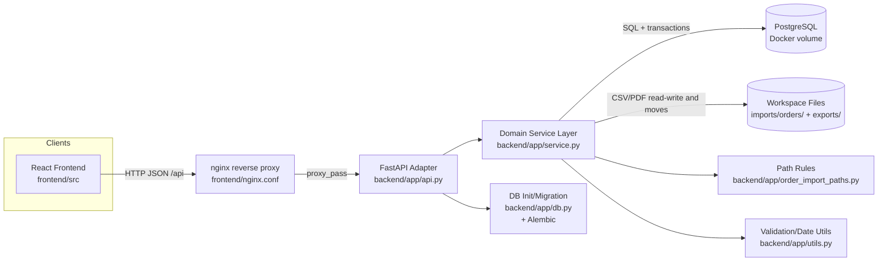
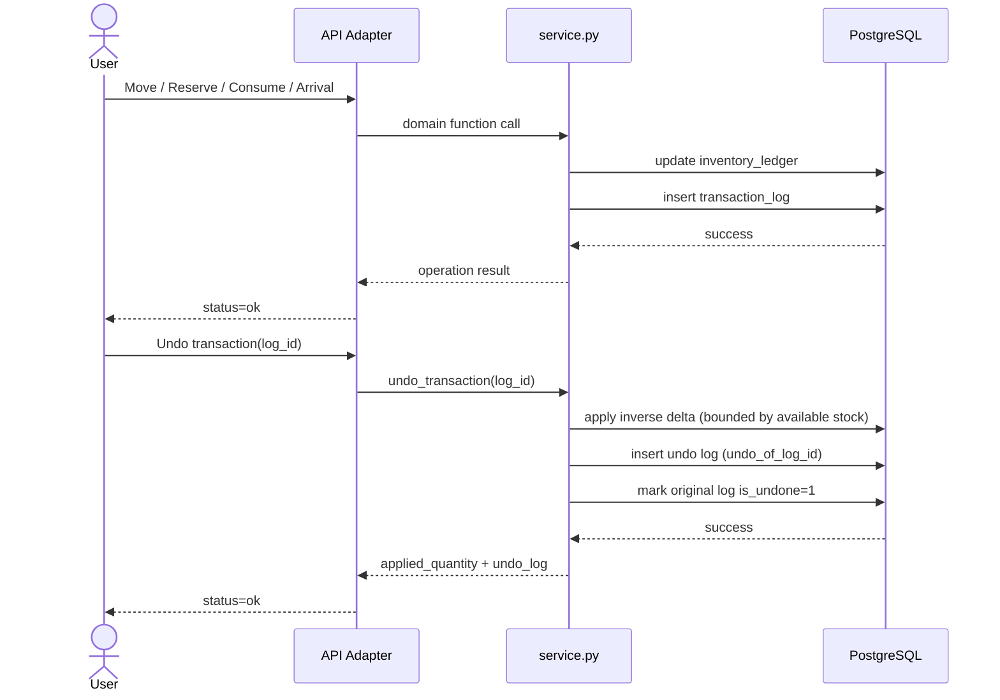

# Technical Documentation

## Purpose and Scope

This document explains the implemented architecture of the Materials Management application, its database design, and the key maintenance rules that keep behavior consistent across API, CLI, and file-based workflows.

## Deployment Architecture

- Backend targets PostgreSQL through a SQLAlchemy-managed engine and Alembic baseline migration.
- The raw-SQL service layer is preserved behind a compatibility connection wrapper while the storage engine is PostgreSQL.
- Docker deployment stack:
  - `docker-compose.yml` (production), `docker-compose.override.yml` (local dev), `docker-compose.test.yml` (test DB)
  - `backend/Dockerfile`, `frontend/Dockerfile`, `frontend/nginx.conf`
- Header-based user identification for mutation requests:
  - anonymous reads remain allowed
  - mutation requests require `X-User-Name`
  - resolved users are stored in `request.state.user`
  - database-side audit triggers populate `created_by` / `updated_by` / `performed_by` where supported
- Frontend user administration at `/users` page.
  - `GET /api/users` provides the active-user feed for the global picker
  - `GET /api/users?include_inactive=true` backs the management screen
  - create/update/deactivate flows emit a frontend refresh signal so the shared header picker stays aligned
- Upload-first shared-server batch import adapters for browser-facing batch workflows:
  - `POST /api/items/batch-upload` stages uploaded CSVs under `imports/staging/items/<job-id>/...` and reuses `register_unregistered_item_csvs(...)`
  - `POST /api/orders/batch-upload` stages an uploaded ZIP under `imports/staging/orders/<job-id>/...`, extracts CSV/PDF files into the expected layout, and reuses `import_unregistered_order_csvs(...)`
  - upload-first Orders ZIP imports treat `pdf_link` as a filename-first field; path-shaped values are stripped to filename semantics
  - the UI presents upload-first controls on Items and Orders pages while keeping server-resident batch actions as advanced fallback paths
- Generated artifact delivery for batch-produced missing-item register CSVs:
  - `GET /api/artifacts`, `GET /api/artifacts/{artifact_id}`, `GET /api/artifacts/{artifact_id}/download`
  - lightweight filesystem-backed registry over generated CSVs under `imports/items/unregistered/`
- `backend/main.py` is a server entrypoint only (no CLI).

## Operating Profile (Confirmed)

- Deployment posture: shared-server Docker Compose deployment (PostgreSQL + backend + nginx/frontend).
- Auth posture: PoC runs without enforced authentication, but API/architecture should remain RBAC-ready (`admin`, `operator`, `viewer` planned).
- Timezone: fixed JST across backend date/time handling.
- Scale target: ~10,000 items, ~5,000 orders, ~100,000 transactions.
- Requirement precedence: `specification.md` > `documents/technical_documentation.md` > current code behavior.

## Software Architecture

### Redesign status (2026-03-23)

- The active direction is procurement-first: legacy RFQ and purchase-candidate flows are being consolidated behind `procurement_batches` and `procurement_lines`.
- Project requirements are item-only in the primary UI path. Assembly-based planning is no longer part of the target design.
- The canonical navigation now favors `/workspace` for planning analysis and `/procurement` for shortage follow-up.
- Temporary backend/API compatibility shims remain for some legacy RFQ, assembly, and purchase-candidate routes while the redesign settles.
- Legacy assembly-backed project requirements are preserved on project update when the item-only editor does not send them back, and the editor warns that those preserved rows are not editable in the current item-only form.
- Workspace procurement creation can explicitly confirm a `PLANNING` project and persist the active planning date so the procurement-first path keeps the prior project-confirmation behavior.
- Workspace planning board now also supports `Confirm Allocation`, which persists current on-time generic coverage by:
  - converting stock-backed coverage into project reservations
  - assigning fully consumed generic orders to the project
  - splitting partially consumed generic orders, then assigning only the consumed child row
  - allowing dry-run preview for `PLANNING` projects but rejecting execute until the project is `CONFIRMED` or `ACTIVE`
  - rejecting stale confirmations when the planning snapshot no longer matches the preview signature

### Projects planning UX notes (frontend)

- Added `/workspace` as the primary future-demand route.
  - default view: project summary dashboard with committed-vs-draft semantics
  - secondary view: committed pipeline table with cumulative generic-consumption metrics
  - deep-dive view: planning board with server-driven shortage rows and supply-source breakdowns
  - planning board rows now summarize later recovery as compact outcome text (`Recovered by ...`, `Resolved on ...`, or `Still short ...`) instead of showing only aggregate recovered quantity
  - undated recovery sources are treated as unknown-date recovery in those summaries and burndown rows instead of rendering backend null placeholders
  - frontend routing now boots through a React Router data router (`createBrowserRouter` + `RouterProvider`)
- workspace route-leave protection now uses `useBlocker` plus an explicit confirmation effect instead of `unstable_usePrompt`, avoiding stale blocked-navigation state after leaving workspace/RFQ flows
  - right-side drawer infrastructure provides local breadcrumb navigation for project, item, and procurement context without leaving the board
  - project drawer now mounts the shared project editor, including preview-first bulk requirement entry
  - item drawer now combines inventory, incoming orders, item flow, and cross-project planning allocation context
  - item planning context cards now include a chronological recovery burndown table showing how the initial start-date gap burns down across dated recovery sources
  - legacy RFQ drawer paths are being reduced in favor of the dedicated `/procurement` page and procurement summary links
  - board date state re-syncs to the effective planning `target_date` when the same project refreshes and no local preview edit is pending
  - drawer close, breadcrumb back, route leave, and drawer-stack truncation flows now guard unsaved project/RFQ drafts
  - item-scoped RFQ drawers keep the full batch visible while surfacing the focused item rows first
  - RFQ save flows selectively rehydrate the saved rows from refreshed server detail so backend-normalized values replace stale local drafts without discarding other unsaved rows
  - nested `CatalogPicker` Escape handling is scoped locally so dismissing picker results does not also trigger drawer close/discard flows
  - when `/workspace/summary` refresh removes the selected project, the page reselects the next valid project before issuing planning-analysis requests
  - hidden breadcrumb panels stay mounted for navigation continuity, but inactive project/item/RFQ panels suspend their SWR fetches and preload queries
  - project drawer RFQ metrics come from `workspace/summary` aggregate `rfq_summary` data rather than a paginated RFQ list slice
  - shared project/RFQ drawer editors backfill current selections when ids fall outside initial preload pages so existing links still render correctly
  - shared RFQ linked-order selectors now lazy-load per active row and keep the current selection visible from saved metadata, avoiding eager option rendering across the whole batch
  - shared RFQ editors now page the line table (25/50/100 rows) so large batches do not mount the entire editable grid at once during route changes
  - legacy `/planning` and `/rfq` routes have been **removed from the router**; `PlanningPage.tsx` and `RfqPage.tsx` remain as unused source files. Unsupported paths fall through to the `*` wildcard catch-all and redirect to `/`.
- The Projects page supports requirement target lookup via searchable item input (`datalist`) so users can select from large item registries faster than scrolling long select lists.
  - item candidate summaries include manufacturer, category, and description text to disambiguate similar part numbers during selection
- Requirement entry includes a preview-first bulk text parser (`item_number,quantity` per line).
  - `POST /api/projects/requirements/preview` classifies each line as `exact`, `high_confidence`, `needs_review`, or `unresolved`
  - preview rows return ranked item candidates and allow manual correction through `CatalogPicker` before the frontend applies them into editable requirement rows
- `POST /api/projects/requirements/preview/unresolved-items.csv` exports unresolved preview rows plus review rows that only have fuzzy/non-exact suggestions as an Items import-compatible CSV with default `row_type=item`, `manufacturer_name=UNKNOWN`, and `units_per_order=1`; exact/duplicate review rows stay excluded so already-registered item numbers are not re-exported, and the Projects UI sends the reviewed preview snapshot so export stays aligned with the visible preview even if the textarea changes later
  - unresolved lines can still be applied as unregistered placeholder rows so operators can finish correction in the main requirement table
- Free-text target parsing accepts `#<id>` suffixes only when the parsed id exists in the currently loaded item/assembly options, preventing invalid IDs from being treated as matched entries.
- Existing projects can be loaded into the same form for edit/save flows (`GET /api/projects/{id}` then `PUT /api/projects/{id}`), including requirement composition updates.

### High-level Architecture (Mermaid)

### Why it is implemented this way

1. Single business-logic layer (`service.py`) is shared by all API routes.
   This avoids duplicated logic and keeps behavior consistent across all operations.
2. Current-state table + event log model.
   `inventory_ledger` gives fast current stock lookup, while `transaction_log` enables traceability and undo.
3. Filesystem-aware order ingestion.
    Orders are imported from CSV/PDF folders, then moved to canonical registered paths to preserve auditability.
   The order-layout migration also rewrites stale `pdf_link` values in both unregistered and registered order CSV archives, plus quotation DB rows, so historical links stay aligned after directory-layout changes.
   The live unregistered batch import now also rewrites the moved registered CSV archive with its final registered `pdf_link` values, keeping the archive consistent with the post-move filesystem state.
   Shared-server upload adapters now stage browser uploads under `imports/staging/...` first, then materialize them into the same folder shape that the existing domain import logic already understands.
4. Reversible bulk imports.
   Item imports store job and row-level effects (`import_jobs`, `import_job_effects`) so undo/redo can be state-checked and safe.
   Backend pytest fixtures remap workspace import/export roots into per-test temporary directories so import-related tests cannot leak CSV artifacts into the real repository workspace.
5. Migration-safe manual project assignment retention.
   DB migration backfills `orders.project_id_manual` for legacy rows that have `project_id` but no ORDERED RFQ ownership, preventing RFQ unlink synchronization from clearing historical manual assignments.
6. Alias-based normalization strategy.
   `supplier_item_aliases` maps supplier-specific ordered numbers to canonical items; `category_aliases` merges categories without destructive rewrites.
7. Docker Compose deployment with growth path.
   The current stack uses PostgreSQL via Docker Compose with a single service layer, preserving extension points for future RBAC enforcement and horizontal scaling.

### Inventory and Undo Flow (Mermaid)

## Database Structure (E-R Diagram)

```mermaid
erDiagram
    MANUFACTURERS {
        int manufacturer_id PK
        string name UK
    }

    SUPPLIERS {
        int supplier_id PK
        string name UK
    }

    ITEMS_MASTER {
        int item_id PK
        string item_number
        int manufacturer_id FK
        string category
        string url
        string description
    }

    INVENTORY_LEDGER {
        int ledger_id PK
        int item_id FK
        string location
        int quantity
        string last_updated
    }

    QUOTATIONS {
        int quotation_id PK
        int supplier_id FK
        string quotation_number
        string issue_date
        string pdf_link
    }

    ORDERS {
        int order_id PK
        int item_id FK
        int quotation_id FK
        int order_amount
        int ordered_quantity
        string ordered_item_number
        string order_date
        string expected_arrival
        string arrival_date
        string status
    }

    TRANSACTION_LOG {
        int log_id PK
        string timestamp
        string operation_type
        int item_id FK
        int quantity
        string from_location
        string to_location
        int is_undone
        int undo_of_log_id FK
        string batch_id
    }

    PROJECTS {
        int project_id PK
        string name UK
        string status
        string planned_start
        string created_at
        string updated_at
    }

    RESERVATIONS {
        int reservation_id PK
        int item_id FK
        int project_id FK
        int quantity
        string status
        string deadline
        string created_at
        string released_at
    }

    ASSEMBLIES {
        int assembly_id PK
        string name UK
        string description
        string created_at
    }

    ASSEMBLY_COMPONENTS {
        int assembly_id PK
        int item_id PK
        int quantity
    }

    LOCATION_ASSEMBLY_USAGE {
        int usage_id PK
        string location
        int assembly_id FK
        int quantity
        string note
        string updated_at
    }

    PROJECT_REQUIREMENTS {
        int requirement_id PK
        int project_id FK
        int assembly_id FK
        int item_id FK
        int quantity
        string requirement_type
        string note
        string created_at
    }

    SUPPLIER_ITEM_ALIASES {
        int alias_id PK
        int supplier_id FK
        string ordered_item_number
        int canonical_item_id FK
        int units_per_order
        string created_at
    }

    CATEGORY_ALIASES {
        string alias_category PK
        string canonical_category
        string created_at
        string updated_at
    }

    IMPORT_JOBS {
        int import_job_id PK
        string import_type
        string source_name
        string source_content
        int continue_on_error
        string status
        string lifecycle_state
        int redo_of_job_id FK
        int last_redo_job_id FK
        string created_at
        string undone_at
    }

    IMPORT_JOB_EFFECTS {
        int effect_id PK
        int import_job_id FK
        int row_number
        string status
        string entry_type
        string effect_type
        int item_id
        int alias_id
        string message
        string code
        string before_state
        string after_state
        string created_at
    }

    USERS {
        int user_id PK
        string username UK
        string display_name
        string role
        bool is_active
        string created_at
        string updated_at
    }

    RESERVATION_ALLOCATIONS {
        int allocation_id PK
        int reservation_id FK
        int item_id FK
        string location
        int quantity
        string status
        string created_at
        string released_at
        string note
    }

    PROCUREMENT_BATCHES {
        int batch_id PK
        int project_id FK
        string status
        string target_date
        string note
        string created_at
        string updated_at
    }

    PROCUREMENT_LINES {
        int line_id PK
        int batch_id FK
        int item_id FK
        int required_quantity
        int finalized_quantity
        string supplier_name
        string status
        string expected_arrival
        int linked_order_id FK
        string note
    }

    ORDER_LINEAGE_EVENTS {
        int event_id PK
        string event_type
        int source_order_id FK
        int target_order_id FK
        string metadata
        string created_at
    }

    MANUFACTURERS ||--o{ ITEMS_MASTER : owns
    ITEMS_MASTER ||--o{ INVENTORY_LEDGER : stocked_in
    SUPPLIERS ||--o{ QUOTATIONS : issues
    QUOTATIONS ||--o{ ORDERS : quoted_in
    ITEMS_MASTER ||--o{ ORDERS : ordered_item
    ITEMS_MASTER ||--o{ TRANSACTION_LOG : movement_history
    TRANSACTION_LOG ||--o{ TRANSACTION_LOG : undo_chain
    ITEMS_MASTER ||--o{ RESERVATIONS : reserved_item
    PROJECTS ||--o{ RESERVATIONS : project_context
    ASSEMBLIES ||--o{ ASSEMBLY_COMPONENTS : has_components
    ITEMS_MASTER ||--o{ ASSEMBLY_COMPONENTS : component_item
    ASSEMBLIES ||--o{ LOCATION_ASSEMBLY_USAGE : deployed_at
    PROJECTS ||--o{ PROJECT_REQUIREMENTS : has_requirements
    ASSEMBLIES ||--o{ PROJECT_REQUIREMENTS : assembly_requirement
    ITEMS_MASTER ||--o{ PROJECT_REQUIREMENTS : item_requirement
    SUPPLIERS ||--o{ SUPPLIER_ITEM_ALIASES : alias_source
    ITEMS_MASTER ||--o{ SUPPLIER_ITEM_ALIASES : canonical_target
    IMPORT_JOBS ||--o{ IMPORT_JOB_EFFECTS : records
    IMPORT_JOBS ||--o{ IMPORT_JOBS : redo_links
    RESERVATIONS ||--o{ RESERVATION_ALLOCATIONS : allocates
    ITEMS_MASTER ||--o{ RESERVATION_ALLOCATIONS : allocated_item
    PROJECTS ||--o{ PROCUREMENT_BATCHES : procurement_context
    PROCUREMENT_BATCHES ||--o{ PROCUREMENT_LINES : has_lines
    ITEMS_MASTER ||--o{ PROCUREMENT_LINES : procured_item
    ORDERS ||--o{ ORDER_LINEAGE_EVENTS : lineage_source
    ORDERS ||--o{ ORDER_LINEAGE_EVENTS : lineage_target
```

Note: `CATEGORY_ALIASES` is intentionally not a strict foreign-key relation to `items_master.category`; it is a soft-merge mapping used during reads and filters.

## Maintenance Guidance

### 1) Business-rule centralization

- Add or change domain behavior in `backend/app/service.py`, then expose it through API adapters in `api.py`.
- Avoid adding business logic directly in `api.py` route handlers.

### 2) Inventory correctness invariants

- Every inventory-changing operation must update both:
  - `inventory_ledger` (current state)
  - `transaction_log` (audit trail and undo source)
- If you introduce a new `operation_type`, update:
  - `undo_transaction`
  - `get_inventory_snapshot` (past/future logic)
  - any dashboard/reporting code that depends on operation semantics
- Snapshot basis contract:
  - `basis=raw` preserves location-state reconstruction semantics
  - `basis=net_available` is a future/current residual-stock view built from `available = inventory_ledger.on_hand - active_allocations`, plus open orders due by the selected date
  - `basis=net_available` rows also expose a compact occupation summary (`allocated_quantity`, `active_reservation_count`, `allocated_project_names`) for the same `(item, location)` so Snapshot can answer "who is occupying this stock?" at a glance without duplicating Workspace-level allocation detail
  - do not claim historical `net_available` support unless allocation-history reconstruction is implemented; the current API rejects `mode=past&basis=net_available`

### 3) Item identity immutability

- Item identity (`item_number`, `manufacturer`) cannot be changed once referenced by orders/inventory/reservations/assemblies/projects/aliases.
- Metadata (`category`, `url`, `description`) remains editable.

### 4) Order and quotation file workflow

- Manual order import accepts only canonical registered PDF links or filename-only values.
- Unregistered batch import resolves/moves CSV and PDF files and rewrites links to canonical workspace-relative paths.
- Upload-first adapters stage browser payloads under:
  - `imports/staging/items/<job-id>/unregistered/`
  - `imports/staging/orders/<job-id>/unregistered/csv_files/<supplier>/`
  - `imports/staging/orders/<job-id>/unregistered/pdf_files/<supplier>/`
- Orders ZIP staging accepts either canonical `csv_files/...` + `pdf_files/...` paths or simpler supplier-subfolder layouts, then normalizes them into the canonical unregistered structure before domain import starts.
- Upload-first Orders ZIP CSVs should use `pdf_link = blank or filename-only`.
  - browser uploads resolve that filename against staged PDFs for the same supplier
  - path-shaped `pdf_link` text is normalized for compatibility, but it is no longer the primary shared-server contract
- Missing items discovered during unregistered batch import are aggregated into a single register CSV per batch run under `imports/items/unregistered/` (instead of per-quotation output beside source CSVs).
- Generated missing-item register CSVs now return artifact metadata in API responses and are downloadable through `/api/artifacts/{artifact_id}/download`, so the frontend no longer has to display raw server file paths.
- Consolidated missing-item rows are de-duplicated by `(supplier, manufacturer_name, item_number)` so repeated unresolved rows across quotations are emitted once per batch register CSV.
- Batch consolidation uses collision-safe temporary per-file register naming (supplier-prefixed) and deletes temporary files only after consolidated-register write succeeds.
- Consolidated register files may include rows from multiple suppliers; successful unregistered-item registration moves the processed CSV into `imports/items/registered/<YYYY-MM>/` while preserving row-level supplier columns.
- Manual Items-page CSV imports follow the same archive root: every successful or partially successful `POST /api/items/import` stores a registered copy under `imports/items/registered/<YYYY-MM>/` and immediately re-runs monthly consolidation so ad-hoc imports and batch registrations share one archive history.
- After a fully successful batch registration, `consolidate_registered_item_csvs()` automatically merges small CSVs in each `imports/items/registered/<YYYY-MM>/` subfolder into larger consolidated files named `items_YYYY-MM_NNN.csv` (e.g., `items_2026-03_001.csv`). Maximum rows per file is controlled by `ITEMS_IMPORT_MAX_CONSOLIDATED_ROWS` (default 5,000) in `config.py`. Files already matching the consolidated naming pattern are included in the merge pass. Consolidation now stages replacement files and only swaps them into place after all chunk writes succeed; original non-consolidated source files are deleted only after that successful swap, and header-only inputs are removed without creating an empty archive. Consolidated CSVs are import-history archives only — UI edits to item attributes affect the database, not the CSV archives.
- Per-file registered-item batch failures stay atomic through the savepoint boundary: if a source CSV has already been moved into `imports/items/registered/<YYYY-MM>/` but report construction or another per-file step fails before the savepoint is released, the file is moved back to the unregistered location and that file's DB work is rolled back.
- In `missing_items_registration.csv`, `supplier` means the supplier alias namespace for ordered SKU resolution. `new_item` rows may optionally provide `manufacturer_name` (or `manufacturer`); blank values default to `UNKNOWN`. The Items-page missing-order resolver now surfaces both manufacturer and alias-supplier fields so its new-item editing surface matches Bulk Item Entry while still preserving alias registration context.
- Missing-item registration now reuses the same core item/alias write path as the preview-first Items CSV import after normalizing the batch-specific CSV contract. Batch-only rules still apply first: unresolved `new_item` rows can be skipped, existing new-item rows remain no-op, and file staging/archive behavior stays specific to the batch workflow.
- Registration inputs accept both `resolution_type` (`new_item`/`alias`) and legacy `row_type` (`item`/`alias`) to avoid mixed-template confusion; `row_type=item` is normalized to `resolution_type=new_item`.
- Content/file-based missing-item registration must preserve the same `skip_unresolved` behavior as path-based batch registration so API upload, CLI, and batch retry flows stay aligned.
- Manual and batch order imports reject quotations already imported for the same supplier (same `quotation_number` with existing orders), returning a conflict to avoid duplicate order ingestion.
- Per-file unregistered import must keep filesystem moves atomic: if any move fails, rollback already moved files for that CSV and return file-level error.
- File collisions are handled by non-destructive renaming (`_1`, `_2`, ...).
- Missing/unresolved PDF links are surfaced as warnings, not silent failures.
- Keep canonical layout:
  - `imports/staging/items/<job-id>/...`
  - `imports/staging/orders/<job-id>/...`
  - `imports/orders/unregistered/csv_files/<supplier>/`
  - `imports/orders/unregistered/pdf_files/<supplier>/`
  - `imports/orders/registered/csv_files/<supplier>/`
  - `imports/orders/registered/pdf_files/<supplier>/`
  - `imports/items/unregistered/`
  - `imports/items/registered/<YYYY-MM>/`

### 5) Reservation partial-actions policy

- Reservation release/consume should support full and partial quantities.
- Full action transitions reservation status (`RELEASED` / `CONSUMED`).
- Partial action keeps status `ACTIVE` and decrements remaining reservation quantity.

### 5.1) Reservation allocation architecture (current)

- Reservation no longer physically moves inventory to `RESERVED`.
- Active reservation quantity is tracked in `reservation_allocations` by `(reservation_id, item_id, location)` rows.
- Availability for reservation and planning uses:
  - `available = inventory_ledger.on_hand - active_allocations`
- Consume acts on physical inventory locations referenced by active allocations, preserving location traceability.
- Release changes allocation status only (no inventory delta).

### 6) Import job undo/redo safety

- Undo is guarded by before/after state snapshots from `import_job_effects`.
- Undo should fail with conflict if rows were modified after import; do not bypass this check.
- Redo is only valid after the source job lifecycle is `undone`.
- Partial undo is acceptable when current stock/locations cannot satisfy full reversal.

### 7) Assembly policy boundary

- Current mode is advisory for planning and visibility.
- Target evolution is enforceable checks during active/operational phases, with explicit override+audit design.

### 7.1) Planning allocation confirmation

- `POST /api/projects/{project_id}/confirm-allocation` is the persistence bridge between planning-time virtual generic consumption and durable project-specific data.
- The endpoint always reuses `_build_project_planning_snapshot(...)` so preview/execute semantics stay identical to the Workspace board.
- `dry_run` returns a preview payload plus `snapshot_signature`; execute may send that signature back as `expected_snapshot_signature` to fail fast on stale planning state.
- Stock sources are persisted through `create_reservation(...)` with `project_id` set.
- Generic orders are persisted through `update_order(...)`.
  - full consumption: assign `project_id` directly
  - partial consumption: split first with the current ETA preserved, then assign only the created child row
- Orders already controlled by ORDERED RFQ/procurement links are skipped rather than forcibly reassigned.

### 8) Schema and migration discipline

- Keep migrations idempotent (`migrate_db` runs at startup).
- New columns/tables must be backward-safe for existing DB files.
- Preserve date normalization (`YYYY-MM-DD`) and trigger constraints around orders.

### 9) API contract consistency

- Response envelope is standardized:
  - success: `{ "status": "ok", "data": ... }`
  - error: `{ "status": "error", "error": { "code", "message", "details" } }`
- Keep frontend in sync when adding/changing payload shapes.

### 10) QA gate and release hygiene

- Minimum gate:
  - run backend full tests (`uv run python -m pytest`)
  - run frontend build check when frontend changed (`npm run build`)
  - run manual smoke checks for touched flows
- Keep docs in the same change set as behavior updates.
- For release history, maintain changelog/migration notes once GitHub repository workflow is established.

## Recommended update workflow

1. Change schema/migration in `app/db.py` or Alembic if needed.
2. Update domain logic in `app/service.py`.
3. Expose endpoints in `app/api.py`.
4. Update frontend API usage/types in `frontend/src/lib`.
5. Add or update tests in `backend/tests`.

### Item flow traceability (item-first workflow)

- Added `GET /api/items/{item_id}/flow` for item-centric stock-change planning/traceability.
- Response merges three sources into a single timeline sorted by event time:
  - transaction-driven stock deltas (`transaction_log`)
  - planned stock increases from open orders with `expected_arrival`
  - planned stock decreases from active reservations with `deadline`
- UI integration: Item List row action opens a dedicated timeline panel showing **when**, **how many (+/-)**, and **why** (demand source reference/reason).

### BOM date-aware gap analysis

- Preview-first reconciliation endpoint:
  - `POST /api/bom/preview`
  - classifies supplier and item resolution per row as `exact`, `high_confidence`, `needs_review`, or `unresolved`
  - returns ranked supplier and item candidates plus projected canonical quantity / available stock / shortage for the suggested item match
  - preview does not create missing suppliers; it reuses the same non-destructive matching stack as the import-preview flows
- `POST /api/bom/analyze` now accepts optional `target_date` (`YYYY-MM-DD`).
- Domain rule (`service.analyze_bom_rows`):
  - no `target_date`: use current net available (`inventory_ledger.on_hand - active_allocations`)
  - with `target_date` (today/future): use
    `current_net_available + sum(open order_amount where expected_arrival <= target_date)`
- Supplier lookup during analyze is now non-creating:
  - unknown supplier labels no longer insert supplier master rows as a side effect of BOM analysis
  - direct canonical item numbers can still be analyzed without a registered supplier alias scope
- Validation:
  - `target_date` earlier than today is rejected with `422` / `INVALID_TARGET_DATE`.
- `POST /api/bom/reserve` remains current-stock reservation behavior (execution-time allocation); it does not reserve future arrivals.

### Sequential project planning pipeline

- Planning is no longer modeled as an isolated per-project gap check.
- Canonical planning endpoint: `GET /api/projects/{project_id}/planning-analysis`
- Supporting summary endpoint: `GET /api/planning/pipeline`
- Workspace summary endpoint: `GET /api/workspace/summary`
- Workspace planning export endpoint: `GET /api/workspace/planning-export`
- Workspace multi-project planning export endpoint: `GET /api/workspace/planning-export-multi`
- Item-side planning context endpoint: `GET /api/items/{item_id}/planning-context`
- Core domain rule (`service.project_planning_analysis` / `_build_project_planning_snapshot`):
  - committed projects are those with status `CONFIRMED` or `ACTIVE`
  - committed projects are processed in `planned_start` order
  - committed projects remain in the pipeline after their `planned_start` passes; missing committed start dates are treated as `today_jst()` for sequencing until a date is persisted
  - current stock starts from `inventory_ledger.on_hand - active_allocations`
  - generic future supply comes only from open orders with `project_id IS NULL`
  - project-dedicated supply comes from:
    - `QUOTED` RFQ lines with `expected_arrival`
    - open orders with `project_id = <project>`
  - dedicated supply is consumed before generic supply at the project start date
  - if a project is still short at its start date, that shortage becomes backlog demand
  - later generic arrivals satisfy older backlog before they become available to later projects
- Planning rows now include explicit `supply_sources_by_start` and `recovery_sources_after_start` arrays so the frontend can explain why one row is covered or short without reconstructing source usage in the browser.
- Pipeline summary rows now include:
  - `generic_committed_total`: generic supply consumed by that project across on-time allocation plus later generic recovery
  - `cumulative_generic_consumed_before_total`: generic supply already absorbed by earlier committed projects before the current project row
- Compatibility endpoint: `GET /api/projects/{project_id}/gap-analysis`
  - still returns `available_stock` / `shortage`
  - no `target_date`: uses a current-stock compatibility rule and does not project pending arrivals
  - with `target_date`: reads from the sequential planning engine and includes eligible arrivals up to that date
  - returns the effective `target_date` used for the response (`today_jst()` when omitted)
- `GET /api/workspace/summary` is intentionally aggregate-only:
  - committed rows include authoritative planning totals reused from the canonical pipeline snapshot
  - `PLANNING` rows return explicit `preview_required` semantics instead of unreliable inferred shortage numbers
  - project rows also include RFQ batch/line counts so the default workspace view does not issue per-project fan-out requests
- `GET /api/items/{item_id}/planning-context` is the drawer-side item drill-in contract:
  - returns one row per committed project, plus the selected preview project when applicable
  - reuses canonical planning metrics and source arrays so the frontend does not recalculate allocation behavior
  - supports workspace what-if review by accepting optional `preview_project_id` and `target_date`
  - narrows snapshot expansion to the requested item while still using the canonical sequential-planning rules
- `_build_project_planning_snapshot(...)` now batches the hot-path lookup work:
  - committed projects and requirements are loaded in one pass instead of repeated `get_project(...)` calls
  - assembly component rows are preloaded once per snapshot and reused across project requirement expansion
  - available inventory totals are precomputed per relevant item instead of re-queried inside the item loop
- `GET /api/workspace/planning-export` serializes the selected planning view into CSV:
  - includes committed pipeline rows, selected-project totals, selected-project item rows, and RFQ summary counts
  - reuses canonical planning analysis output instead of duplicating export-only planning logic
- `GET /api/workspace/planning-export-multi` serializes the whole planning pipeline into CSV:
  - emits one `project_summary` row and one-or-more `project_item` rows per project in sequential planning order
  - optional `project_id` / `target_date` include the selected board preview project in the same export so users can compare committed work against a what-if project
  - `target_date` reflects the shared effective preview/analysis date used for that export; committed-only exports leave it blank because there is no single selected board date
  - reuses `_build_project_planning_snapshot(...)` so the CSV stays aligned with the board/pipeline netting rules

### Project RFQ workflow

- Added persistent RFQ tables:
  - `rfq_batches`
  - `rfq_lines`
- RFQ creation flow:
  - `POST /api/projects/{project_id}/rfq-batches`
  - creates line items from current on-time shortage rows only
  - accepts optional `target_date` so RFQ creation can reuse the planning date currently under review
  - auto-promotes a `PLANNING` project to `CONFIRMED` so later projects will net against it
  - when auto-promoted, the project persists the analysis `target_date` as `projects.planned_start`
- RFQ maintenance endpoints:
  - `GET /api/rfq-batches`
  - `GET /api/rfq-batches/{rfq_id}`
  - `PUT /api/rfq-batches/{rfq_id}`
  - `PUT /api/rfq-lines/{line_id}`
- RFQ line semantics:
  - `QUOTED` + `expected_arrival` => dedicated planned supply
  - `ORDERED` requires `linked_order_id`
  - non-`ORDERED` RFQ states clear `linked_order_id`, so quoted supply stays in the planning-only path
  - only `ORDERED` links set `orders.project_id`; removing or replacing the link clears/reassigns the dedicated order ownership to match the RFQ line state, and manual `/api/orders/{id}` project edits must not override that RFQ-owned assignment
  - splitting an RFQ-owned order must not clone that dedicated `project_id` onto the new sibling order, because RFQ ownership remains attached only to the original linked row

### Purchase candidate persistence (pre-PO planning)

- Added persistent shortage table `purchase_candidates` for planning between gap analysis and PO creation.
- New endpoints:
  - `GET /api/purchase-candidates`
  - `GET /api/purchase-candidates/{candidate_id}`
  - `POST /api/purchase-candidates/from-bom`
  - `POST /api/purchase-candidates/from-project/{project_id}`
  - `PUT /api/purchase-candidates/{candidate_id}`
- Status lifecycle for planning execution:
  - `OPEN` -> `ORDERING` -> `ORDERED`
  - `CANCELLED` for abandoned candidates
- Item mutation/deletion safeguards treat `purchase_candidates` as item references, so item delete conflicts surface as controlled `ITEM_REFERENCED` errors instead of raw FK exceptions.
- UI flow:
  - BOM page can persist shortages directly via `Save Shortages`.
  - Purchase Candidates page remains available for BOM / ad-hoc pre-PO tracking, but the main multi-project workflow now runs through Planning + RFQ.

### Order/quotation correction operations (UI + consistency)

- Correction endpoints:
  - `PUT /api/orders/{order_id}` updates open-order expected arrival metadata (`expected_arrival`) and supports partial ETA postponement via `split_quantity` (integer-safe split creates a second open order row).
  - `POST /api/orders/merge` merges two open split-compatible rows and appends lineage metadata.
  - `GET /api/orders/{order_id}/lineage` returns split/merge/arrival lineage events for traceability views and audits.
  - `PUT /api/quotations/{quotation_id}` updates quotation metadata.
  - `DELETE /api/orders/{order_id}` deletes open (non-arrived) orders.
  - `DELETE /api/quotations/{quotation_id}` deletes quotation and linked orders only when no linked order is already arrived.
- Orders-page read model note: the Orders screen now fetches all pages for `/orders` and `/quotations` before rendering `Imported Quotations` aggregates or opening quotation-driven `Quotation Details`, preventing older quotations from showing false zero counts and ensuring the selected quotation can list every linked order even when some linked rows were outside the first API page.
- Consistency rule: when these operations mutate DB rows, matching order CSV records are rewritten/inserted/removed so CSV source files and database state do not diverge.
- Reliability/scalability posture: order split/merge transitions are persisted in `order_lineage_events` so future analytics/audit screens can read durable lineage without inferring history from mutable order rows.
- CSV row identity rule for order-level maintenance: `update_order`/`delete_order` must target exactly one CSV row by order identity (including duplicate `(supplier, quotation_number, item_number)` occurrences) to prevent fan-out edits/deletes when a quotation contains repeated item rows.

## CSV import extensions (movements/reservations)

- Added API endpoints:
  - `POST /api/inventory/import-csv` (multipart CSV, optional `batch_id`)
  - `POST /api/reservations/import-csv` (multipart CSV)
  - `GET /api/items/import-template`, `GET /api/items/import-reference`
  - `GET /api/inventory/import-template`, `GET /api/inventory/import-reference`
  - `GET /api/orders/import-template`, `GET /api/orders/import-reference`
  - `GET /api/reservations/import-template`, `GET /api/reservations/import-reference`
- Movement CSV rows are normalized into existing `batch_inventory_operations`, preserving transaction log semantics and undo behavior consistency.
- Reservation CSV supports assembly references by assembly name/id and expands to component-level reservations; this reuses assembly data efficiently for planning input while keeping assembly behavior advisory.
- Template CSV endpoints return header-only files encoded as UTF-8 with BOM for Excel compatibility; reference endpoints render live canonical DB values on demand so the frontend does not maintain duplicated template/reference logic.
- Orders import reference supports optional `supplier_name` scoping so alias rows match the supplier currently selected in the write flow while canonical item rows remain available for direct item-number imports.
- Manual CSV imports now support preview-first reconciliation:
  - `POST /api/items/import-preview` classifies item rows as new-vs-duplicate and alias rows as create/update/review/unresolved before commit
  - `POST /api/items/import` accepts optional multipart JSON `row_overrides` so preview confirmation can pin `canonical_item_number` and `units_per_order` for alias rows
  - `POST /api/inventory/import-preview` validates movement rows against operation/location rules, simulates stock deltas in CSV order, and flags item resolution or stock-shortage problems before commit
  - `POST /api/inventory/import-csv` accepts optional multipart JSON `row_overrides` so preview confirmation can substitute canonical `item_id` values
  - `POST /api/orders/import-preview` parses the upload, classifies rows (`exact`, `high_confidence`, `needs_review`, `unresolved`), ranks candidate matches, and reports duplicate quotation conflicts before commit
  - preview uses direct canonical item numbers, supplier-scoped aliases, normalized equality, and fuzzy ranking, but does not create a missing supplier during preview
  - `POST /api/orders/import` now accepts optional multipart JSON fields `row_overrides` and `alias_saves` so preview-confirmation can pin canonical items/units and persist supplier aliases after duplicate checks pass
  - `POST /api/reservations/import-preview` validates item/assembly target resolution, previews assembly expansion into generated component reservations, and flags inventory shortages before commit
  - `POST /api/reservations/import-csv` accepts optional multipart JSON `row_overrides` so preview confirmation can choose `item_id` or `assembly_id` targets explicitly; that explicit override wins over stale raw CSV target text during commit
  - preview-confirmation JSON is strict across these flows: malformed JSON, wrong top-level shapes, missing required keys, unsupported fields, and row numbers not present in the uploaded CSV all return controlled `422` responses instead of uncaught server errors

## Catalog search / picker foundation

- Added `GET /api/catalog/search?q=...&types=item,assembly,supplier,project&limit_per_type=8`.
- Current search coverage:
  - `item`: canonical item number, manufacturer, category, description, supplier alias text, and alias supplier name
  - `assembly`: assembly name and description
  - `supplier`: supplier name
  - `project`: project name and description
- Search returns typed rows with `entity_type`, `entity_id`, `value_text`, `display_label`, `summary`, and `match_source`; the frontend groups them by entity type.
- Frontend now has a reusable `CatalogPicker` component with:
  - keyboard navigation (`ArrowUp`, `ArrowDown`, `Enter`, `Escape`)
  - `localStorage` recent selections
  - single-select and multi-select support
  - inline or popover result presentation
  - single-select query text resync when the parent value changes while the picker is open, so preview correction panels stay aligned after external edits/reset
- Current rollout:
  - Projects page requirement selector now uses `CatalogPicker` for item and assembly targets
  - Projects quick bulk-parser preview also uses `CatalogPicker` for manual item correction before rows are applied
  - Assemblies page component selector now uses `CatalogPicker` for item lookup
  - BOM spreadsheet entry now uses `CatalogPicker` in type-or-search mode for supplier and item cells
  - BOM preview reconciliation also uses `CatalogPicker` for supplier and item overrides before analyze/reserve/save
  - Movements entry now uses `CatalogPicker` for item selection in the unified single/batch movement table
  - Adding a new movement row inherits the latest completed `from/to` locations to speed repeated transfer entry
  - Reservations entry now uses `CatalogPicker` for item selection
  - Items, Orders, Movements, and Reservations import preview rows now use the same catalog-search payload for reconciliation corrections
  - Orders import supplier selection also uses the same picker/search contract
  - preview-first flows now preserve an explicit cleared selection instead of silently falling back to a stale suggested match
