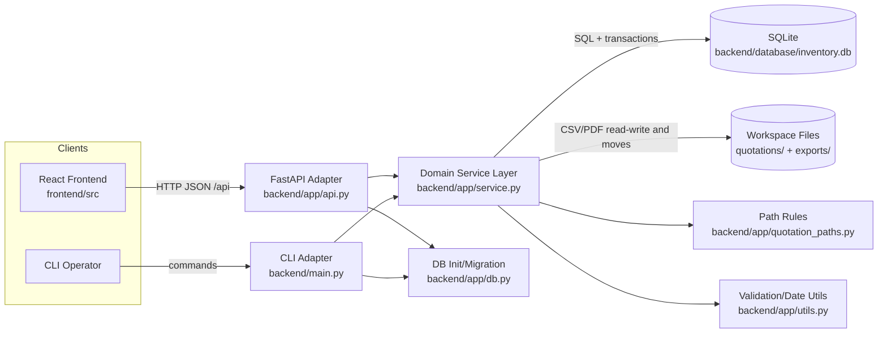
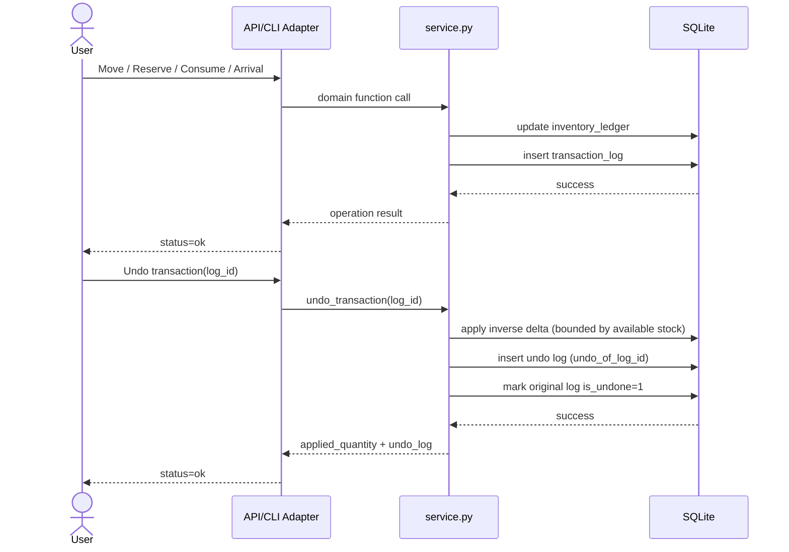

# Technical Documentation

## Purpose and Scope

This document explains the implemented architecture of the Materials Management application, its database design, and the key maintenance rules that keep behavior consistent across API, CLI, and file-based workflows.

## Operating Profile (Confirmed)

- Deployment posture: local-first personal usage today, with future migration path to shared multi-user operation.
- Auth posture: PoC runs without enforced authentication, but API/architecture should remain RBAC-ready (`admin`, `operator`, `viewer` planned).
- Timezone: fixed JST across backend date/time handling.
- Scale target: ~10,000 items, ~5,000 orders, ~100,000 transactions.
- Requirement precedence: `specification.md` > `documents/technical_documentation.md` > current code behavior.

## Software Architecture

### High-level Architecture (Mermaid)

### Why it is implemented this way

1. Single business-logic layer (`service.py`) is shared by API and CLI.
   This avoids duplicated logic and keeps behavior consistent for web and batch operations.
2. Current-state table + event log model.
   `inventory_ledger` gives fast current stock lookup, while `transaction_log` enables traceability and undo.
3. Filesystem-aware quotation ingestion.
   Orders are imported from CSV/PDF folders, then moved to canonical registered paths to preserve auditability.
4. Reversible bulk imports.
   Item imports store job and row-level effects (`import_jobs`, `import_job_effects`) so undo/redo can be state-checked and safe.
5. Alias-based normalization strategy.
   `supplier_item_aliases` maps supplier-specific ordered numbers to canonical items; `category_aliases` merges categories without destructive rewrites.
6. Local PoC with growth path.
   The current stack is intentionally simple (SQLite + single service layer) while preserving extension points for future RBAC and multi-user deployment.

### Inventory and Undo Flow (Mermaid)

## Database Structure (E-R Diagram)

Note: `CATEGORY_ALIASES` is intentionally not a strict foreign-key relation to `items_master.category`; it is a soft-merge mapping used during reads and filters.

## Maintenance Guidance

### 1) Business-rule centralization

- Add or change domain behavior in `backend/app/service.py`, then expose it through API/CLI adapters.
- Avoid adding business logic directly in `api.py` route handlers or CLI parser branches.

### 2) Inventory correctness invariants

- Every inventory-changing operation must update both:
  - `inventory_ledger` (current state)
  - `transaction_log` (audit trail and undo source)
- If you introduce a new `operation_type`, update:
  - `undo_transaction`
  - `get_inventory_snapshot` (past/future logic)
  - any dashboard/reporting code that depends on operation semantics

### 3) Item identity immutability

- Item identity (`item_number`, `manufacturer`) cannot be changed once referenced by orders/inventory/reservations/assemblies/projects/aliases.
- Metadata (`category`, `url`, `description`) remains editable.

### 4) Order and quotation file workflow

- Manual order import accepts only canonical registered PDF links or filename-only values.
- Unregistered batch import resolves/moves CSV and PDF files and rewrites links to canonical workspace-relative paths.
- Missing items discovered during unregistered batch import are aggregated into a single register CSV per batch run under `quotations/unregistered/missing_item_registers/` (instead of per-quotation output beside source CSVs).
- Consolidated missing-item rows are de-duplicated by `(supplier, manufacturer_name, item_number)` so repeated unresolved rows across quotations are emitted once per batch register CSV.
- Batch consolidation uses collision-safe temporary per-file register naming (supplier-prefixed) and deletes temporary files only after consolidated-register write succeeds.
- Consolidated register files may include rows from multiple suppliers; archive move in missing-item registration uses `registered/csv_files/UNKNOWN/` while preserving row-level supplier columns.
- In `missing_items_registration.csv`, `supplier` means the supplier alias namespace for ordered SKU resolution. `new_item` rows may optionally provide `manufacturer_name` (or `manufacturer`); blank values default to `UNKNOWN`.
- Registration inputs accept both `resolution_type` (`new_item`/`alias`) and legacy `row_type` (`item`/`alias`) to avoid mixed-template confusion; `row_type=item` is normalized to `resolution_type=new_item`.
- Manual and batch order imports reject quotations already imported for the same supplier (same `quotation_number` with existing orders), returning a conflict to avoid duplicate order ingestion.
- Per-file unregistered import must keep filesystem moves atomic: if any move fails, rollback already moved files for that CSV and return file-level error.
- File collisions are handled by non-destructive renaming (`_1`, `_2`, ...).
- Missing/unresolved PDF links are surfaced as warnings, not silent failures.
- Keep canonical layout:
  - `quotations/unregistered/csv_files/<supplier>/`
  - `quotations/unregistered/pdf_files/<supplier>/`
  - `quotations/registered/csv_files/<supplier>/`
  - `quotations/registered/pdf_files/<supplier>/`
  - `quotations/unregistered/missing_item_registers/`

### 5) Reservation partial-actions policy

- Reservation release/consume should support full and partial quantities.
- Full action transitions reservation status (`RELEASED` / `CONSUMED`).
- Partial action keeps status `ACTIVE` and decrements remaining reservation quantity.

### 5.1) Reservation allocation architecture (current)

- Reservation no longer physically moves inventory to `RESERVED`.
- Active reservation quantity is tracked in `reservation_allocations` by `(reservation_id, item_id, location)` rows.
- Availability for reservation and planning uses:
  - `available = inventory_ledger.on_hand - active_allocations`
- Consume acts on physical inventory locations referenced by active allocations, preserving location traceability.
- Release changes allocation status only (no inventory delta).

### 6) Import job undo/redo safety

- Undo is guarded by before/after state snapshots from `import_job_effects`.
- Undo should fail with conflict if rows were modified after import; do not bypass this check.
- Redo is only valid after the source job lifecycle is `undone`.
- Partial undo is acceptable when current stock/locations cannot satisfy full reversal.

### 7) Assembly policy boundary

- Current mode is advisory for planning and visibility.
- Target evolution is enforceable checks during active/operational phases, with explicit override+audit design.

### 8) Schema and migration discipline

- Keep migrations idempotent (`migrate_db` runs at startup).
- New columns/tables must be backward-safe for existing DB files.
- Preserve date normalization (`YYYY-MM-DD`) and trigger constraints around orders.

### 9) API contract consistency

- Response envelope is standardized:
  - success: `{ "status": "ok", "data": ... }`
  - error: `{ "status": "error", "error": { "code", "message", "details" } }`
- Keep frontend in sync when adding/changing payload shapes.

### 10) QA gate and release hygiene

- Minimum gate:
  - run backend full tests (`uv run python -m pytest`)
  - run frontend build check when frontend changed (`npm run build`)
  - run manual smoke checks for touched flows
- Keep docs in the same change set as behavior updates.
- For release history, maintain changelog/migration notes once GitHub repository workflow is established.

## Recommended update workflow

1. Change schema/migration in `app/db.py` if needed.
2. Update domain logic in `app/service.py`.
3. Expose endpoints/CLI routes in `app/api.py` and `main.py`.
4. Update frontend API usage/types in `frontend/src/lib`.
5. Add or update tests in `backend/tests`.

### Item flow traceability (item-first workflow)

- Added `GET /api/items/{item_id}/flow` for item-centric stock-change planning/traceability.
- Response merges three sources into a single timeline sorted by event time:
  - transaction-driven stock deltas (`transaction_log`)
  - planned stock increases from open orders with `expected_arrival`
  - planned stock decreases from active reservations with `deadline`
- UI integration: Item List row action opens a dedicated timeline panel showing **when**, **how many (+/-)**, and **why** (demand source reference/reason).

### Order/quotation correction operations (UI + consistency)

- Correction endpoints:
  - `PUT /api/orders/{order_id}` updates open-order expected arrival metadata (`expected_arrival`) and supports partial ETA postponement via `split_quantity` (integer-safe split creates a second open order row).
  - `POST /api/orders/merge` merges two open split-compatible rows and appends lineage metadata.
  - `GET /api/orders/{order_id}/lineage` returns split/merge/arrival lineage events for traceability views and audits.
  - `PUT /api/quotations/{quotation_id}` updates quotation metadata.
  - `DELETE /api/orders/{order_id}` deletes open (non-arrived) orders.
  - `DELETE /api/quotations/{quotation_id}` deletes quotation and linked orders only when no linked order is already arrived.
- Consistency rule: when these operations mutate DB rows, matching order CSV records are rewritten/inserted/removed so CSV source files and database state do not diverge.
- Reliability/scalability posture: order split/merge transitions are persisted in `order_lineage_events` so future analytics/audit screens can read durable lineage without inferring history from mutable order rows.
- CSV row identity rule for order-level maintenance: `update_order`/`delete_order` must target exactly one CSV row by order identity (including duplicate `(supplier, quotation_number, item_number)` occurrences) to prevent fan-out edits/deletes when a quotation contains repeated item rows.

## CSV import extensions (movements/reservations)

- Added API endpoints:
  - `POST /api/inventory/import-csv` (multipart CSV, optional `batch_id`)
  - `POST /api/reservations/import-csv` (multipart CSV)
- Movement CSV rows are normalized into existing `batch_inventory_operations`, preserving transaction log semantics and undo behavior consistency.
- Reservation CSV supports assembly references by assembly name/id and expands to component-level reservations; this reuses assembly data efficiently for planning input while keeping assembly behavior advisory.
