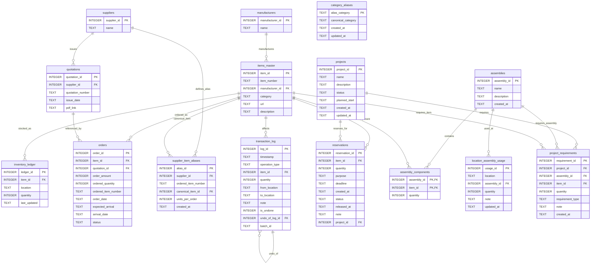

# **Optical Component Inventory Management System**
---

## **1. System Overview**

### **1.1 Purpose**

The Optical Component Inventory Management System provides comprehensive lifecycle management for optical laboratory components, from purchasing through usage tracking, with support for advanced planning features.

### **1.2 Core Capabilities**

| Capability | Description |
|------------|-------------|
| **Purchasing** | Order registration, quotation tracking, unregistered batch import+move procedure, alias-based SKU normalization, arrival processing |
| **Stock Tracking** | Real-time inventory by location |
| **Movement** | Transfer, consume, adjust inventory |
| **Reservation** | Soft-reserve with purpose/deadline tracking |
| **BOM Analysis** | Gap analysis, batch reservation |
| **Assembly Management** | Define reusable component groups |
| **Project Planning** | Future demand registration and projection |
| **Undo Operations** | Safe reversal with compensating transactions |

### **1.3 Non-Functional Requirements**

| Requirement | Specification |
|-------------|---------------|
| Target OS | Windows |
| Database | SQLite (single file) |
| Language (Backend) | Python 3.10+ |
| Backend API | FastAPI |
| Backend DB Access | SQLAlchemy Core / Raw SQL |
| Language (Frontend) | TypeScript |
| UI Framework | React (+React Router for SPA routing) |
| UI Styling | Tailwind CSS (+shadcn/ui or Radix primitives) |
| Data Fetching | SWR |
| Package Manager (Python) | uv |
| Package Manager (Frontend) | npm |
| Frontend Builder | Vite |
| User Model | Local-first personal usage (PoC), with forward compatibility for future shared/multi-user deployment |
| Authentication/Authorization | PoC: none (trusted local environment). Roadmap: RBAC (`admin`, `operator`, `viewer`) |
| Timezone | Fixed JST for all date/time fields |
| CSV Encoding | UTF-8 (no BOM) |
| Expected Scale | Items: 10,000 / Orders: 5,000 / Transactions: ~100,000 |
| Response Time | List views < 500ms, Single item operations < 200ms |

### **1.4 Requirement Precedence**

When statements conflict, interpret in this order:

1. `specification.md`
2. `documents/technical_documentation.md`
3. current code behavior

---

## **2. Database Schema**

### **2.1 Design Principles**

- `items_master.item_id` is the canonical identifier for all components
- All references use foreign keys to enforce referential integrity
- Prices and costs are explicitly out of scope
- Zero-quantity inventory records are deleted (not retained)
- Transaction log is append-only for full audit trail
- Should satisfy Third Normal Form (3NF) at least to minimize redundancy and update anomalies

### **2.2 Table Summary**

| Table | Purpose | Key Fields |
|-------|---------|------------|
| `manufacturers` | Manufacturer registry | manufacturer_id, name |
| `suppliers` | Supplier registry (Vendors) | supplier_id, name |
| `items_master` | Component definitions | item_id, item_number, manufacturer_id |
| `inventory_ledger` | Current inventory by location | item_id, location, quantity |
| `quotations` | Quotation metadata | quotation_id, quotation_number |
| `orders` | Purchase orders | order_id, item_id, status |
| `supplier_item_aliases` | Supplier SKU alias mappings | alias_id, supplier_id, ordered_item_number |
| `category_aliases` | Category soft-merge aliases | alias_category, canonical_category |
| `transaction_log` | All inventory operations | log_id, operation_type, item_id |
| `reservations` | Structured reservations | reservation_id, item_id, purpose |
| `assemblies` | Assembly definitions | assembly_id, name |
| `assembly_components` | Assembly component list | assembly_id, item_id, quantity |
| `location_assembly_usage` | Assembly deployment by location | location, assembly_id, quantity |
| `projects` | Project definitions | project_id, name, status |
| `project_requirements` | Project component needs | requirement_id, project_id |

### **2.3 ER Diagram (Mermaid)**



---

## **3. Table Definitions**

### **3.1 manufacturers**

Centralizes manufacturer names. An item's SKU belongs to a manufacturer.

| Column | Type | Constraints | Description |
|--------|------|-------------|-------------|
| manufacturer_id | INTEGER | PK, AUTOINCREMENT | Internal manufacturer ID |
| name | TEXT | UNIQUE, NOT NULL | Canonical manufacturer name |

### **3.2 suppliers**

Centralizes supplier (vendor) names from whom items are purchased.

| Column | Type | Constraints | Description |
|--------|------|-------------|-------------|
| supplier_id | INTEGER | PK, AUTOINCREMENT | Internal supplier ID |
| name | TEXT | UNIQUE, NOT NULL | Canonical supplier name |

### **3.3 items_master**

Stores constant, non-quantity attributes of components.

| Column | Type | Constraints | Description |
|--------|------|-------------|-------------|
| item_id | INTEGER | PK, AUTOINCREMENT | Canonical item ID |
| item_number | TEXT | NOT NULL | Manufacturer part number |
| manufacturer_id | INTEGER | FK ↁEmanufacturers | Manufacturer reference |
| category | TEXT | | Component category (Lens, Mirror, etc.) |
| url | TEXT | | Product URL |
| description | TEXT | | Human-readable description |

**Unique Constraint:** `(manufacturer_id, item_number)`

### **3.4 inventory_ledger**

Stores current quantity snapshots per location.

| Column | Type | Constraints | Description |
|--------|------|-------------|-------------|
| ledger_id | INTEGER | PK, AUTOINCREMENT | Internal ID |
| item_id | INTEGER | FK ↁEitems_master | Item reference |
| location | TEXT | NOT NULL | Logical location |
| quantity | INTEGER | NOT NULL | Current quantity |
| last_updated | TEXT | | Last modification timestamp |

**Unique Constraint:** `(item_id, location)`

**Location Semantics:**
- `STOCK` ↁEAvailable inventory
- `RESERVED` ↁELegacy compatibility location only (new reservations should not move physical stock here)
- Any other string ↁEUser-defined locations

**Rules:**
- Empty string locations are forbidden
- If quantity becomes 0, the row is deleted

### **3.5 quotations**

Stores quotation metadata.

| Column | Type | Constraints | Description |
|--------|------|-------------|-------------|
| quotation_id | INTEGER | PK, AUTOINCREMENT | Internal ID |
| supplier_id | INTEGER | FK ↁEsuppliers | Supplier reference |
| quotation_number | TEXT | NOT NULL | Supplier quotation number |
| issue_date | TEXT | | YYYY-MM-DD |
| pdf_link | TEXT | | File path to quotation PDF |

**Unique Constraint:** `(supplier_id, quotation_number)`

### **3.6 orders**

Tracks purchasing and delivery status.

| Column | Type | Constraints | Description |
|--------|------|-------------|-------------|
| order_id | INTEGER | PK, AUTOINCREMENT | Internal ID |
| item_id | INTEGER | FK ↁEitems_master | Item reference |
| quotation_id | INTEGER | FK ↁEquotations | Quotation reference |
| order_amount | INTEGER | NOT NULL | Canonical-item quantity used for inventory math |
| ordered_quantity | INTEGER | Legacy nullable; auto-filled and validated | Original quantity from supplier order line |
| ordered_item_number | TEXT | Legacy nullable; auto-filled and validated | Original supplier order SKU |
| order_date | TEXT | NOT NULL | Order date (YYYY-MM-DD) |
| expected_arrival | TEXT | | Scheduled arrival date |
| arrival_date | TEXT | | Actual arrival date |
| status | TEXT | Normalized to `Ordered`/`Arrived` | `Ordered`, `Arrived` |

**Split Delivery Policy:**
When an order is partially delivered:
1. Update original row: `order_amount = arrived_quantity`, `status = 'Arrived'`
2. Create a new row: `order_amount = remaining_quantity`, `status = 'Ordered'`
3. Reject the operation if split traceability would become fractional

**Traceability Rule:**
- `ordered_item_number` and `ordered_quantity` preserve the source order representation.
- If an order line was resolved via alias (pack SKU), `order_amount` can differ from `ordered_quantity`.

**Runtime Guards:**
- Trigger validation enforces date fields in `YYYY-MM-DD` when present.
- Trigger validation enforces `status` in `Ordered` / `Arrived`.
- Trigger autofill ensures missing legacy `ordered_item_number` / `ordered_quantity` / `status` are repaired.

### **3.7 transaction_log**

Records all inventory-affecting operations (append-only).

| Column | Type | Constraints | Description |
|--------|------|-------------|-------------|
| log_id | INTEGER | PK, AUTOINCREMENT | Internal ID |
| timestamp | TEXT | DEFAULT NOW | Event time |
| operation_type | TEXT | | ARRIVAL, MOVE, RESERVE, CONSUME, ADJUST |
| item_id | INTEGER | FK ↁEitems_master | Item reference |
| quantity | INTEGER | | Absolute value |
| from_location | TEXT | Nullable | Source location |
| to_location | TEXT | Nullable | Destination location |
| note | TEXT | | Optional comment |
| is_undone | INTEGER | DEFAULT 0 | 1 if operation was undone |
| undo_of_log_id | INTEGER | FK ↁEtransaction_log | Reference to original if this is an undo |
| batch_id | TEXT | | Group related operations |

### **3.8 reservations**

Stores structured reservation records with lifecycle tracking.

| Column | Type | Constraints | Description |
|--------|------|-------------|-------------|
| reservation_id | INTEGER | PK, AUTOINCREMENT | Internal ID |
| item_id | INTEGER | FK ↁEitems_master, NOT NULL | Reserved item |
| quantity | INTEGER | NOT NULL, CHECK > 0 | Reserved quantity |
| purpose | TEXT | | Reservation purpose |
| deadline | TEXT | | Optional deadline (YYYY-MM-DD) |
| created_at | TEXT | DEFAULT NOW | Creation timestamp |
| status | TEXT | DEFAULT 'ACTIVE' | ACTIVE, RELEASED, CONSUMED |
| released_at | TEXT | | Timestamp when released/consumed |
| note | TEXT | | Optional notes |
| project_id | INTEGER | FK ↁEprojects, Nullable | Associated project |

**Status Transitions:**
- ACTIVE ↁERELEASED (cancelled, items returned to STOCK)
- ACTIVE ↁECONSUMED (items used/removed from inventory)

### **3.9 assemblies**

Stores assembly definitions as reusable templates.

| Column | Type | Constraints | Description |
|--------|------|-------------|-------------|
| assembly_id | INTEGER | PK, AUTOINCREMENT | Internal ID |
| name | TEXT | NOT NULL, UNIQUE | Assembly name |
| description | TEXT | | Detailed description |
| created_at | TEXT | DEFAULT NOW | Creation timestamp |

### **3.10 assembly_components**

Defines component composition per assembly.

| Column | Type | Constraints | Description |
|--------|------|-------------|-------------|
| assembly_id | INTEGER | FK ↁEassemblies, PK | Parent assembly |
| item_id | INTEGER | FK ↁEitems_master, PK | Component reference |
| quantity | INTEGER | NOT NULL, CHECK > 0 | Quantity per assembly |

### **3.11 location_assembly_usage**

Tracks assembly deployment per location.

| Column | Type | Constraints | Description |
|--------|------|-------------|-------------|
| usage_id | INTEGER | PK, AUTOINCREMENT | Internal ID |
| location | TEXT | NOT NULL | Location name |
| assembly_id | INTEGER | FK ↁEassemblies, NOT NULL | Assembly reference |
| quantity | INTEGER | NOT NULL, CHECK > 0 | Number of assemblies |
| note | TEXT | | Optional note |
| updated_at | TEXT | DEFAULT NOW | Last modification |

**Unique Constraint:** `(location, assembly_id)`

### **3.12 projects**

Stores project definitions with lifecycle status.

| Column | Type | Constraints | Description |
|--------|------|-------------|-------------|
| project_id | INTEGER | PK, AUTOINCREMENT | Internal ID |
| name | TEXT | NOT NULL, UNIQUE | Project name |
| description | TEXT | | Detailed description |
| status | TEXT | DEFAULT 'PLANNING' | Lifecycle status |
| planned_start | TEXT | | Target start date (YYYY-MM-DD) |
| created_at | TEXT | DEFAULT NOW | Creation timestamp |
| updated_at | TEXT | | Last modification |

**Valid Statuses:** PLANNING, CONFIRMED, ACTIVE, COMPLETED, CANCELLED

### **3.13 project_requirements**

Defines component requirements per project.

| Column | Type | Constraints | Description |
|--------|------|-------------|-------------|
| requirement_id | INTEGER | PK, AUTOINCREMENT | Internal ID |
| project_id | INTEGER | FK ↁEprojects, NOT NULL | Parent project |
| assembly_id | INTEGER | FK ↁEassemblies, Nullable | Assembly (if assembly-based) |
| item_id | INTEGER | FK ↁEitems_master, Nullable | Item (if item-based) |
| quantity | INTEGER | NOT NULL, CHECK > 0 | Required quantity |
| requirement_type | TEXT | DEFAULT 'INITIAL' | INITIAL, SPARE, REPLACEMENT |
| note | TEXT | | Optional note |
| created_at | TEXT | DEFAULT NOW | Creation timestamp |

**Check Constraint:** Either assembly_id OR item_id must be set (not both, not neither).

### **3.14 supplier_item_aliases**

Maps supplier-facing order SKUs (for example pack SKUs) to canonical items in `items_master`.

| Column | Type | Constraints | Description |
|--------|------|-------------|-------------|
| alias_id | INTEGER | PK, AUTOINCREMENT | Internal alias ID |
| supplier_id | INTEGER | FK -> suppliers, NOT NULL | Supplier owning this alias |
| ordered_item_number | TEXT | NOT NULL | Item number as it appears in supplier order CSV |
| canonical_item_id | INTEGER | FK -> items_master, NOT NULL | Canonical item for inventory/order records |
| units_per_order | INTEGER | NOT NULL, CHECK > 0 | Multiplier to convert ordered quantity |
| created_at | TEXT | DEFAULT NOW | Creation timestamp |

**Unique Constraint:** `(supplier_id, ordered_item_number)`

### **3.15 category_aliases**

Maps raw category names to canonical category names for soft-merge behavior.

| Column | Type | Constraints | Description |
|--------|------|-------------|-------------|
| alias_category | TEXT | PK, NOT NULL, CHECK TRIM != '' | Raw category value to treat as alias |
| canonical_category | TEXT | NOT NULL, CHECK TRIM != '' | Canonical category shown in UI/search |
| created_at | TEXT | DEFAULT NOW | Alias creation timestamp |
| updated_at | TEXT | DEFAULT NOW | Last alias update timestamp |

**Rules:**
- `alias_category` and `canonical_category` cannot be identical.
- Soft-merge does not rewrite `items_master.category`; resolution is applied at read time.
- Removing an alias restores original category behavior immediately.

---

## **4. Core Business Logic**

### **4.1 Order Processing**

**Order Import:**
1. User selects supplier and uploads CSV
2. System resolves each CSV `item_number`:
   - direct match in `items_master`, or
   - alias match in `supplier_item_aliases` (`ordered_item_number -> canonical_item_id`)
3. Quantity conversion:
   - direct match: `order_amount = quantity`
   - alias match: `order_amount = quantity * units_per_order`
4. If unresolved items remain: generate `missing_items_registration.csv` and return `status="missing_items"` (no orders inserted yet)
5. User registers missing items (new item or alias) and re-runs order import with the same CSV
   - Missing-item registration supports mixed batches: alias rows may reference canonical rows created as `new_item` in the same file
6. If all rows resolve, insert orders into `orders` and keep traceability fields
   (`ordered_item_number`, `ordered_quantity`)
   - Reject import when the same `(supplier, quotation_number)` already has existing orders
     to prevent duplicate quotation re-import
7. Normalize date fields to `YYYY-MM-DD`; reject invalid date strings
8. For manual CSV import, `pdf_link` must be blank or `quotations/registered/pdf_files/<supplier>/<file>.pdf`
   - Filename-only values are normalized to the selected supplier's registered path

**Batch Procedure (Unregistered Folder):**
1. Scan all `*.csv` under `quotations/unregistered/csv_files`
2. Derive supplier from CSV relative folder (must be under `<root>/csv_files/<supplier>/<file>.csv`)
3. Step A (`register_unregistered_missing_items_csvs`):
   - Process only `*_missing_items_registration.csv`
   - Register missing items/aliases via `register_missing_items()`
   - Move successfully processed missing-items CSV files to `quotations/registered/csv_files/<supplier>/`
4. Step B (`import_unregistered_order_csvs`):
   - Process only order CSV files (skip `*_missing_items_registration.csv`)
   - Run standard `import_orders()` for each CSV
   - If result is `ok`: move CSV to `registered/csv_files`, move referenced PDFs to `registered/pdf_files`, normalize CSV/quotation `pdf_link`
   - If result is `missing_items`: keep source CSV/PDF under `unregistered`; collect missing rows into one consolidated batch register CSV under `quotations/unregistered/missing_item_registers/`; do not move source files
5. If one file errors, continue or stop based on `continue_on_error`

**Arrival Processing:**
1. Update order status to 'Arrived'
2. Increment inventory at STOCK location
3. Log ARRIVAL operation
4. For partial arrivals, require integer-safe split of ordered traceability quantities

### **4.2 Inventory Operations**

**Movement Types:**

| Type | From | To | Effect |
|------|------|-----|--------|
| MOVE | Location A | Location B | Transfer items |
| CONSUME | Location | NULL | Remove items from inventory |
| RESERVE | NULL | NULL | Create/release allocation records without moving physical inventory |
| ADJUST | NULL or Location | Location or NULL | Correction (add/remove) |
| ARRIVAL | NULL | STOCK | Add from order |

**Shortage Handling:**
- Validate sufficient quantity before applying
- If insufficient: return shortage status, no changes made

### **4.3 Reservation System**

**Creating Reservations:**
1. Validate item exists and quantity > 0
2. Calculate available quantity across physical locations (`inventory_ledger.quantity - active allocations`)
3. Allocate reservation quantity from physical locations without moving inventory rows
4. Create reservation record with purpose/deadline

**Releasing Reservations:**
1. Support full or partial release quantity
2. Mark corresponding active allocations as RELEASED (no inventory movement)
3. If released quantity equals remaining reservation quantity: set status to RELEASED
4. If released quantity is partial: keep status ACTIVE and decrement remaining reservation quantity

**Consuming Reservations:**
1. Support full or partial consume quantity
2. Consume from allocated physical locations and mark those allocations CONSUMED
3. If consumed quantity equals remaining reservation quantity: set status to CONSUMED
4. If consumed quantity is partial: keep status ACTIVE and decrement remaining reservation quantity

### **4.4 Assembly System**

**Assembly Formula:**
```
Total Component @ Location = 
    Σ(assembly_qty ÁEcomponent_qty_per_assembly)
```

**Example:**
- Assembly "Laser Module" contains: 2ÁELens, 1ÁEMirror
- Location "SetupA" uses 3ÁE"Laser Module"
- Total @ SetupA: Lens = 6, Mirror = 3

**Key Principle (Current + Target):**
- **Current implementation:** Assembly data is advisory/organizational.
- **Target evolution:** Keep advisory behavior in planning, then allow enforceable checks in active operation mode.

Current advisory behavior does NOT:
- Automatically move components
- Block movements that violate requirements
- Modify inventory_ledger directly

Target enforceable mode (future) should:
- Validate required components for active locations/projects before critical operations
- Provide override/audit workflows instead of silent failure

### **4.5 Project Demand Planning**

**Project Lifecycle:**
```
PLANNING ↁECONFIRMED ↁEACTIVE ↁECOMPLETED
     ↁE
  CANCELLED
```

**Status Behaviors:**

| Status | Inventory Impact | Editability |
|--------|------------------|-------------|
| PLANNING | None | Free add/edit/delete requirements |
| CONFIRMED | RESERVED via reservations | Release required before changes |
| ACTIVE | Components at project locations | Movement operations only |
| COMPLETED | Archived | Read-only |

**Inventory Projection Formula:**
```
Projected Available = 
    Current STOCK
  + Pending Orders (expected_arrival ≤ date)
  - Active Reservations
  - Planned Demand (PLANNING status projects)
```

### **4.6 Undo Operations**

**Design Principles:**
- Append-only log (original entries never deleted)
- Creates compensating transactions
- Supports partial undo when full reversal isn't possible
- Partial undo is acceptable when required quantity is not currently available
- Undo actor policy (PoC): any local operator; RBAC control planned for multi-user phase
- Undo note policy: note is strongly recommended and should become mandatory in controlled deployments

**Undo Feasibility:**
| Original | Undo Requirement | Feasibility Check |
|----------|------------------|-------------------|
| MOVE | Reverse direction | Check quantity at to_location |
| ARRIVAL | Remove from STOCK | Check quantity at STOCK |
| CONSUME | Restore to original | Always possible |
| ADJUST | Reverse the delta | Check if removal is possible |

### **4.7 Category Soft Merge (Alias)**

**Behavior:**
- Category merge uses alias mapping (`category_aliases`) instead of rewriting `items_master.category`.
- Category resolution is applied in read paths (search, item list, location inspect, snapshots, item details).
- Alias removal provides a direct rollback path for category taxonomy changes.

**Service Functions:**

| Function | Purpose | Parameters |
|----------|---------|------------|
| `list_raw_categories()` | List raw category values from item rows | conn |
| `list_categories()` | List effective (canonical) category values | conn |
| `list_category_aliases()` | List active alias mappings | conn |
| `get_category_usage()` | Show direct/effective usage for one category | conn, category |
| `merge_category_alias()` | Soft-merge source into target canonical category | conn, source_category, target_category |
| `remove_category_alias()` | Remove one alias mapping (undo soft merge) | conn, source_category |
| `rename_category()` | Backward-compatible wrapper to soft merge | conn, source_category, target_category |

### **4.8 Orders and Quotations Management**

**Service Functions:**

| Function | Purpose | Parameters |
|----------|---------|------------|
| `list_orders()` | Query orders with filters | status, supplier, include_arrived |
| `update_order()` | Edit open order or split partial ETA | order_id, expected_arrival, status, split_quantity |
| `merge_open_orders()` | Merge two open split-compatible orders | source_order_id, target_order_id, expected_arrival |
| `list_order_lineage_events()` | Retrieve split/merge lineage events for one order | order_id |
| `list_quotations()` | Query quotations with filters | supplier |
| `update_quotation()` | Edit quotation | quotation_id, issue_date, pdf_link |
| `list_supplier_item_aliases()` | Query alias mappings | supplier |
| `upsert_supplier_item_alias()` | Create/update one alias | supplier, ordered_item_number, canonical_item_number, units_per_order |
| `register_supplier_item_aliases_df()` | Bulk import aliases | supplier, dataframe |
| `register_supplier_item_aliases()` | Bulk import aliases | supplier, csv_path |
| `delete_supplier_item_alias()` | Delete one alias | alias_id |
| `register_unregistered_missing_items_csvs()` | Batch register completed missing-items CSV files and move successful files | unregistered/registered roots, continue_on_error |
| `import_unregistered_order_csvs()` | Batch import unregistered order CSV files and move successful CSV/PDF files | unregistered/registered roots, default_order_date, continue_on_error |
| `rename_category()` | Backward-compatible soft merge wrapper | source_category, target_category |

**Constraints:**
- Only non-Arrived orders can be updated
- Open-order status remains `Ordered` (do not set `Arrived` via `update_order`)
- `update_order` can split one open order into two open rows when `split_quantity` is provided together with a new `expected_arrival`
- Split must be integer-safe for traceability quantities (`ordered_quantity`)
- Merge is allowed only when open orders share `item_id`, `quotation_id`, and `ordered_item_number`
- Split/merge updates must append lineage events for auditability
- All quotations can be edited
- Date fields must be YYYY-MM-DD format


### **4.8.1 Movement/Reservation CSV Import**

- Inventory movement CSV import supports `MOVE`, `CONSUME`, `ADJUST`, `ARRIVAL`, `RESERVE` operation rows and executes them via the existing batch transaction service.
- Reservation CSV import supports either direct `item_id` reservations or assembly-driven rows (`assembly` + optional `assembly_quantity`) that expand to component reservations using assembly definitions.
- Assembly expansion is intentionally advisory/planning-oriented (no automatic inventory movement beyond reservation allocation), which aligns with current assembly policy and avoids unnecessary complexity.

### **4.9 Inventory Snapshots**

**Purpose:** View inventory state at any point in time (past or future).

**Service Functions:**

| Function | Purpose |
|----------|---------|
| `get_inventory_snapshot_past()` | Reconstruct past state by reversing transactions |
| `get_inventory_snapshot_future()` | Project future state based on expected arrivals/reservations |
| `get_inventory_snapshot()` | Unified API with auto mode detection |

**Past Snapshot Algorithm:**
1. Start with current `inventory_ledger`
2. Query all transactions after the specified date
3. Reverse each transaction:
   - MOVE: Reverse from/to locations
   - CONSUME: Add back to from_location
   - RESERVE: Move from RESERVED to STOCK
   - ARRIVAL: Remove from STOCK
   - ADJUST: Reverse the delta

**Future Snapshot Algorithm:**
1. Start with current `inventory_ledger`
2. Add pending orders where `date(expected_arrival) <= date(target_date)` and `status != 'Arrived'`
3. Subtract active reservations where `deadline <= date` (assumed consumed)

---

## **5. Interface Specifications**

### **5.1 User Interface Tabs**

**General UI Requirement (Multi-row Data Entry):** 
All management pages handling CRUD operations (Items, Orders, Reservations, etc.) MUST provide **Bulk/Multi-row Data Entry** interfaces. To prevent tedious data entry, the system should avoid forcing users to submit forms one-by-one. Instead, it should offer spreadsheet-like grids where users can paste or type multiple rows of data at once and submit them as a single batch, in addition to CSV import/export functions.

| Tab | Functions |
|-----|-----------|
| **Dashboard** | **Overview: overdue arrivals, expiring reservations, low stock alerts, recent activity** |
| Search | Keyword search (multi-word support), filtering/sorting, inventory snapshot export |
| Location | Location inspection, assembly view, disassemble |
| Projects | CRUD projects, requirements, gap analysis |
| Orders | Bulk import orders, register missing items, alias CSV import, **batch import+move from unregistered folders**, **orders/quotations management** |
| Arrival | Process arrivals, partial deliveries (supports bulk resolution) |
| Movements | Single/batch movements, all operation types, CSV import (`operation_type,item_id,quantity,from_location,to_location,location,note`) |
| Reserve | Reservation management, BOM batch reservation, CSV import (`item_id` or `assembly`, `quantity`, optional `assembly_quantity/purpose/deadline/note/project_id`) |
| BOM | Gap analysis, reserve available |
| Assemblies | Define assemblies, location usage, requirements |
| Items | Bulk edit item attributes; soft-merge categories via alias mapping |
| History | Transaction log, undo operations |
| **Snapshot** | **Past/future inventory state reconstruction, CSV export** |

### **5.2 CLI Commands**

| Command | Purpose |
|---------|---------|
| `init-db` | Initialize database |
| `import-orders` | Import order CSV |
| `register-missing` | Register missing items CSV |
| `arrival` | Process order arrival |
| `move` | Move inventory |
| `consume` | Consume inventory |
| `reserve` | Reserve inventory |
| `list-reservations` | List reservations |
| `release-reservation` | Release reservation (full or partial with `--quantity`) |
| `consume-reservation` | Consume reservation (full or partial with `--quantity`) |
| `bom-analyze` | BOM gap analysis |
| `bom-reserve` | Reserve BOM items |
| `search` | Search items |
| `location-inspect` | Inspect location |
| `location-disassemble` | Return location items to STOCK |
| `assembly-create` | Create assembly |
| `assembly-list` | List assemblies |
| `assembly-show` | Show assembly details |
| `assembly-delete` | Delete assembly |
| `location-set-assembly` | Set assembly usage |

### **5.3 API Endpoints**

Base URL: `http://localhost:8000/api`

#### **Dashboard**

| Method | Endpoint | Description |
|--------|----------|-------------|
| GET | `/dashboard/summary` | Get dashboard overview (overdue orders, expiring reservations, low stock) |

#### **Auth / Capability Metadata**

| Method | Endpoint | Description |
|--------|----------|-------------|
| GET | `/auth/capabilities` | Return runtime auth mode and planned RBAC roles metadata |

#### **Items**

| Method | Endpoint | Description |
|--------|----------|-------------|
| GET | `/items` | List items (supports `?q=`, `?category=`, `?manufacturer=`, pagination) |
| GET | `/items/{item_id}` | Get item details |
| POST | `/items` | Create item |
| PUT | `/items/{item_id}` | Update item |
| DELETE | `/items/{item_id}` | Delete item (blocked if referenced) |
| GET | `/items/{item_id}/history` | Get item transaction history |
| GET | `/items/{item_id}/flow` | Get item-centric increase/decrease timeline (transactions + expected arrivals + reservation demand) |

#### **Inventory**

| Method | Endpoint | Description |
|--------|----------|-------------|
| GET | `/inventory` | List inventory by location |
| GET | `/inventory/snapshot` | Get inventory snapshot (supports `?date=`, `?mode=past|future`) |
| POST | `/inventory/move` | Move items between locations |
| POST | `/inventory/consume` | Consume items from location |
| POST | `/inventory/adjust` | Adjust inventory quantity |
| POST | `/inventory/batch` | Batch movement operations |

#### **Orders & Quotations**

| Method | Endpoint | Description |
|--------|----------|-------------|
| GET | `/orders` | List orders (supports `?status=`, `?supplier=`) |
| GET | `/orders/{order_id}` | Get order details |
| PUT | `/orders/{order_id}` | Update order ETA (or split partial ETA via `split_quantity`) |
| POST | `/orders/merge` | Merge two open compatible orders |
| GET | `/orders/{order_id}/lineage` | List split/merge lineage events for the order |
| POST | `/orders/import` | Import orders from CSV |
| POST | `/orders/{order_id}/arrival` | Process order arrival |
| POST | `/orders/{order_id}/partial-arrival` | Process partial arrival |
| GET | `/quotations` | List quotations |
| PUT | `/quotations/{quotation_id}` | Update quotation |

#### **Reservations**

| Method | Endpoint | Description |
|--------|----------|-------------|
| GET | `/reservations` | List reservations (supports `?status=`, `?item_id=`) |
| POST | `/reservations` | Create reservation |
| PUT | `/reservations/{reservation_id}` | Update reservation |
| POST | `/reservations/{reservation_id}/release` | Release reservation (full or partial using optional `quantity`) |
| POST | `/reservations/{reservation_id}/consume` | Consume reservation (full or partial using optional `quantity`) |
| POST | `/reservations/batch` | Batch create reservations |

#### **Assemblies**

| Method | Endpoint | Description |
|--------|----------|-------------|
| GET | `/assemblies` | List assemblies |
| GET | `/assemblies/{assembly_id}` | Get assembly with components |
| POST | `/assemblies` | Create assembly |
| PUT | `/assemblies/{assembly_id}` | Update assembly |
| DELETE | `/assemblies/{assembly_id}` | Delete assembly (cascades) |
| GET | `/assemblies/{assembly_id}/locations` | Get assembly usage by location |
| PUT | `/locations/{location}/assemblies` | Set assembly usage at location |

#### **Projects**

| Method | Endpoint | Description |
|--------|----------|-------------|
| GET | `/projects` | List projects |
| GET | `/projects/{project_id}` | Get project with requirements |
| POST | `/projects` | Create project |
| PUT | `/projects/{project_id}` | Update project |
| DELETE | `/projects/{project_id}` | Delete project |
| GET | `/projects/{project_id}/gap-analysis` | Analyze requirement gaps |
| POST | `/projects/{project_id}/reserve` | Reserve project requirements |

#### **BOM Analysis**

| Method | Endpoint | Description |
|--------|----------|-------------|
| POST | `/bom/analyze` | Analyze BOM gaps (accepts CSV or JSON) |
| POST | `/bom/reserve` | Reserve BOM items |

#### **Locations**

| Method | Endpoint | Description |
|--------|----------|-------------|
| GET | `/locations` | List all locations with item counts |
| GET | `/locations/{location}` | Inspect location (items + assemblies) |
| POST | `/locations/{location}/disassemble` | Return all items to STOCK |

#### **Transaction History**

| Method | Endpoint | Description |
|--------|----------|-------------|
| GET | `/transactions` | List transactions (supports `?item_id=`, `?batch_id=`) |
| POST | `/transactions/{log_id}/undo` | Undo a transaction |

#### **Master Data**

| Method | Endpoint | Description |
|--------|----------|-------------|
| GET | `/manufacturers` | List manufacturers |
| POST | `/manufacturers` | Create manufacturer |
| GET | `/suppliers` | List suppliers |
| POST | `/suppliers` | Create supplier |
| GET | `/suppliers/{supplier_id}/aliases` | List supplier item aliases |
| POST | `/suppliers/{supplier_id}/aliases` | Create/update alias |
| DELETE | `/aliases/{alias_id}` | Delete alias |
| GET | `/categories` | List categories (canonical) |
| GET | `/categories/raw` | List raw categories |
| POST | `/categories/merge` | Soft-merge categories |
| DELETE | `/categories/aliases/{alias_category}` | Remove category alias |

#### **API Response Format**

**Success Response:**
```json
{
  "status": "ok",
  "data": { ... }
}
```

**Error Response:**
```json
{
  "status": "error",
  "error": {
    "code": "ITEM_NOT_FOUND",
    "message": "Item with id 123 not found"
  }
}
```

**Pagination Response:**
```json
{
  "status": "ok",
  "data": [...],
  "pagination": {
    "page": 1,
    "per_page": 50,
    "total": 234,
    "total_pages": 5
  }
}
```

---

## **6. CSV File Formats**

### **6.1 order_import.csv**

| Column | Required | Type |
|--------|----------|------|
| item_number | Yes | String |
| quantity | Yes | Integer > 0 |
| quotation_number | Yes | String |
| issue_date | Yes | YYYY-MM-DD |
| order_date | Conditional* | YYYY-MM-DD |
| expected_arrival | No | YYYY-MM-DD |
| pdf_link | No | File path |

*Required unless shared order date provided.

### **6.2 missing_items_registration.csv**

| Column | Required | Type |
|--------|----------|------|
| item_number | Yes | String |
| supplier | Yes | String |
| manufacturer_name | No | String (used for `new_item`; defaults to `UNKNOWN` when blank; accepts alias header `manufacturer`) |
| resolution_type | No | `new_item` (default) or `alias` (alias header: `row_type`; value `item` is treated as `new_item`) |
| category | No | String (used for `new_item`; optional in current app) |
| url | No | URL |
| description | No | String |
| canonical_item_number | Conditional | String (required for `alias`; must exist for supplier as existing item or `new_item` in same registration batch) |
| units_per_order | No | Integer > 0 (defaults to 1 for alias when blank) |

Notes:
- `supplier` here is the supplier namespace used for order-SKU resolution/alias mapping. It is not the same concept as item `manufacturer`.
- `new_item` rows can optionally set `manufacturer_name` (or `manufacturer` alias header). When blank, manufacturer defaults to `UNKNOWN`.

For batch-generated consolidated register CSV, additional provenance columns may be prepended:

| Column | Required | Type |
|--------|----------|------|
| source_csv | Yes (batch-generated only) | String path |
| source_supplier | Yes (batch-generated only) | String |

### **6.3 bom_input.csv**

| Column | Required | Type |
|--------|----------|------|
| supplier | Yes | String |
| item_number | Yes | String |
| required_quantity | Yes | Integer ≥ 0 |

### **6.4 movement_import.csv**

| Column | Required | Type |
|--------|----------|------|
| supplier | Yes | String |
| item_number | Yes | String |
| quantity | Yes | Integer > 0 |
| from_location | Yes | String |
| to_location | Yes | String |
| operation_type | Yes | MOVE, CONSUME, RESERVE |
| note | No | String |

### **6.5 supplier_item_aliases.csv**

| Column | Required | Type |
|--------|----------|------|
| ordered_item_number | Yes | String |
| canonical_item_number | Yes | String (must exist for selected supplier) |
| units_per_order | Yes | Integer > 0 |
| supplier | No* | String |

*Optional in UI alias import flow (supplier is selected in UI). If present, it must match the selected supplier.

### **6.6 File Encoding and Format Rules**

| Rule | Value |
|------|-------|
| Character Encoding | UTF-8 (no BOM) |
| Line Endings | CRLF (Windows) or LF |
| Header Row | Required for all CSV files |
| Empty Values | Empty string (not NULL literal) |

---

## **7. File Management**

### **7.1 Directory Structure**
`
<workspace_root>/
  quotations/
    unregistered/
      csv_files/
        <supplier_name>/
          <order>.csv
      pdf_files/
        <supplier_name>/
          <quotation>.pdf
      missing_item_registers/
        batch_missing_items_registration_<timestamp>.csv
    registered/
      csv_files/
        <supplier_name>/
          <order>.csv
      pdf_files/
        <supplier_name>/
          <quotation>.pdf
  exports/
    <export_YYYYMMDD_HHMMSS>.csv
  backend/database/
    inventory.db
`
### **7.2 File Naming Conventions**

| File Type | Pattern | Example |
|-----------|---------|---------|
| Quotation PDF | `<quotation_number>.pdf` | `Q2026-0001.pdf` |
| Order CSV | `<quotation_number>.csv` or free | `Q2026-0001.csv` |
| Missing Items CSV (single file import) | `<original>_missing_items_registration.csv` | `Q2026-0001_missing_items_registration.csv` |
| Missing Item Register CSV (batch import) | `batch_missing_items_registration_<timestamp>.csv` | `batch_missing_items_registration_20260302_120000.csv` |
| Export CSV | `<type>_<timestamp>.csv` | `inventory_20260223_143052.csv` |

### **7.3 PDF Storage Rules**

- All quotation PDFs are stored under `quotations/registered/pdf_files/<supplier>/`
- `pdf_link` in database stores relative path from workspace root
- PDF files are moved (not copied) during batch import processing
- Input paths are normalized (including known legacy typos and mixed separators)
- Missing/unresolved PDF links are returned as warnings in batch reports
- Filename collisions are handled by deterministic suffixing (`_1`, `_2`, ...)
- Future hardening target: hash-based duplicate detection and original-filename retention

---

## **8. Data Integrity Rules**

### **7.1 Referential Integrity**

- All foreign keys are enforced
- Deleting an assembly cascades to assembly_components and location_assembly_usage
- Deleting an item is blocked if referenced in assembly_components

### **7.2 Business Rules**

| Rule | Enforcement |
|------|-------------|
| Zero-quantity deletion | Automatic on inventory update |
| Empty location prohibition | Validation on all operations |
| Unique (manufacturer_id, item_number) | Database constraint |
| Unique (supplier, ordered_item_number) alias | Database constraint |
| Unique category alias key (`alias_category`) | Database constraint |
| Unique (location, assembly) usage | Database constraint |
| Requirement: exactly one of assembly_id/item_id | Check constraint |
| Positive quantities | Check constraints |
| Positive alias units_per_order | Check constraint |
| Category alias cannot map blank/self | Check constraints + migration cleanup |

### **7.3 Transaction Logging**

- All inventory changes are logged
- Logs include operation type, item, quantity, locations, timestamp
- Undo operations create new log entries (never modify originals)
- Category alias changes are managed separately in `category_aliases` (not `transaction_log`)

---

## **9. Explicit Non-Goals**

The following are intentionally out of scope:

- **Cost/price tracking**: No financial data
- **Production-grade multi-user control (current release)**: Local-first PoC only, while keeping future compatibility
- **Authentication enforcement (current release)**: No login/session enforcement yet (RBAC planned)
- **Hard locking**: Soft reservation only
- **Nested assemblies**: Assemblies cannot contain other assemblies
- **Automatic ordering**: No integration with purchasing systems
- **Email notifications**: No alerting system
- **Assembly versioning**: No history of assembly changes
- **Automatic deployment**: Assemblies don't auto-move components

---

## **10. Database Indexes**

| Table | Column(s) | Purpose |
|-------|-----------|---------|
| transaction_log | batch_id | Batch operation lookup |
| transaction_log | undo_of_log_id | Undo chain lookup |
| reservations | item_id | Item reservation lookup |
| reservations | status | Status filtering |
| reservations | deadline | Deadline queries |
| reservations | project_id | Project reservation lookup |
| assembly_components | item_id | Component usage lookup |
| location_assembly_usage | location | Location assembly lookup |
| location_assembly_usage | assembly_id | Assembly location lookup |
| projects | status | Status filtering |
| projects | planned_start | Timeline queries |
| project_requirements | project_id | Project requirement lookup |
| project_requirements | assembly_id | Assembly requirement lookup |
| project_requirements | item_id | Item requirement lookup |
| orders | ordered_item_number | Ordered-SKU traceability queries |
| orders | status, expected_arrival | Pending-order date filtering |
| orders | item_id, status, expected_arrival | Item-level future projection |
| supplier_item_aliases | canonical_item_id | Canonical item alias lookup |
| category_aliases | canonical_category | Canonical category lookup |
| category_aliases | updated_at | Alias recency listing |

---

## **11. Migration Support**

The system supports migration from older database versions:

- `init_db()` creates tables if they don't exist
- `migrate_db()` adds missing columns to existing tables
- `migrate_db()` creates and normalizes category alias storage (`category_aliases`)
- `migrate_db()` backfills and normalizes legacy order traceability fields
- `migrate_db()` normalizes order/quotation date fields to `YYYY-MM-DD`
- `migrate_db()` installs order integrity validation/fill triggers
- Safe to run on every application startup (idempotent)
- Includes data normalization for forward compatibility

---

## **12. Change Management and QA Gate**

Minimum gate for non-trivial changes:

1. Update domain behavior first (`backend/app/service.py`), then adapters (`api.py`, CLI), then UI.
2. Run backend full tests: `uv run python -m pytest`.
3. If frontend changed, run build check: `npm run build`.
4. Execute a manual smoke check for touched flows (API/CLI/UI).
5. Update documents in the same change:
   - `specification.md` for requirement/contract changes
   - `documents/technical_documentation.md` for architecture/maintenance impact
   - relevant README files for usage/setup impact

---

## **13. Release and Compliance Posture**

- **Versioning/Release Notes:** GitHub repository is expected, with `CHANGELOG.md` and migration notes recommended for each release.
- **Current compliance scope:** formal backup/retention/deletion policies are not enforced yet.
- **Forward-compatibility requirement:** design decisions should preserve room for:
  - backup/restore automation
  - retention controls for logs and quotation files
  - role-based audit controls in multi-user deployments

---

*End of Specification Sheet*

### 11.4 Order/Quotation maintenance from UI

- Users may correct imported purchase data from frontend by:
  - editing quotation metadata (`issue_date`, `pdf_link`)
  - deleting non-arrived orders
  - deleting quotations only when all linked orders are non-arrived (then cascade delete linked orders)
- Consistency requirement: these operations must keep persisted quotation/order CSV files and database records synchronized.
